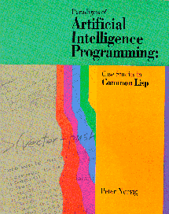

# *Paradigms of Artificial Intelligence Programming* 

This is an open-source repository for the book *Paradigms of Artificial
Intelligence Programming: Case Studies in Common Lisp* by Peter Norvig (1992), and the code contained therein.  The copyright has reverted to the author, who has shared it here under MIT license.

## The Book

The book is available in these formats:

* pdf: [PAIP-part1.pdf](https://github.com/norvig/paip-lisp/blob/master/PAIP-part1.pdf) (Chapters 1-14) and [PAIP-part2.pdf](https://github.com/norvig/paip-lisp/blob/master/PAIP-part2.pdf) (15-25)
* text: [PAIP.txt](https://github.com/norvig/paip-lisp/blob/master/PAIP.txt) (containing many errors)
* epub: [PAIP-safari.epub](https://github.com/norvig/paip-lisp/blob/master/PAIP-safari.epub) (much cleaner)
* and `chapter?.md` markdown files:

- **Paradigms of Artificial Intelligence Programming**
  * [Front matter](docs/frontmatter.md)
  * [Preface](docs/preface.md)
- **Part I:  Introduction to Common Lisp**
  * 1  [Introduction to Lisp](docs/chapter1.md)
  * 2  [A Simple Lisp Program](docs/chapter2.md)
  * 3 [Overview of Lisp](docs/chapter3.md)
- **Part II: Early AI Programs**
  * 4  [GPS:  The General problem Solver](docs/chapter4.md)
  * 5  [Eliza:  Dialog with a Machine](docs/chapter5.md)
  * 6  [Building Software Tools](docs/chapter6.md)
  * 7 [Student:  Solving Algebra Word Problems](docs/chapter7.md)
  * 8 [Symbolic Mathematics:  A Simplification Program](docs/chapter8.md)
- **Part III:  Tools and Techniques**
  * 9  [Efficiency Issues](docs/chapter9.md)
  * 10  [Low-Level Efficiency Issues](docs/chapter10.md)
  * 11  [Logic Programming](docs/chapter11.md)
  * 12  [Compiling Logic programs](docs/chapter12.md)
  * 13  [Object-Oriented Programming](docs/chapter13.md)
  * 14  [Knowledge Representation and Reasoning](docs/chapter14.md)
- **Part IV:  Advanced AI Programs**
  * 15  [Symbolic Mathematics with Canonical Forms](docs/chapter15.md)
  * 16  [Expert Systems](docs/chapter16.md)
  * 17  [Line-Diagram Labeling by Constraint Satisfaction](docs/chapter17.md)
  * 18  [Search and the Game of Othello](docs/chapter18.md)
  * 19  [Introduction to Natural Language](docs/chapter19.md)
  * 20  [Unification Grammars](docs/chapter20.md)
  * 21  [A Grammar of English](docs/chapter21.md)
- **Part V:  The Rest of Lisp**
  * 22  [Scheme:  An Uncommon Lisp](docs/chapter22.md)
  * 23  [Compiling Lisp](docs/chapter23.md)
  * 24  [ANSI Common Lisp](docs/chapter24.md)
  * 25  [Troubleshooting](docs/chapter25.md)
  
As seen on [TV](https://norvig.com/paip-tv.html). See also: [errata](https://norvig.com/paip-errata.html), [comments](https://norvig.com/paip-comments.html),  [retrospective](https://norvig.com/Lisp-retro.html).

## The Lisp Files

The [Lisp code files](https://github.com/norvig/paip-lisp/tree/master/lisp) are listed here:

| CH   | Filename                            | Description                                                            |
|------|-------------------------------------|------------------------------------------------------------------------|
| -    | [examples.lisp](lisp/examples.lisp) | A list of example inputs taken from the book                           |
| -    | [tutor.lisp](lisp/tutor.lisp)       | An interpreter for running the examples                                |
| -    | [auxfns.lisp](lisp/auxfns.lisp)     | Auxiliary functions; load this before anything else                    |
| 1    | [intro.lisp](lisp/intro.lisp)       | A few simple definitions                                               |
| 2    | [simple.lisp](lisp/simple.lisp)     | Random sentence generator (two versions)                               |
| 3    | [overview.lisp](lisp/overview.lisp) | 14 versions of LENGTH and other examples                               |
| 4    | [gps1.lisp](lisp/gps1.lisp)         | Simple version of General Problem Solver                               |
| 4    | [gps.lisp](lisp/gps.lisp)           | Final version of General Problem Solver                                |
| 5    | [eliza1.lisp](lisp/eliza1.lisp)     | Basic version of Eliza program                                         |
| 5    | [eliza.lisp](lisp/eliza.lisp)       | Eliza with more rules; different reader                                |
| 6    | [patmatch.lisp](lisp/patmatch.lisp) | Pattern Matching Utility                                               |
| 6    | [eliza-pm.lisp](lisp/eliza-pm.lisp) | Version of Eliza using utilities                                       |
| 6    | [search.lisp](lisp/search.lisp)     | Search Utility                                                         |
| 6    | [gps-srch.lisp](lisp/gps-srch.lisp) | Version of GPS using the search utility                                |
| 7    | [student.lisp](lisp/student.lisp)   | The Student Program                                                    |
| 8    | [macsyma.lisp](lisp/macsyma.lisp)   | The Macsyma Program                                                    |
| 8    | [macsymar.lisp](lisp/macsymar.lisp) | Simplification and integration rules for Macsyma                       |
| 9-10 |  &nbsp;                             | (functions from these chapters are in [auxfns.lisp](lisp/auxfns.lisp)) |
| 11   | [unify.lisp](lisp/unify.lisp)       | Unification functions                                                  |
| 11   | [prolog1.lisp](lisp/prolog1.lisp)   | First version of Prolog interpreter                                    |
| 11   | [prolog.lisp](lisp/prolog.lisp)     | Final version of Prolog interpreter                                    |
| 12   | [prologc1.lisp](lisp/prologc1.lisp) | First version of Prolog compiler                                       |
| 12   | [prologc2.lisp](lisp/prologc2.lisp) | Second version of Prolog compiler                                      |
| 12   | [prologc.lisp](lisp/prologc.lisp)   | Final version of Prolog compiler                                       |
| 12   | [prologcp.lisp](lisp/prologcp.lisp) | Primitives for Prolog compiler                                         |
| 13   | [clos.lisp](lisp/clos.lisp)         | Some object-oriented and CLOS code                                     |
| 14   | [krep1.lisp](lisp/krep1.lisp)       | Knowledge Representation code: first version                           |
| 14   | [krep2.lisp](lisp/krep2.lisp)       | Knowledge Representation code with conjunctions                        |
| 14   | [krep.lisp](lisp/krep.lisp)         | Final KR code: worlds and attached functions                           |
| 15   | [cmacsyma.lisp](lisp/cmacsyma.lisp) | Efficient Macsyma with canonical form                                  |
| 16   | [mycin.lisp](lisp/mycin.lisp)       | The Emycin expert system shell                                         |
| 16   | [mysin-r.lisp](lisp/mysin-r.lisp)   | Some rules for a medical application of emycin                         |
| 17   | [waltz.lisp](lisp/waltz.lisp)       | A Line-Labeling program using the Waltz algorithm                      |
| 18   | [othello.lisp](lisp/othello.lisp)   | The Othello playing program and some strategies                        |
| 18   | [othello2.lisp](lisp/othello2.lisp) | Additional strategies for Othello                                      |
| 18   | [edge-tab.lisp](lisp/edge-tab.lisp) | Edge table for Iago strategy                                           |
| 19   | [syntax1.lisp](lisp/syntax1.lisp)   | Syntactic Parser                                                       |
| 19   | [syntax2.lisp](lisp/syntax2.lisp)   | Syntactic Parser with semantics                                        |
| 19   | [syntax3.lisp](lisp/syntax3.lisp)   | Syntactic Parser with semantics and preferences                        |
| 20   | [unifgram.lisp](lisp/unifgram.lisp) | Unification Parser                                                     |
| 21   | [grammar.lisp](lisp/grammar.lisp)   | Comprehensive grammar of English                                       |
| 21   | [lexicon.lisp](lisp/lexicon.lisp)   | Sample Lexicon of English                                              |
| 22   | [interp1.lisp](lisp/interp1.lisp)   | Scheme interpreter, including version with macros                      |
| 22   | [interp2.lisp](lisp/interp2.lisp)   | A tail recursive Scheme interpreter                                    |
| 22   | [interp3.lisp](lisp/interp3.lisp)   | A Scheme interpreter that handles call/cc                              |
| 23   | [compile1.lisp](lisp/compile1.lisp) | Simple Scheme compiler                                                 |
| 23   | [compile2.lisp](lisp/compile2.lisp) | Compiler with tail recursion and primitives                            |
| 23   | [compile3.lisp](lisp/compile3.lisp) | Compiler with peephole optimizer                                       |
| 23   | [compopt.lisp](lisp/compopt.lisp)   | Peephole optimizers for compile3.lisp                                  |

# Running the Code

There is no single "application" to run. Rather, there is a collection of source code files,
duplicating the code in the book. You can read and/or run whatever you like. Lisp is an interactive language,
and you will need to interact with the code to get benefit from it. Some hints:

* You will need a Common Lisp interpreter/compiler/environment. Here's a [discussion](https://www.reddit.com/r/lisp/comments/752wxe/what_is_the_best_common_lisp_interpreter_out_there/) of the options.
* You will always need `(load "auxfns.lisp")`.
* You will need `(requires "`*file*`")`, for the various
instances of *file* that you want to use. (If `requires` does not work properly on
your system you may have to alter its definition, in 
`auxfns.lisp`.  
* The function `do-examples`, which takes as an argument either `:all`
or a chapter number or a list of chapter numbers, can be used to see examples
of the use of various functions.  For example, `(do-examples 1)` shows
the examples from chapter 1. Access this by doing `(requires "examples")`.
