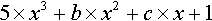
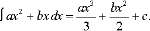
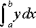
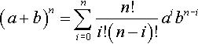
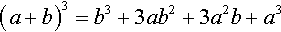
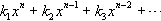
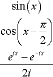

# Chapter 15
## Symbolic Mathematics with Canonical Forms

> Anything simple always interests me.

> -David Hockney

[Chapter 8](B978008057115750008X.xhtml) started with high hopes: to take an existing pattern matcher, copy down some mathematical identities out of a reference book, and come up with a usable symbolic algebra system.
The resulting system *was* usable for some purposes, and it showed that the technique of rule-based translation is a powerful one.
However, the problems of [section 8.5](B978008057115750008X.xhtml#s0030) show that not everything can be done easily and efficiently within the rule-based pattern matching framework.

There are important mathematical transformations that are difficult to express in the rule-based approach.
For example, dividing two polynomials to obtain a quotient and remainder is a task that is easier to express as an algorithm-a program-than as a rule or set of rules.

In addition, there is a problem with efficiency.
Pieces of the input expressions are simplified over and over again, and much time is spent interpreting rules that do not apply.
[Section 9.6](B9780080571157500091.xhtml#s0035) showed some techniques for speeding up the program by a factor of 100 on inputs of a dozen or so symbols, but for expressions with a hundred or so symbols, the speed-up is not enough.
We can do better by designing a specialized representation from the ground up.

Serious algebraic manipulation programs generally enforce a notion of *canonical simplification.* That is, expressions are converted into a canonical internal format that may be far removed from the input form.
They are then manipulated, and translated back to external form for output.
Of course, the simplifier we have already does this kind of translation, to some degree.
It translates `(3 + x + -3 + y)` into `(+ x y)` internally, and then outputs it as `(x + y)`.
But a *canonical* representation must have the property that any two expressions that are equal have identical canonical forms.
In our system the expression `(5 + y + x + -5)`is translated to the internal form `(+ y x)`, which is not identical to `(+ x y)`, even though the two expressions are equal.
Thus, our system is not canonical.
Most of the problems of the previous section stem from the lack of a canonical form.

Adhering to canonical form imposes grave restrictions on the representation.
For example, *x2*-  1 and (*x*- 1)(*x* + 1) are equal, so they must be represented identically.
One way to insure this is to multiply out all factors and collect similar terms.
So (*x*- 1)(*x* + 1) is *x2*- *x* + *x*- 1, which simplifies to *x2*-  1, in whatever the canonical internal form is.
This approach works fine for *x2*- 1, but for an expression like (*x*- 1)1000, multiplying out all factors would be quite time- (and space-) consuming.
It is hard to find a canonical form that is ideal for all problems.
The best we can do is choose one that works well for the problems we are most likely to encounter.

## 15.1 A Canonical Form for Polynomials
{:#s0010}
{:.h1hd}

This section will concentrate on a canonical form for *polynomials.* Mathematically speaking, a polynomial is a function (of one or more variables) that can be computed using only addition and multiplication.
We will speak of a polynomial's *main variable, coefficients,* and *degree.* In the polynomial:

5xx3+bxx2+cxx+1



the main variable is *x,* the degree is 3 (the highest power of *x*), and the coefficients are 5, *b, c* and 1.
We can define an input format for polynomials as follows:

1.  Any Lisp number is a polynomial.
!!!(p) {:.numlist}

2.  Any Lisp symbol is a polynomial.
!!!(p) {:.numlist}

3.  If *p* and *q* are polynomials, so are (*p + q*) and (*p * q*).
!!!(p) {:.numlist}

4.  If *p* is a polynomial and *n* is a positive integer, then (*p* ^ *n*) is a polynomial.
!!!(p) {:.numlist}

However, the input format cannot be used as the canonical form, because it would admit both `(x + y)` and `(y + x)`, and both `4` and `(2 + 2)`.

Before considering a canonical form for polynomials, let us see why polynomials were chosen as the target domain.
First, the volume of programming needed to support canonical forms for a larger class of expressions grows substantially.
To make things easier, we have eliminated complications like log and trig functions.
Polynomials are a good choice because they are closed under addition and multiplication: the sum or product of any two polynomials is a polynomial.
If we had allowed division, the result would not be closed, because the quotient of two polynomials need not be a polynomial.
As a bonus, polynomials are also closed under differentiation and integration, so we can include those operators as well.

Second, for sufficiently large classes of expressions it becomes not just difficult but impossible to define a canonical form.
This may be surprising, and we don't have space here to explain exactly why it is so, but here is an argument: Consider what would happen if we added enough functionality to duplicate all of Lisp.
Then "converting to canonical form" would be the same as "running a program." But it is an elementary result of computability theory that it is in general impossible to determine the result of running an arbitrary program (this is known as the halting problem).
Thus, it is not surprising that it is impossible to canonicalize complex expressions.

Our task is to convert a polynomial as previously defined into some canonical form.[1](#fn0015) Much of the code and some of the commentary on this format and the routines to manipulate it was written by Richard Fateman, with some enhancements made by Peter Klier.

The first design decision is to assume that we will be dealing mostly with *dense* polynomials, rather than *sparse* ones.
That is, we expect most of the polynomials to be like *ax*3*+ bx*2*+ cx* + *d,* not like *ax*100*+ bx*50 + *c.* For dense polynomials, we can save space by representing the main variable (*x* in these examples) and the individual coefficients (*a*, *b*, *c*, and *d* in these examples) explicitly, but representing the exponents only implicitly, by position.
Vectors will be used instead of lists, to save space and to allow fast access to any element.
Thus, the representation of 5*x*3+ 10*x*2+ 20*x +* 30 will be the vector:

```lisp
#(x 30 20 10 5)
```

The main variable, *x*, is in the 0th element of the vector, and the coefficient of the *i*th power of *x* is in element *i* + 1 of the vector.
A single variable is represented as a vector whose first coefficient is 1, and a number is represented as itself:

| []()              |                                        |
|-------------------|----------------------------------------|
| `#(x 30 20 10 5)` | represents 5*x*3 + 10*x*2 + 20*x* + 30 |
| `#(x 0 1)`        | represents *x*                         |
| `5`               | represents 5                           |

The fact that a number is represented as itself is a possible source of confusion.
The number 5, for example, is a polynomial by our mathematical definition of polynomials.
But it is represented as 5, not as a vector, so `(typep 5 'polynomial)` will be false.
The word "polynomial" is used ambiguously to refer to both the mathematical concept and the Lisp type, but it should be clear from context which is meant.

A glossary for the canonical simplifier program is given in [figure  15.1](#f0010).

| []()                                                        |
|-------------------------------------------------------------|
|                       |
| Figure 15.1: Glossary for the Symbolic Manipulation Program |

*(ed: should be a markdown table)*

The functions defining the type `polynomial` follow.
Because we are concerned with efficiency, we proclaim certain short functions to be compiled inline, use the specific function `svref` (simple-vector reference) rather than the more general aref, and provide declarations for the polynomials using the special form the.
More details on efficiency issues are given in [Chapter 9](B9780080571157500091.xhtml).

```lisp
(proclaim '(inline main-var degree coef
```

              `var= var> poly make-poly))`

```lisp
(deftype polynomial () 'simple-vector)
(defun main-var (p) (svref (the polynomial p) 0))
(defun coef (p i)  (svref (the polynomial p) (+ i 1)))
(defun degree (p)  (-(length (the polynomial p)) 2))
```

We had to make another design decision in defining `coef`, the function to extract a coefficient from a polynomial.
As stated above, the *i*th coefficient of a polynomial is in element *i* + 1 of the vector.
If we required the caller of coef to pass in *i* + 1 to get *i,* we might be able to save a few addition operations.
The design decision was that this would be too confusing and error prone.
Thus, coef expects to be passed *i* and does the addition itself.

For our format, we will insist that main variables be symbols, while coefficients can be numbers or other polynomials.
A "production" version of the program might have to account for main variables like `(sin x)`, as well as other complications like + and * with more than two arguments, and noninteger powers.

Now we can extract information from a polynomial, but we also need to build and modify polynomials.
The function `poly` takes a variable and some coefficients and builds a vector representing the polynomial.
`make-poly` takes a variable and a degree and produces a polynomial with all zero coefficients.

```lisp
(defun poly (x &rest coefs)
```

    `"Make a polynomial with main variable x`

    `and coefficients in increasing order."`

    `(apply #'vector x coefs))`

```lisp
(defun make-poly (x degree)
```

    `"Make the polynomial 0 + 0*x + 0*x^2 + ... 0*x^degree"`

    `(let ((p (make-array (+ degree 2) : initial-element 0)))`

        `(setf (main-var p) x)`

        `p))`

A polynomial can be altered by setting its main variable or any one of its coefficients using the following `defsetf` forms.

```lisp
(defsetf main-var (p) (val)
```

  `'(setf (svref (the polynomial ,p) 0) ,val))`

```lisp
(defsetf coef (p i) (val)
```

  `'(setf (svref (the polynomial .p) (+ ,i 1)) .val))`

The function `poly` constructs polynomials in a fashion similar to `list` or `vector`: with an explicit list of the contents, `make-poly`, on the other hand, is like `make-array`: it makes a polynomial of a specified size.

We provide `setf` methods for modifying the main variable and coefficients.
Since this is the first use of `defsetf`, it deserves some explanation.
A `defsetf` form takes a function (or macro) name, an argument list, and a second argument list that must consist of a single argument, the value to be assigned.
The body of the form is an expression that stores the value in the proper place.
So the `defsetf` for `main-var` says that `(setf (main-varp) val)` is equivalent to `(setf (svref (the polynomial p) 0) val)`.
A `defsetf` is much like a `defmacro`, but there is a little less burden placed on the writer of `defsetf`.
Instead of passing `p` and `val` directly to the `setf` method, Common Lisp binds local variables to these expressions, and passes those variables to the `setf` method.
That way, the writer does not have to worry about evaluating the expressions in the wrong order or the wrong number of times.
It is also possible to gain finer control over the whole process with `define-setf-method`, as explained on [page 884](B978008057115750025X.xhtml#p884).

The functions `poly+poly, poly*poly` and `poly^n` perform addition, multiplication, and exponentiation of polynomials, respectively.
They are defined with several helping functions.
`k*poly` multiplies a polynomial by a constant, `k`, which may be a number or another polynomial that is free of polynomial `p`'s main variable.
`poly*same` is used to multiply two polynomials with the same main variable.
For addition, the functions `k+poly` and `poly+same` serve analogous purposes.
With that in mind, here's the function to convert from prefix to canonical form:

```lisp
(defun prefix->canon (x)
```

  `"Convert a prefix Lisp expression to canonical form.`

  `Exs: (+ (^ x 2) (* 3 x))` =>`#(x 0 3 1)`

      `(- (* (- x 1) (+ x 1)) (- (^ x 2) 1))` =>`0"`

  `(cond ((numberp x) x)`

      `((symbolp x) (poly x 0 1))`

      `((and (exp-p x) (get (exp-op x) 'prefix->canon))`

              `(apply (get (exp-op x) 'prefix->canon)`

          `(mapcar #'prefix->canon (exp-args x))))`

      `(t (error "Not a polynomial: ~a" x))))`

It is data-driven, based on the `prefix->canon` property of each operator.
In the following we install the appropriate functions.
The existing functions `poly*poly` and `poly^n` can be used directly.
But other operators need interface functions.
The operators + and - need interface functions that handle both unary and binary.

```lisp
(dolist (item '((+ poly+) (- poly-) (* poly*poly)
```

          `(^ poly^n) (D deriv-poly)))`

  `(setf (get (first item) 'prefix->canon) (second item)))`

```lisp
(defun poly+ (&rest args)
```

  `"Unary or binary polynomial addition."`

  `(ecase (length args)`

    `(1 (first args))`

    `(2 (poly+poly (first args) (second args)))))`

```lisp
(defun poly- (&rest args)
```

  `"Unary or binary polynomial subtraction."`

  `(ecase (length args)`

    `(1 (poly*poly -1 (first args)))`

    `(2 (poly+poly (first args) (poly*poly -1 (second args))))))`

The function `prefix->canon` accepts inputs that were not part of our definition of polynomials: unary positive and negation operators and binary subtraction and differentiation operators.
These are permissible because they can all be reduced to the elementary + and * operations.

Remember that our problems with canonical form all began with the inability to decide which was simpler: `(+ x y)` or `(+ y x)`.
In this system, we define a canonical form by imposing an ordering on variables (we use alphabetic ordering as defined by `string>`).
The rule is that a polynomial `p` can have coefficients that are polynomials in a variable later in the alphabet than `p`'s main variable, but no coefficients that are polynomials in variables earlier than `p`'s main variable.
Here's how to compare variables:

```lisp
(defun var= (x y) (eq x y))
(defun var> (x y) (string> x y))
```

The canonical form of the variable `x` will be `#(x 0 1)`, which is 0 x *x*0 + 1 x *x*1.
The canonical form of `(+ x y)` is `#(x #(y 0 1) 1)`.
It couldn't be `#(y #(x 0 1) 1)`, because then the resulting polynomial would have a coefficient with a lesser main variable.
The policy of ordering variables assures canonicality, by properly grouping like variables together and by imposing a particular ordering on expressions that would otherwise be commutative.

Here, then, is the code for adding two polynomials:

```lisp
(defun poly+poly (p q)
```

  `"Add two polynomials."`

  `(normalize-poly`

    `(cond`

      `((numberp p)                                            (k+poly p q))`

      `((numberp q)                                            (k+poly q p))`

      `((var= (main-var p) (main-var q)) (poly+same p q))`

      `((var> (main-var q) (main-var p)) (k+poly q p))`

      `(t                                                                (k+poly p q)))))`

```lisp
(defun k+poly (k p)
```

  `"Add a constant k to a polynomial p."`

  `(cond ((eql k 0) p)          ;; 0 + p = p`

        `((and (numberp k)(numberp p))`

                `(+ k p))              ;; Add numbers`

        `(t (let ((r (copy-poly p))) ;; Add k to x^0 term of p`

            `(setf (coef r 0) (poly+poly (coef r 0) k))`

            `r))))`

```lisp
(defun poly+same (p q)
```

  `"Add two polynomials with the same main variable."`

  `;; First assure that q is the higher degree polynomial`

  `(if (> (degree p) (degree q))`

      `(poly+same q p)`

      `;; Add each element of p into r (which is a copy of q).`

      `(let ((r (copy-poly q)))`

        `(loop for i from 0 to (degree p) do`

            `(setf (coef r i) (poly+poly (coef r i) (coef p i))))`

        `r)))`

```lisp
(defun copy-poly (p)
```

  `"Make a copy a polynomial."`

  `(copy-seq p))`

and the code for multiplying polynomials:

```lisp
(defun poly*poly (p q)
```

  `"Multiply two polynomials."`

  `(normalize-poly`

    `(cond`

      `((numberp p)                                            (k*poly p q))`

      `((numberp q)                                            (k*poly q p))`

      `((var= (main-var p) (main-var q)) (poly*same p q))`

      `((var> (main-var q) (main-var p)) (k*poly q p))`

      `(t                                                                (k*poly p q)))))`

```lisp
(defun k*poly (k p)
```

  `"Multiply a polynomial p by a constant factor k."`

  `(cond`

    `((eql k 0)      0)      ;; 0 * p = 0`

    `((eql kl)      p)      ;; 1 * p = p`

    `((and (numberp k)`

        `(numberp p)) (* k p)) ;; Multiply numbers`

    `(t ;; Multiply each coefficient`

      `(let ((r (make-poly (main-var p) (degree p))))`

              `;; Accumulate result in r; r[i] = k*p[i]`

              `(loop for i from 0 to (degree p) do`

          `(setf (coef r i) (poly*poly k (coef p i))))`

              `r))))`

The hard part is multiplying two polynomials with the same main variable.
This is done by creating a new polynomial, `r`, whose degree is the sum of the two input polynomials `p` and `q`.
Initially, all of `r`'s coefficients are zero.
A doubly nested loop multiplies each coefficient of `p` and `q` and adds the `result` into the appropriate coefficient of `r`.

```lisp
(defun poly*same (p q)
```

  `"Multiply two polynomials with the same variable."`

  `;; r[i] = p[0]*q[i] + p[l]*q[i-1] + ...`

  `(let* ((r-degree (+ (degree p) (degree q)))`

      `(r (make-poly (main-var p) r-degree)))`

    `(loop for i from 0 to (degree p) do`

        `(unless (eql (coef p i) 0)`

          `(loop for j from 0 to (degree q) do`

            `(setf (coef r (+ i j))`

              `(poly+poly (coef r (+ i j))`

                `(poly*poly (coef p i)`

                  `(coef q j)))))))`

    `r))`

Both `poly+poly` and `poly*poly` make use of the function `normalize-poly` to "normalize" the `result`.
The idea is that `(- (^ 5) (^ x 5))` should return 0, not `#(x 0 0 0 0 0 0)`.
Note that `normal` ize`-poly` is a destructive operation: it calls `delete,` which can actually alter its argument.
Normally this is a dangerous thing, but since `normalize-poly` is replacing something with its conceptual equal, no harm is done.

```lisp
(defun normalize-poly (p)
```

  `"Alter a polynomial by dropping trailing zeros."`

  `(if (numberp p)`

      `p`

      `(let ((p-degree (- (position 0 p :test (complement #'eql)`

                                    `:from-end t)`

                        `1)))`

        `(cond ((<= p-degree 0) (normalize-poly (coef p 0)))`

          `((< p-degree (degree p))`

            `(delete 0 p :start p-degree))`

          `(t p)))))`

There are a few loose ends to clean up.
First, the exponentiation function:

```lisp
(defun poly^n (p n)
```

  `"Raise polynomial p to the nth power, n>=0."`

  `(check-type n (integer 0 *))`

  `(cond ((= n 0) (assert (not (eql p 0))) 1)`

      `((integerp p) (expt p n))`

      `(t (poly*poly p (poly^n p (- n 1))))))`

## 15.2 Differentiating Polynomials
{:#s0015}
{:.h1hd}

The differentiation routine is easy, mainly because there are only two operators (+ and *) to deal with:

```lisp
(defun deriv-poly (p x)
```

  `"Return the derivative, dp/dx, of the polynomial p."`

  `;; If p is a number or a polynomial with main-var > x,`

  `;; then p is free of x, and the derivative is zero;`

  `;; otherwise do real work.`

  `;; But first, make sure X is a simple variable,`

  `;; of the form #(X 0 1).`

  `(assert (and (typep x 'polynomial) (= (degree x) 1)`

          `(eql (coef x 0) 0) (eql (coef x 1) 1)))`

    `(cond`

          `((numberp p) 0)`

          `((var> (main-var p) (main-var x)) 0)`

          `((var= (main-var p) (main-var x))`

            `;; d(a + bx + cx^2 + dx^3)/dx = b + 2cx + 3dx^2`

            `;; So, shift the sequence p over by 1, then`

            `;; put x back in, and multiply by the exponents`

            `(let ((r (subseq p 1)))`

            `(setf (main-var r) (main-var x))`

            `(loop for i from 1 to (degree r) do`

                `(setf (coef r i) (poly*poly (+ i 1) (coef r i))))`

            `(normalize-poly r)))`

          `(t ;; Otherwise some coefficient may contain x.
Ex:`

            `;; d(z + 3x + 3zx^2 + z^2x^3)/dz`

            `;; = 1 + 0 + 3x^2 + 2zx^3`

            `;; So copy p, and differentiate the coefficients.`

            `(let ((r (copy-poly p)))`

            `(loop for i from 0 to (degree p) do`

                `(setf (coef r i) (deriv-poly (coef r i) x)))`

            `(normalize-poly r)))))`

**Exercise  15.1 [h]** Integrating polynomials is not much harder than differentiating them.
For example:

&int;ax2+bxdx=ax33+bx22+c.



Write a function to integrate polynomials and install it in `prefix->canon`.

**Exercise  15.2 [m]** Add support for *definite* integrals, such as &int;abydx !!!(span) {:.hiddenClass} .
You will need to make up a suitable notation and properly install it in both `infix->prefix` and `prefix->canon`.
A full implementation of this feature would have to consider infinity as a bound, as well as the problem of integrating over singularises.
You need not address these problems.

## 15.3 Converting between Infix and Prefix
{:#s0020}
{:.h1hd}

All that remains is converting from canonical form back to prefix form, and from there back to infix form.
This is a good point to extend the prefix form to allow expressions with more than two arguments.
First we show an updated version of `prefix->infix` that handles multiple arguments:

```lisp
(defun prefix->infix (exp)
```

  `"Translate prefix to infix expressions.`

  `Handles operators with any number of args."`

  `(if (atom exp)`

      `exp`

      `(intersperse`

        `(exp-op exp)`

        `(mapcar #'prefix->infix (exp-args exp)))))`

```lisp
(defun intersperse (op args)
```

  `"Place op between each element of args.`

  `Ex: (intersperse '+ '(a b c))` =>`'(a + b + c)"`

  `(if (length=1 args)`

      `(first args)`

      `(rest (loop for arg in args`

            `collect op`

            `collect arg))))`

Now we need only convert from canonical form to prefix:

```lisp
(defun canon->prefix (p)
```

  `"Convert a canonical polynomial to a lisp expression."`

  `(if (numberp p)`

        `p`

        `(args->prefix`

            `'+ 0`

            `(loop for i from (degree p) downto 0`

                `collect (args->prefix`

                `'* 1`

                `(list (canon->prefix (coef pi))`

                  `(exponent->prefix`

                    `(main-var p) i)))))))`

```lisp
(defun exponent->prefix (base exponent)
```

  `"Convert canonical base'exponent to prefix form."`

  `(case exponent`

    `(0 1)`

    `(1 base)`

    `(t '(^ .base .exponent))))`

```lisp
(defun args->prefix (op identity args)
```

  `"Convert argl op arg2 op ... to prefix form."`

  `(let ((useful-args (remove identity args)))`

    `(cond ((null useful-args) identity)`

        `((and (eq op '*) (member 0 args)) 0)`

        `((length=1 args) (first useful-args))`

        `(t (cons op (mappend`

                `#'(lambda (exp)`

                `(if (starts-with exp op)`

                      `(exp-args exp)`

                      `(list exp)))`

            `useful-args))))))`

Finally, here's a top level to make use of all this:

```lisp
(defun canon (infix-exp)
```

  `"Canonicalize argument and convert it back to infix"`

  `(prefix->infix`

    `(canon->prefix`

      `(prefix->canon`

        `(infix->prefix infix-exp)))))`

```lisp
(defun canon-simplifier ()
```

  `"Read an expression, canonicalize it, and print the result."`

  `(loop`

    `(print 'canon>)`

    `(print (canon (read)))))`

and an example of it in use:

```lisp
> (canon-simplifier)
CANON> (3 + x + 4 - x)
7
CANON> (x + y + y + x)
((2 * X) + (2 * Y))
CANON> (3 * x + 4 * x)
(7 * X)
CANON> (3 * x + y + x + 4 * x)
((8 * X) + Y)
CANON> (3 * x + y + z + x + 4 * x)
((8 * X) + (Y + Z))
CANON> ((x + 1) ^ 10)
((X ^ 10) + (10 * (X ^ 9)) + (45 * (X ^ 8)) + (120 * (X ^ 7))
```

  `+ (210 * (X ^ 6)) + (252 * (X ^ 5)) + (210 * (X ^ 4))`

  `+ (120 * (X ^ 3)) + (45 * (X ^ 2)) + (10 * X) + 1)`

```lisp
CANON> ((x + 1) ^ 10 + (x - 1) ^ 10)
((2 * (X ^ 10)) + (90 * (X ^ 8)) + (420 * (X ^ 6))
```

  `+ (420 * (X ^ 4)) + (90 * (X ^ 2)) + 2)`

```lisp
CANON> ((x + 1) ^ 10 - (x - 1) ^ 10)
((20 * (X ^ 8)) + (240 * (X ^ 7)) + (504 * (X ^ 5))
```

  `+ (240 * (X ^ 3)) + (20 * X))`

```lisp
CANON> (3 * x ^ 3 + 4 * x * y * (x - 1) + x ^ 2 * (x + y))
((4 * (X ^ 3)) + ((5 * Y) * (X ^ 2)) + ((-4 * Y) * X))
CANON> (3 * x ^ 3 + 4 * x * w * (x - 1) + x ^ 2 * (x + w))
((((5 * (X ^ 2)) + (-4 * X)) * W) + (4 * (X ^ 3)))
CANON> (d (3 * x ^ 2 + 2 * x + 1) / d x)
((6 * X) + 2)
CANON> (d(z + 3 * x + 3 * z * x ^ 2 + z ^ 2 * x ^ 3) / d z)
(((2 * Z) * (X ^ 3)) + (3 * (X ^ 2)) + 1)
CANON> [Abort]
```

## 15.4 Benchmarking the Polynomial Simplifier
{:#s0025}
{:.h1hd}

Unlike the rule-based program, this version gets all the answers right.
Not only is the program correct (at least as far as these examples go), it is also fast.
We can compare it to the canonical simplifier originally written for MACSYMA !!!(span) {:.smallcaps} by William Martin (circa 1968), and modified by Richard Fateman.
The modified version was used by Richard Gabriel in his suite of Common Lisp benchmarks (1985).
The benchmark program is called `frpoly`, because it deals with polynomials and was originally written in the dialect Franz Lisp.
The `frpoly` benchmark encodes polynomials as lists rather than vectors, and goes to great lengths to be efficient.
Otherwise, it is similar to the algorithms used here (although the code itself is quite different, using progs and gos and other features that have fallen into disfavor in the intervening decades).
The particular benchmark we will use here is raising 1 ***+** x + y + z* to the 15th power:

```lisp
(defun r15-test ()
```

  `(let ((r (prefix->canon'(+ 1 (+ x (+ y z))))))`

    `(time (poly^n r 15))`

    `nil))`

This takes .97 seconds on our system.
The equivalent test with the original `frpoly` code takes about the same time: .98 seconds.
Thus, our program is as fast as production-quality code.
In terms of storage space, vectors use about half as much storage as lists, because half of each cons cell is a pointer, while vectors are all useful data.[2](#fn0020)

How much faster is the polynomial-based code than the rule-based version?
Unfortunately, we can't answer that question directly.
We can time `(simp ' ( (1 + x + y + z) ^ 15)))`.
This takes only a tenth of a second, but that is because it is doing no work at all-the answer is the same as the input!
Alternately, we can take the expression computed by `(poly^n r 15)`, convert it to prefix, and pass that `to simplify.
simplify` takes 27.8 seconds on this, so the rule-based version is much slower.
[Section 9.6](B9780080571157500091.xhtml#s0035) describes ways to speed up the rule-based program, and a comparison of timing data appears on [page 525](#p525).

There are always surprises when it comes down to measuring timing data.
For example, the alert reader may have noticed that the version of `poly^n` defined above requires *n* multiplications.
Usually, exponentiation is done by squaring a value when the exponent is even.
Such an algorithm takes only log *n* multiplications instead of *n.* We can add a line to the definition of `poly^n` to get an *O*(log *n*) algorithm:

```lisp
(defun poly^n (p n)
```

  `"Raise polynomial p to the nth power, n>=0."`

  `(check-type n (integer 0 *))`

  `(cond ((= n 0) (assert (not (eql p 0))) 1)`

      `((integerp p) (expt p n))`

      `((evenp n) (poly^2 (poly^n p (/ n 2)))) ;***`

      `(t (poly*poly p (poly^n p (- n 1))))))`

```lisp
(defun poly^2 (p) (poly*poly p p))
```

The surprise is that this takes *longer* to raise `*r*` to the 15th power.
Even though it does fewer `poly*poly` operations, it is doing them on more complex arguments, and there is more work altogether.
If we use this version of `poly^n,` then `r15-test` takes 1.6 seconds instead of .98 seconds.

By the way, this is a perfect example of the conceptual power of recursive functions.
We took an existing function, poly^n, added a single cond clause, and changed it from an *O*(*n*) to *O*(log *n*) algorithm.
(This turned out to be a bad idea, but that's beside the point.
It would be a good idea for raising integers to powers.) The reasoning that allows the change is simple: First, *pn* is certainly equal to (*p**n*/2)2 when *n* is even, so the change can't introduce any wrong answers.
Second, the change continues the policy of decrementing *n* on every recursive call, so the function must eventually termina te (when *n =* 0).
If it gives no wrong answers, and it terminates, then it must give the right answer.

In contrast, making the change for an iterative algorithm is more complex.
The initial algorithm is simple:

```lisp
(defun poly^n (p n)
```

  `(let ((result 1))`

    `(loop repeat n do (setf result (poly*poly p result)))`

    `result))`

But to change it, we have to change the repeat loop to a `while` loop, explicitly put in the decrement of *n*, and insert a test for the even case:

```lisp
(defun poly^n (p n)
```

  `(let ((result 1))`

    `(loop while (> n 0)`

      `do (if (evenp n)`

          `(setf p (poly^2 p)`

              `n (/ n 2))`

          `(setf result (poly*poly p result)`

              `n (- n 1))))`

    `result))`

For this problem, it is clear that thinking recursively leads to a simpler function that is easier to modify.

It turns out that this is not the final word.
Exponentiation of polynomials can be done even faster, with a little more mathematical sophistication.
[Richard Fateman's 1974](B9780080571157500285.xhtml#bb0380) paper on Polynomial Multiplication analyzes the complexity of a variety of exponentiation algorithms.
Instead of the usual asymptotic analysis (e.g.
*O*(*n*) or *O*(*n*2)), he uses a fine-grained analysis that computes the constant factors (e.g.
1000 x *n* or 2 x *n*2).
Such analysis is crucial for small values of *n*.
It turns out that for a variety of polynomials, an exponentiation algorithm based on the binomial theorem is best.
The binomial theorem states that

a+bn=&Sigma;i=0nn!i!n-i!aibn-i



for example,

a+b3=b3+3ab2+3a2b+a3



We can use this theorem to compute a power of a polynomial all at once, instead of computing it by repeated multiplication or squaring.
Of course, a polynomial will in general be a sum of more than two components, so we have to decid`e` how to split it into the *a* and *b* pieces.
There are two obvious ways: either eut the polynomial in half, so that *a* and *b* will be of equal size, or split off one component at a time.
Fateman shows that the latter method is more efficient in most cases.
In other words, a polynomial k1xn+k2xn-1+k3xn-2+... !!!(span) {:.hiddenClass}  will be treated as the sum *a + b* where *a*=  *k*1*xn* and *b* is the rest of the polynomial.

Following is the code for binomial exponentiation.
It is somewhat messy, because the emphasis is on efficiency.
This means reusing some data and using `p-add-into!` instead of the more general `poly+poly`.

```lisp
(defun poly^n (p n)
```

  `"Raise polynomial p to the nth power, n>=0."`

  `;; Uses the binomial theorem`

  `(check-type n (integer 0 *))`

  `(cond`

    `((= n 0) 1)`

    `((integerp p) (expt p n))`

    `(t ;; First: split the polynomial p = a + b, where`

      `;; a = k*x^d and b is the rest of p`

      `(let ((a (make-poly (main-var p) (degree p)))`

        `(b (normalize-poly (subseq p 0 (- (length p) 1))))`

        `;; Allocate arrays of powers of a and b:`

        `(a^n (make-array (+ n 1)))`

        `(b^n (make-array (+ n 1)))`

        `;; Initialize the result:`

        `(result (make-poly (main-var p) (* (degree p) n))))`

      `(setf (coef a (degree p)) (coef p (degree p)))`

      `;; Second: Compute powers of a^i and b^i for i up to n`

      `(setf (aref a^n 0) 1)`

      `(setf (aref b^n 0) 1)`

      `(loop for i from 1 to n do`

          `(setf (aref a^n i) (poly*poly a (aref a^n (- i 1))))`

          `(setf (aref b^n i) (poly*poly b (aref b^n (- i 1)))))`

      `;; Third: add the products into the result,`

      `;; so that result[i] = (n choose i) * a^i * b^(n-i)`

      `(let ((c 1)) ;; c helps compute (n choose i) incrementally`

        `(loop for i from 0 to n do`

            `(p-add-into!
result c`

                `(poly*poly (aref a^n i)`

                    `(aref b^n (- n i))))`

            `(setf c (/ (* c (- n i)) (+ i 1)))))`

      `(normalize-poly result)))))`

`(defun p-add-into!
(result c p)`

  `"Destructively add c*p into result."`

  `(if (or (numberp p)`

          `(not (var= (main-var p) (main-var result))))`

      `(setf (coef result 0)`

            `(poly+poly (coef result 0) (poly*poly c p)))`

      `(loop for i from 0 to (degree p) do`

            `(setf (coef result i)`

                `(poly+poly (coef result i) (poly*poly c (coef p i))))))`

  `result)`

Using this version of `poly^n, r15-test` takes only .23 seconds, four times faster than the previous version.
The following table compares the times for `r15-test` with the three versions of `poly^n`, along with the times for applying `simply` to the `r15` polynomial, for various versions of `simplify`:


|      | program                 | secs | speed-up |
|------|-------------------------|------|----------|
|      | **rule-based versions** |      |          |
| 1    | original                | 27.8 | -        |
| 2    | memoization             | 7.7  | 4        |
| 3    | memo+index              | 4.0  | 7        |
| 4    | compilation only        | 2.5  | 11       |
| 5    | memo+compilation        | 1.9  | 15       |
|      | **canonical versions**  |      |          |
| 6    | squaring `poly^n`       | 1.6  | 17       |
| 7    | iterative `poly^n`      | .98  | 28       |
| 8    | binomial `poly^n`       | .23  | 120      |

As we remarked earlier, the general techniques of memoization, indexing, and compilation provide for dramatic speed-ups.
However, in the end, they do not lead to the fastest program.
Instead, the fastest version was achieved by throwing out the original rule-based program, replacing it with a canonical-form-based program, and fine-tuning the algorithms within that program, using mathematical analysis.

Now that we have achieved a sufficiently fast system, the next two sections concentrate on making it more powerful.

## 15.5 A Canonical Form for Rational Expressions
{:#s0030}
{:.h1hd}

A *rational* number is defined as a fraction: the quotient of two integers.
A *rational expression* is hereby defined as the quotient of two polynomials.
This section presents a canonical form for rational expressions.

First, a number or polynomial will continue to be represented as before.
The quotient of two polynomials will be represented as a cons cells of numerator and denominator pairs.
However, just as Lisp automatically reduces rational numbers to simplest form (6/8 is represented as 3/4), we must reduce rational expressions.
So, for example, (*x*2- 1)/(*x*- 1) must be reduced to *x* + 1, not left as a quotient of two polynomials.

The following functions build and access rational expressions but do not reduce to simplest form, except in the case where the denominator is a number.
Building up the rest of the functionality for full rational expressions is left to a series of exercises:

```lisp
(defun make-rat (numerator denominator)
```

  `"Build a rational: a quotient of two polynomials."`

  `(if (numberp denominator)`

      `(k*poly (/ 1 denominator) numerator)`

      `(cons numeratordenominator)))`

```lisp
(defun rat-numerator (rat)
```

  `"The numerator of a rational expression."`

  `(typecase rat`

    `(cons (car rat))`

    `(number (numerator rat))`

    `(t rat)))`

```lisp
(defun rat-denominator (rat)
```

  `"The denominator of a rational expression."`

  `(typecase rat`

    `(cons (cdr rat))`

    `(number (denominator rat))`

    `(t 1)))`

**Exercise  15.3 [s]** Modify `prefix->canon` to accept input of the form `x / y` and to return rational expressions instead of polynomials.
Also allow for input of the form `x ^ - n`.

**Exercise  15.4 [m]** Add arithmetic routines for multiplication, addition, and division of rational expressions.
Call them `rat*rat, rat+rat`, and `rat/rat` respectively.
They will call upon `poly*poly.
poly+poly` and a new function, `poly/poly`, which is defined in the next exercise.

**Exercise  15.5 [h]** Define `poly-gcd`, which computes the greatest common divisor of two polynomials.

**Exercise  15.6 [h]** Using `poly-gcd`, define the function `poly/poly`, which will implement division for polynomials.
Polynomials are closed under addition and multiplication, so `poly+poly` and `poly*poly` both returned polynomials.
Polynomials are not closed under division, so `poly/poly` will return a rational expression.

## 15.6 Extending Rational Expressions
{:#s0035}
{:.h1hd}

Now that we can divide polynomials, the final step is to reinstate the logarithmic, exponential, and trigonometrie functions.
The problem is that if we allow all these functions, we get into problems with canonical form again.
For example, the following three expressions are all equivalent  :

sinxcosx-&pi;2eix-e-ix2i



If we are interested in assuring we have a canonical form, the safest thing is to allow only *e**x*** and log(*x*).
All the other functions can be defined in terms of these two.
With this extension, the set of expressions we can form is closed under differentiation, and it is possible to canonicalize expressions.
The `result` is a mathematically sound construction known as a *differentiable field.* This is precisely the construct that is assumed by the Risch integration algorithm ([Risch 1969](B9780080571157500285.xhtml#bb0985),[1979](B9780080571157500285.xhtml#bb0990)).

The disadvantage of this minimal extension is that answers may be expressed in unfamiliar terms.
The user asks for *d* sin(*x2*)*/dx,* expecting a simple answer in terms of cos, and is surprised to see a complex answer involving *eix*.
Because of this problem, most computer algebra systems have made more radical extensions, allowing sin, cos, and other functions.
These systems are treading on thin mathematical ice.
Algorithms that would be guaranteed to work over a simple differentiable field may fail when the domain is extended this way.
In general, the result will not be a wrong answer but rather the failure to find an answer at all.

## 15.7 History and References
{:#s0040}
{:.h1hd}

A brief history of symbolic algebra systems is given in [chapter 8](B978008057115750008X.xhtml).
[Fateman (1979)](B9780080571157500285.xhtml#bb0385), [Martin and Fateman (1971)](B9780080571157500285.xhtml#bb0775), and [Davenport et al.
(1988)](B9780080571157500285.xhtml#bb0270) give more details on the MACSYMA !!!(span) {:.smallcaps} system, on which this chapter is loosely based.
[Fateman (1991)](B9780080571157500285.xhtml#bb0390) discusses the `frpoly` benchmark and introduces the vector implementation used in this chapter.

## 15.8 Exercises
{:#s0045}
{:.h1hd}

**Exercise 15.7 [h]** Implement an extension of the rationals to include logarithmic, exponential, and trigonometrie functions.

**Exercise 15.8 [m]** Modify `deriv` to handle the extended rational expressions.

**Exercise 15.9 [d]** Adapt the integration routine from [section 8.6](B9780080571157500078.xhtml#s0035) ([page 252](B978008057115750008X.xhtml#p252)) to the rational expression representation.
[Davenport et al.
1988](B9780080571157500285.xhtml#bb0270) may be useful.

**Exercise 15.10 [s]** Give several reasons why constant polynomials, like 3, are represented as integers rather than as vectors.

## 15.9 Answers
{:#s0050}
{:.h1hd}

**Answer 15.4**

```lisp
(defun rat*rat (x y)
```

  `"Multiply rationals: a/b * c/d = a*c/b*d"`

  `(poly/poly (poly*poly (rat-numerator x)`

                `(rat-numerator y))`

        `(poly*poly (rat-denominator x)`

                `(rat-denominator y))))`

```lisp
(defun rat+rat (x y)
```

  `"Add rationals: a/b + c/d = (a*d + c*b)/b*d"`

  `(let ((a (rat-numerator x))`

        `(b (rat-denominator x))`

        `(c (rat-numerator y))`

        `(d (rat-denominator y)))`

    `(poly/poly (poly+poly (poly*poly a d) (poly*poly c b))`

              `(poly*poly b d))))`

```lisp
(defun rat/rat (x y)
```

  `"Divide rationals: a/b / c/d - a*d/b*c"`

  `(rat*rat x (make-rat (rat-denominator y) (rat-numerator y))))`

**Answer 15.6**

```lisp
(defun poly/poly (p q)
```

  `"Divide p by q: if d is the greatest common divisor of p and q`

  `then p/q = (p/d) / (q/d).
Note if q-1.
then p/q = p."`

  `(if (eql q 1)`

      `p`

      `(let ((d (poly-gcd p q)))`

        `(make-rat (poly/poly p d)`

                `(poly/poly q d)))))`

**Answer 15.10** (1) An integer takes less time and space to process.
(2) Representing numbers as a polynomial would cause an infinit`e` regress, because the coefficients would be numbers.
(3) Unless a policy was decided upon, the representation would not be canonical, since `#(x 3)` and `#(y 3)` both represent 3.

----------------------

[1](#xfn0015) In fact, the algebraic properties of polynomial arithmetic and its generalizations fit so well with ideas in data abstraction that an extended example (in Scheme) on this topic is provided in *Structure and Interpretation of Computer Programs* by Abelson and Sussman (see section 2.4.3, [pages 153](B9780080571157500054.xhtml#p153)-[166](B9780080571157500054.xhtml#p166)).
We'll pursue a slightly different approach here.
!!!(p) {:.ftnote1}

[2](#xfn0020) Note: systems that use `"`cdr-coding`"` take about the same space for lists that are allocated all at once as for vectors.
But cdr-coding is losing favor as RISC chips replace microcoded processors.
!!!(p) {:.ftnote1}

