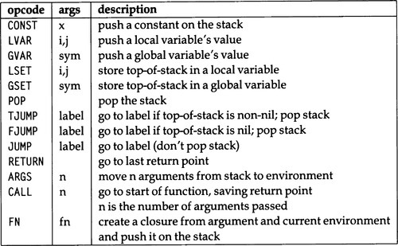
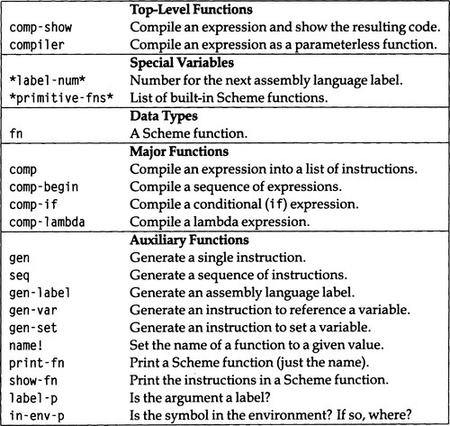
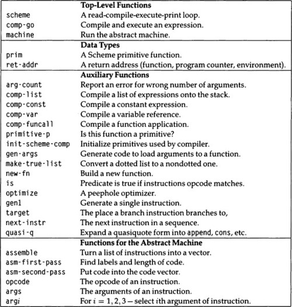

# Chapter 23
## Compiling Lisp

Many textbooks show simple interpreters for Lisp, because they are simple to write, and because it is useful to know how an interpreter works.
Unfortunately, not as many textbooks show how to write a compiler, even though the same two reasons hold.
The simplest compiler need not be much more complex than an interpreter.

One thing that makes a compiler more complex is that we have to describe the output of the compiler: the instruction set of the machine we are compiling for.
For the moment let's assume a stack-based machine.
The calling sequence on this machine for a function call with *n* arguments is to push the *n* arguments onto the stack and then push the function to be called.
A `"CALL *n*"` instruction saves the return point on the stack and goes to the first instruction of the called function.
By convention, the first instruction of a function will always be `"ARGS *n*"`, which pops *n* arguments off the stack, putting them in the new function's environment, where they can be accessed by `LVAR` and `LSET` instructions.
The function should return with a `RETURN` instruction, which resets the program counter and the environment to the point of the original `CALL` instruction.

In addition, our machine has three `JUMP` instructions; one that branches unconditionally, and two that branch depending on if the top of the stack is nil or non-nil.
There is also an instruction for popping unneeded values off the stack, and for accessing and altering global variables.
The instruction set is shown in [figure 23.1](#f0010).
A glossary for the compiler program is given in [figure 23.2](#f0015).
A summary of a more complex version of the compiler appears on [page 795](#p795).

| []() |
|---|
|  |
| Figure 23.1: Instruction Set for Hypothetical Stack Machine |

*(ed: should be a markdown table)*

| []() |
|---|
|  |
| Figure 23.2: Glossary for the Scheme Compiler |

*(ed: should be a markdown table)*


As an example, the procedure

```lisp
(lambda () (if (= x y) (f (g x)) (h x y (h 1 2))))
```

should compile into the following instructions:

| []()  |          |      |
|-------|----------|------|
|       | `ARGS`   | `0`  |
|       | `GVAR`   | `X`  |
|       | `GVAR`   | `Y`  |
|       | `GVAR`   | `=`  |
|       | `CALL`   | `2`  |
|       | `FJUMP`  | `L1` |
|       | `GVAR`   | `X`  |
|       | `GVAR`   | `G`  |
|       | `CALL`   | `1`  |
|       | `GVAR`   | `F`  |
|       | `CALL`   | `1`  |
|       | `JUMP`   | `L2` |
| `L1:` | `GVAR`   | `X`  |
|       | `GVAR`   | `Y`  |
|       | `CONST`  | `1`  |
|       | `CONST`  | `2`  |
|       | `GVAR`   | `H`  |
|       | `CALL`   | `2`  |
|       | `GVAR`   | `H`  |
|       | `CALL`   | `3`  |
| `L2:` | `RETURN` |      |

The first version of the Scheme compiler is quite simple.
It mimics the structure of the Scheme evaluator.
The difference is that each case generates code rather than evaluating a subexpression:

```lisp
(defun comp (x env)
    "Compile the expression x into a list of instructions."
    (cond
        ((symbolp x) (gen-var x env))
        ((atom x) (gen 'CONST x))
        ((scheme-macro (first x)) (comp (scheme-macro-expand x) env))
        ((case (first x)
            (QUOTE (gen 'CONST (second x)))
            (BEGIN (comp-begin (rest x) env))
```

`            (SET!
(seq (comp (third x) env) (gen-set (second x) env)))`

```lisp
            (IF (comp-if (second x) (third x) (fourth x) env))
            (LAMBDA (gen 'FN (comp-lambda (second x) (rest (rest x)) env)))
            ;; Procedure application:
            ;; Compile args, then fn, then the call
            (t    (seq (mappend #'(lambda (y) (comp y env)) (rest x))
                              (comp (first x) env)
                    (gen 'call (length (rest x)))))))))
```

The compiler `comp` has the same nine cases-in fact the exact same structure-as the interpreter `interp` from [chapter 22](B9780080571157500224.xhtml).
Each case is slightly more complex, so the three main cases have been made into separate functions: `comp-begin`, `comp-if`, and `comp-lambda.` A `begin` expression is compiled by compiling each argument in turn but making sure to pop each value but the last off the stack after it is computed.
The last element in the `begin` stays on the stack as the value of the whole expression.
Note that the function `gen` generates a single instruction (actually a list of one instruction), and `seq` makes a sequence of instructions out of two or more subsequences.

```lisp
(defun comp-begin (exps env)
    "Compile a sequence of expressions, popping all but the last."
    (cond ((null exps) (gen 'CONST nil))
                ((length=l exps) (comp (first exps) env))
                (t (seq (comp (first exps) env)
                                (gen 'POP)
                                (comp-begin (rest exps) env)))))
```

An `if` expression is compiled by compiling the predicate, then part, and else part, and by inserting appropriate branch instructions.

```lisp
(defun comp-if (pred then else env)
    "Compile a conditional expression."
    (let ((L1 (gen-label))
                (L2 (gen-label)))
        (seq (comp pred env) (gen 'FJUMP L1)
                  (comp then env) (gen 'JUMP L2)
                  (list L1) (comp else env)
                  (list L2))))
```

Finally, a `lambda` expression is compiled by compiling the body, surrounding it with one instruction to set up the arguments and another to return from the function, and then storing away the resulting compiled code, along with the environment.
The data type `fn` is implemented as a structure with slots for the body of the code, the argument list, and the name of the function (for printing purposes only).

```lisp
(defstruct (fn (:print-function print-fn))
    code (env nil)(name nil) (args nil))
(defun comp-lambda (args body env)
    "Compile a lambda form into a closure with compiled code."
    (assert (and (listp args) (every #'symbolp args)) ()
                    "Lambda arglist must be a list of symbols, not ~  a" args)
```

`    ;; For now.
no &rest parameters.`

```lisp
    ;; The next version will support Scheme's version of &rest
    (make-fn
        :env env :args args
        :code (seq (gen 'ARGS (length args))
                              (comp-begin body (cons args env))
                              (gen 'RETURN))))
```

The advantage of compiling over interpreting is that much can be decided at compile time.
For example, the compiler can determine if a variable reference is to a global or lexical variable, and if it is to a lexical variable, exactly where that lexical variable is stored.
This computation is done only once by the compiler, but it has to be done each time the expression is encountered by the interpreter.
Similarly, the compiler can count up the number of arguments once and for all, while the interpreter must go through a loop, counting up the number of arguments, and testing for the end of the arguments after each one is interpreted.
So it is clear that the compiler can be more efficient than the interpreter.

Another advantage is that the compiler can be more robust.
For example, in `comp-lambda,` we check that the parameter list of a lambda expression is a list containing only symbols.
It would be too expensive to make such checks in an interpreter, but in a compiler it is a worthwhile trade-off to check once at compile time for error conditions rather than checking repeatedly at run time.

Before we show the rest of the compiler, here's a useful top-level interface to `comp`:

```lisp
(defvar *label-num* 0)
(defun compiler (x)
    "Compile an expression as if it were in a parameterless lambda."
    (setf *label-num* 0)
    (comp-lambda '() (list x) nil))
(defun comp-show (x)
    "Compile an expression and show the resulting code"
  (show-fn (compiler x))
    (values))
```

Now here's the code to generate individual instructions and sequences of instructions.
A sequence of instructions is just a list, but we provide the function `seq` rather than using `append` directly for purposes of data abstraction.
A label is just an atom.

```lisp
(defun gen (opcode &rest args)
    "Return a one-element list of the specified instruction."
    (list (cons opcode args)))
(defun seq (&rest code)
    "Return a sequence of instructions"
    (apply #'append code))
(defun gen-label (&optional (label 'L))
    "Generate a label (a symbol of the form Lnnn)"
    (intern (format nil "~a~d" label (incf *label-num*))))
```

Environments are now represented as lists of frames, where each frame is a sequence of variables.
Local variables are referred to not by their name but by two integers: the index into the list of frames and the index into the individual frame.
As usual, the indexes are zero-based.
For example, given the code:

```lisp
(let ((a 2.0)
          (b 2.1))
  (let ((c 1.0)
            (d 1.1))
    (let ((e 0.0)
          (f 0.1))
      (+ a b c d e f))))
```

the innermost environment is `((e f) (c d) (a b))`.
The function `in-env-p` tests if a variable appears in an environment.
If this environment were called `env`, then `(in-env-p 'f env)` would return `(2 1)` and `(in-env-p 'x env)` would return `nil`.

```lisp
(defun gen-var (var env)
    "Generate an instruction to reference a variable's value."
    (let ((p (in-env-p var env)))
        (if p
                (gen 'LVAR (first p) (second p) ";" var)
                (gen 'GVAR var))))
(defun gen-set (var env)
    "Generate an instruction to set a variable to top-of-stack."
    (let ((p (in-env-p var env)))
        (if p
                (gen 'LSET (first p) (second p) ";" var)
                (gen 'GSET var))))
```

Finally, we have some auxiliary functions to print out the results, to distinguish between labels and instructions, and to determine the index of a variable in an environment.
Scheme functions now are implemented as structures, which must have a field for the code, and one for the environment.
In addition, we provide a field for the name of the function and for the argument list; these are used only for debugging purposes, We'll adopt the convention that the `define` macro sets the function's name field, by calling `name` ! (which is not part of standard Scheme).

```lisp
(def-scheme-macro define (name &rest body)
  (if (atom name)
```

`      '(name!
(set!
,name . ,body) ',name)`

```lisp
    (scheme-macro-expand
        '(define ,(first name)
          (lambda ,(rest name) . ,body)))))
```

`(defun name!
(fn name)`

```lisp
  "Set the name field of fn, if it is an un-named fn."
  (when (and (fn-p fn) (null (fn-name fn)))
    (setf (fn-name fn) name))
  name)
;; This should also go in init-scheme-interp:
```

`(set-global-var!
'name!
#'name!)`

```lisp
(defun print-fn (fn &optional (stream *standard-output*) depth)
  (declare (ignore depth))
  (format stream "{~  a}" (or (fn-name fn) '??)))
(defun show-fn (fn &optional (stream *standard-output*) (depth 0))
    "Print all the instructions in a function.
    If the argument is not a function, just princ it,
    but in a column at least 8 spaces wide."
    (if (not (fn-p fn))
            (format stream "~8a" fn)
            (progn
                (fresh-line)
                (incf depth 8)
                (dolist (instr (fn-code fn))
                    (if (label-p instr)
                            (format stream "~a:" instr)
                            (progn
                                (format stream "~VT" depth)
                                (dolist (arg instr)
                                    (show-fn arg stream depth))
                                (fresh-line)))))))
(defun label-p (x) "Is x a label?" (atom x))
(defun in-env-p (symbol env)
```

`    "If symbol is in the environment.
return its index numbers."`

```lisp
    (let ((frame (find symbol env :test #'find)))
        (if frame (list (position frame env) (position symbol frame)))))
```

Now we are ready to show the compiler at work:

```
> (comp-show '(if (= x y) (f (g x)) (h x y (h 1 2))))
```

| []()  |          |      |
|-------|----------|------|
|       | `ARGS`   | `0`  |
|       | `GVAR`   | `X`  |
|       | `GVAR`   | `Y`  |
|       | `GVAR`   | `=`  |
|       | `CALL`   | `2`  |
|       | `FJUMP`  | `L1` |
|       | `GVAR`   | `X`  |
|       | `GVAR`   | `G`  |
|       | `CALL`   | `1`  |
|       | `GVAR`   | `F`  |
|       | `CALL`   | `1`  |
|       | `JUMP`   | `L2` |
| `L1:` | `GVAR`   | `X`  |
|       | `GVAR`   | `Y`  |
|       | `CONST`  | `1`  |
|       | `CONST`  | `2`  |
|       | `GVAR`   | `H`  |
|       | `CALL`   | `2`  |
|       | `GVAR`   | `H`  |
|       | `CALL`   | `3`  |
| `L2:` | `RETURN` |      |

This example should give the reader a feeling for the code generated by the compiler.

Another reason a compiler has an advantage over an interpreter is that the compiler can afford to spend some time trying to find a more efficient encoding of an expression, while for the interpreter, the overhead of searching for a more efficient interpretation usually offsets any advantage gained.
Here are some places where a compiler could do better than an interpreter (although our compiler currently does not):

```
> (comp-show '(begin "doc" (write x) y))
```

| []() |          |         |
|------|----------|---------|
|      | `ARGS`   | `0`     |
|      | `CONST`  | `doc`   |
|      | `POP`    |         |
|      | `GVAR`   | `X`     |
|      | `GVAR`   | `WRITE` |
|      | `CALL`   | `1`     |
|      | `POP`    |         |
|      | `GVAR`   | `Y`     |
|      | `RETURN` |         |

In this example, code is generated to push the constant "`doc`" on the stack and then immediately pop it off.
If we have the compiler keep track of what expressions are compiled "for value"-as y is the value of the expression above-and which are only compiled "for effect," then we can avoid generating any code at all for a reference to a constant or variable for effect.
Here's another example:

```
> (comp-show '(begin (+ (* a x) (f x)) x))
```

| []()     |     |
|----------|-----|
| `ARGS`   | `0` |
| `GVAR`   | `A` |
| `GVAR`   | `X` |
| `GVAR`   | `*` |
| `CALL`   | `2` |
| `GVAR`   | `X` |
| `GVAR`   | `F` |
| `CALL`   | `1` |
| `GVAR`   | `+` |
| `CALL`   | `2` |
| `POP`    |     |
| `GVAR`   | `X` |
| `RETURN` |     |

In this expression, if we can be assured that + and * refer to the normal arithmetic functions, then we can compile this as if it were `(begin (f x) x)`.
Furthermore, it is reasonable to assume that + and * will be instructions in our machine that can be invoked inline, rather than having to call out to a function.
Many compilers spend a significant portion of their time optimizing arithmetic operations, by taking into account associativity, commutativity, distributivity, and other properties.

Besides arithmetic, compilers often have expertise in conditional expressions.
Consider the following:

```
> (comp-show '(if (and p q) x y))
```

| []()  |          |       |
|-------|----------|-------|
|       | `ARGS`   | `0`   |
|       | `GVAR`   | `P`   |
|       | `FJUMP`  | `L3`  |
|       | `GVAR`   | `Q`   |
|       | `JUMP`   | `L4`  |
| `L3:` | `GVAR`   | `NIL` |
| `L4:` | `FJUMP`  | `L1`  |
|       | `GVAR`   | `X`   |
|       | `JUMP`   | `L2`  |
| `L1:` | `GVAR`   | `Y`   |
| `L2:` | `RETURN` |       |

Note that `(and p q)` macro-expands to `(if p q nil)`.
The resulting compiled code is correct, but inefficient.
First, there is an unconditional jump to `L4`, which labels a conditional jump to `L1`.
This could be replaced with a conditional jump to `L1`.
Second, at `L3` we load `NIL` and then jump on nil to `L1`.
These two instructions could be replaced by an unconditional jump to `L1`.
Third, the `FJUMP` to `L3` could be replaced by an `FJUMP` to `L1`, since we now know that the code at `L3` unconditionally goes to `L1`.

Finally, some compilers, particularly Lisp compilers, have expertise in function calling.
Consider the following:

```
> (comp-show '(f (g x y)))
```

| []() |          |     |
| ---  |----------|-----|
|      | `ARGS`   | `0` |
|      | `GVAR`   | `X` |
|      | `GVAR`   | `Y` |
|      | `GVAR`   | `G` |
|      | `CALL`   | `2` |
|      | `GVAR`   | `F` |
|      | `CALL`   | `1` |
|      | `RETURN` |     |

Here we call `g` and when `g` returns we call `f` , and when `f` returns we return from this function.
But this last return is wasteful; we push a return address on the stack, and then pop it off, and return to the next return address.
An alternative function-calling protocol involves pushing the return address before calling `g,` but then not pushing a return address before calling `f;` when `f` returns, it returns directly to the calling function, whatever that is.

Such an optimization looks like a small gain; we basically eliminate a single instruction.
In fact, the implications of this new protocol are enormous: we can now invoke a recursive function to an arbitrary depth without growing the stack at all-as long as the recursive call is the last statement in the function (or in a branch of the function when there are conditionals).
A function that obeys this constraint on its recursive calls is known as a *properly tail-recursive* function.
This subject was discussed in [section 22.3.](B9780080571157500224.xhtml#s0020)

All the examples so far have only dealt with global variables.
Here's an example using local variables:

```
> (comp-show '((lambda (x) ((lambda (y z) (f x y z)) 3 x)) 4))
```

| []()     |          |          |     |     |     |     |
|----------|----------|----------|-----|-----|-----|-----|
| `ARGS`   | `0`      |          |     |     |     |     |
| `CONST`  | `4`      |          |     |     |     |     |
| `FN`     |          |          |     |     |     |     |
|          | `ARGS`   | `1`      |     |     |     |     |
|          | `CONST`  | `3`      |     |     |     |     |
|          | `LVAR`   | `0`      | `0` | ;   | `X` |     |
|          | `FN`     |          |     |     |     |     |
|          |          | `ARGS`   | `2` |     |     |     |
|          |          | `LVAR`   | `1` | `0` | ;   | `X` |
|          |          | `LVAR`   | `0` | `0` | ;   | `Y` |
|          |          | `LVAR`   | `0` | `1` | `;` | `Z` |
|          |          | `GVAR`   | `F` |     |     |     |
|          |          | `CALL`   | `3` |     |     |     |
|          |          | `RETURN` |     |     |     |     |
|          | `CALL`   | `2`      |     |     |     |     |
|          | `RETURN` |          |     |     |     |     |
| `CALL`   | `1`      |          |     |     |     |     |
| `RETURN` |          |          |     |     |     |     |

The code is indented to show nested functions.
The top-level function loads the constant 4 and an anonymous function, and calls the function.
This function loads the constant 3 and the local variable `x`, which is the first (0th) element in the top (0th) frame.
It then calls the double-nested function on these two arguments.
This function loads `x, y`, and `z: x` is now the 0th element in the next-to-top (1st) frame, and `y` and `z` are the 0th and 1st elements of the top frame.
With all the arguments in place, the function `f` is finally called.
Note that no continuations are stored-`f` can return directly to the caller of this function.

However, all this explicit manipulation of environments is inefficient; in this case we could have compiled the whole thing by simply pushing 4, 3, and 4 on the stack and calling `f`.

## 23.1 A Properly Tail-Recursive Lisp Compiler
{:#s0010}
{:.h1hd}

In this section we describe a new version of the compiler, first by showing examples of its output, and then by examining the compiler itself, which is summarized in [figure 23.3](#f0020).
The new version of the compiler also makes use of a different function calling sequence, using two new instructions, `CALLJ` and `SAVE`.
As the name implies, `SAVE` saves a return address on the stack.
The `CALLJ` instruction no longer saves anything; it can be seen as an unconditional jump-hence the `J` in its name.

| []() |
|---|
|  |
| Figure 23.3: Glossary of the Scheme Compiler, Second Version |

*(ed: should be a markdown table)*

First, we see how nested function calls work:

```
> (comp-show '(f (g x)))
```

| []()  |         |      |
|-------|---------|------|
|       | `ARGS`  | `0`  |
|       | `SAVE`  | `K1` |
|       | `GVAR`  | `X`  |
|       | `GVAR`  | `G`  |
|       | `CALLJ` | `1`  |
| `K1:` | `GVAR`  | `F`  |
|       | `CALLJ` | `1`  |

The continuation point `K1` is saved so that g can return to it, but then no continuation is saved for f, so f returns to whatever continuation is on the stack.
Thus, there is no need for an explicit `RETURN` instruction.
The final `CALL` is like an unconditional branch.

The following example shows that all functions but the last `(f)` need a continuation point:

```
> (comp-show '(f (g (h x) (h y))))
```

| []()  |         |      |
|-------|---------|------|
|       | `ARGS`  | `0`  |
|       | `SAVE`  | `K1` |
|       | `SAVE`  | `K2` |
|       | `GVAR`  | `X`  |
|       | `GVAR`  | `H`  |
|       | `CALLJ` | `1`  |
| `K2:` | `SAVE`  | `K3` |
|       | `GVAR`  | `Y`  |
|       | `GVAR`  | `H`  |
|       | `CALLJ` | `1`  |
| `K3:` | `GVAR`  | `G`  |
|       | `CALLJ` | `2`  |
| `K1:` | `GVAR`  | `F`  |
|       | `CALLJ` | `1`  |

This code first computes `(h x)` and returns to `K2`.
Then it computes `(h y)` and returns to `K3`.
Next it calls `g` on these two values, and returns to `K1` before transferring to `f`.
Since whatever `f` returns will also be the final value of the function we are compiling, there is no need to save a continuation point for `f` to return to.

In the next example we see that unneeded constants and variables in `begin` expressions are ignored:

```
> (comp-show '(begin "doc" x (f x) y))
```

| []()  |          |      |
|-------|----------|------|
|       | `ARGS`   | `0`  |
|       | `SAVE`   | `K1` |
|       | `GVAR`   | `X`  |
|       | `GVAR`   | `F`  |
|       | `CALLJ`  | `1`  |
| `K1:` | `POP`    |      |
|       | `GVAR`   | `Y`  |
|       | `RETURN` |      |

One major flaw with the first version of the compiler is that it could pass data around, but it couldn't actually *do* anything to the data objects.
We fix that problem by augmenting the machine with instructions to do arithmetic and other primitive operations.
Unneeded primitive operations, like variables constants, and arithmetic operations are ignored when they are in the nonfinal position within `begins`.
Contrast the following two expressions:

```
> (comp-show '(begin (+ (* a x) (f x)) x))
```

| []()  |          |      |
|-------|----------|------|
|       | `ARGS`   | `0`  |
|       | `SAVE`   | `K1` |
|       | `GVAR`   | `X`  |
|       | `GVAR`   | `F`  |
|       | `CALLJ`  | `1`  |
| `K1:` | `POP`    |      |
|       | `GVAR`   | `X`  |
|       | `RETURN` |      |

| `> (comp-show '(begin (+ (* a x) (f x))))` |

| []()  |          |      |
|-------|----------|------|
|       | `ARGS`   | `0`  |
|       | `GVAR`   | `A`  |
|       | `GVAR`   | `X`  |
|       | `*`      |      |
|       | `SAVE`   | `K1` |
|       | `GVAR`   | `X`  |
|       | `GVAR`   | `F`  |
|       | `CALLJ`  | `1`  |
| `K1:` | `+`      |      |
|       | `RETURN` |      |

The first version of the compiler was context-free, in that it compiled all equivalent expressions equivalently, regardless of where they appeared.
A properly tail-recursive compiler needs to be context-sensitive: it must compile a call that is the final value of a function differently than a call that is used as an intermediate value, or one whose value is ignored.
In the first version of the compiler, `comp-lambda` was responsible for generating the `RETURN` instruction, and all code eventually reached that instruction.
To make sure the `RETURN` was reached, the code for the two branches of `if` expressions had to rejoin at the end.

In the tail-recursive compiler, each piece of code is responsible for inserting its own `RETURN` instruction or implicitly returning by calling another function without saving a continuation point.

We keep track of these possibilities with two flags.
The parameter `val?` is true when the expression we are compiling returns a value that is used elsewhere.
The parameter `more?` is false when the expression represents the final value, and it is true when there is more to compute.
In summary, there are three possibilities:

| `val?` | `more?` | example: the `X` in:          |
|--------|---------|-------------------------------|
| true   | true    | `(if X y z)`*or*`(f X y)`     |
| true   | false   | `(if p X z)`*or*`(begin y X)` |
| false  | true    | `(begin X y)`                 |
| false  | false   | *impossible*                  |

The code for the compiler employing these conventions follows:

`(defun comp (x env val?
more?)`

```lisp
    "Compile the expression x into a list of instructions."
      (cond
```

`        ((member x '(t nil)) (comp-const x val?
more?))`

`        ((symbolp x) (comp-var x env val?
more?))`

`        ((atom x) (comp-const x val?
more?))`

`      ((scheme-macro (first x)) (comp (scheme-macro-expand x) env val?
more?))`

```lisp
        ((case (first x)
              (QUOTE (arg-count x 1)
```

`                            (comp-const (second x) val?
more?))`

`              (BEGIN (comp-begin (rest x) env val?
more?))`

`              (SET!
  (arg-count x 2)`

```lisp
                            (assert (symbolp (second x)) (x)
                                            "Only symbols can be set!, not ~  a in ~  a"
                                            (second x) x)
                            (seq (comp (third x) env t t)
                                      (gen-set (second x) env)
                                      (if (not val?) (gen 'POP))
```

`                                      (unless more?
(gen 'RETURN))))`

```lisp
            (IF    (arg-count x 2 3)
                      (comp-if (second x) (third x) (fourth x)
```

`                                        env val?
more?))`

```lisp
            (LAMBDA (when val?
                              (let ((f (comp-lambda (second x) (rest2 x) env)))
```

`                                  (seq (gen 'FN f) (unless more?
(gen 'RETURN))))))`

`            (t (comp-funcall (first x) (rest x) env val?
more?))))))`

Here we've added one more case: `t` and `nil` compile directly into primitive instructions, rather than relying on them being bound as global variables.
(In real Scheme, the Boolean values are `#t` and `#f`, which need not be quoted, the empty list is `()`, which must be quoted, and `t` and `nil` are ordinary symbols with no special significance.)

I've also added some error checking for the number of arguments supplied to quote, `set!` and `if`.
Note that it is reasonable to do more error checking in a compiler than in an interpreter, since the checking need be done only once, not each time through.
The function to check arguments is as follows:

```lisp
(defun arg-count (form min &optional (max min))
    "Report an error if form has wrong number of args."
    (let ((n-args (length (rest form))))
        (assert (<= min n-args max) (form)
            "Wrong number of arguments for ~  a in ~  a:
            ~d supplied, ~  d~@[ to ~  d  ~] expected"
          (first form) form n-args min (if (/= min max) max))))
```

**Exercise  23.1 [m]** Modify the compiler to check for additional compile-time errors suggested by the following erroneous expression:

```lisp
(cdr (+ (list x y) 'y (3 x) (car 3 x)))
```

The tail-recursive compiler still has the familiar nine cases, but I have introduced `comp-var, comp-const, comp-if,` and `comp-funcall` to handle the increased complexity introduced by the `var?` and `more?` parameters.

Let's go through the `comp-` functions one at a time.
First, `comp-begin` and `comp-list` just handle and pass on the additional parameters.
`comp-list` will be used in `comp-funcall`, a new function that will be introduced to compile a procedure application.

`(defun comp-begin (exps env val?
more?)`

```lisp
    "Compile a sequence of expressions,
    returning the last one as the value."
```

`    (cond ((null exps) (comp-const nil val?
more?))`

`                ((length=l exps) (comp (first exps) env val?
more?))`

```lisp
                (t (seq (comp (first exps) env nil t)
```

`                                (comp-begin (rest exps) env val?
more?)))))`

```lisp
(defun comp-list (exps env)
    "Compile a list, leaving them all on the stack."
    (if (null exps) nil
            (seq (comp (first exps) env t t)
                      (comp-list (rest exps) env))))
```

Then there are two trivial functions to compile variable access and constants.
If the value is not needed, these produce no instructions at all.
If there is no more to be done, then these functions have to generate the return instruction.
This is a change from the previous version of `comp`, where the caller generated the return instruction.
Note I have extended the machine to include instructions for the most common constants: t, nil, and some small integers.

`(defun comp-const (x val?
more?)`

```lisp
    "Compile a constant expression."
```

`    (if val?
(seq (if (member x '(t nil -  1 0 1 2))`

```lisp
                                        (gen x)
                                        (gen 'CONST x))
```

`                                  (unless more?
(gen 'RETURN)))))`

`(defun comp-var (x env val?
more?)`

```lisp
    "Compile a variable reference."
```

`    (if val?
(seq (gen-var x env) (unless more?
(gen 'RETURN)))))`

The remaining two functions are more complex.
First consider `comp-if` . Rather than blindly generating code for the predicate and both branches, we will consider some special cases.
First, it is clear that `(if t x y)` can reduce to `x` and `(if nil x y)` can reduce to `y`.
It is perhaps not as obvious that `(if p x x)` can reduce to `(begin p x)`, or that the comparison of equality between the two branches should be done on the object code, not the source code.
Once these trivial special cases have been considered, we're left with three more cases: `(if p x nil), (if p nil y),` and `(if p x y)`.
The pattern of labels and jumps is different for each.

`(defun comp-if (pred then else env val?
more?)`

```lisp
    "Compile a conditional (IF) expression."
    (cond
        ((null pred) ; (if nil x y) ==> y
```

`          (comp else env val?
more?))`

```lisp
        ((constantp pred) ; (if t x y) ==> x
```

`          (comp then env val?
more?))`

```lisp
        ((and (listp pred) ; (if (not p) x y) ==> (if p y x)
                    (length=l (rest pred))
                    (primitive-p (first pred) env 1)
                    (eq (prim-opcode (primitive-p (first pred) env 1)) 'not))
```

`          (comp-if (second pred) else then env val?
more?))`

```lisp
        (t (let ((pcode (comp pred env t t))
```

`                          (tcode (comp then env val?
more?))`

`                          (ecode (comp else env val?
more?)))`

```lisp
                  (cond
                      ((equal tcode ecode) ; (if p x x) ==> (begin p x)
                        (seq (comp pred env nil t) ecode))
                      ((null tcode) ; (if p nil y) ==> p (TJUMP L2) y L2:
                        (let ((L2 (gen-label)))
                          (seq pcode (gen 'TJUMP L2) ecode (list L2)
```

`                                    (unless more?
(gen 'RETURN)))))`

```lisp
                      ((null ecode) ; (if p x) ==> p (FJUMP L1) x L1:
                        (let ((L1 (gen-label)))
                          (seq pcode (gen 'FJUMP L1) tcode (list L1)
```

`                                    (unless more?
(gen 'RETURN)))))`

```lisp
                      (t                          ; (if p x y) ==> p (FJUMP L1) x L1: y
                                                    ; or p (FJUMP L1) x (JUMP L2) L1: y L2:
                        (let ((L1 (gen-label))
```

`                                    (L2 (if more?
(gen-label))))`

```lisp
                            (seq pcode (gen 'FJUMP L1) tcode
```

`                                      (if more?
(gen 'JUMP L2))`

`                                      (list L1) ecode (if more?
(list L2))))))))))`

Here are some examples of `if` expressions.
First, a very simple example:

```
> (comp-show '(if p (+ x y) (* x y)))
```

| []()   |          |      |
|--------|----------|------|
|        | `ARGS`   | `0`  |
|        | `GVAR`   | `P`  |
|        | `FJUMP`  | `L1` |
|        | `GVAR`   | `X`  |
|        | `GVAR`   | `Y`  |
|        | `+`      |      |
|        | `RETURN` |      |
| `L1 :` | `GVAR`   | `X`  |
|        | `GVAR`   | `Y`  |
|        | `*`      |      |
|        | `RETURN` |      |

Each branch has its own `RETURN` instruction.
But note that the code generated is sensitive to its context.
For example, if we put the same expression inside a `begin` expression, we get something quite different:

```
> (comp-show '(begin (if p (+ x y) (* x y)) z))
```

| []() |          |     |
|------|----------|-----|
|      | `ARGS`   | `0` |
|      | `GVAR`   | `Z` |
|      | `RETURN` |     |

What happens here is that `(+ x y)` and `(* x y)`, when compiled in a context where the value is ignored, both resuit in no generated code.
Thus, the `if` expression reduces to `(if p nil nil)`, which is compiled like `(begin p nil)`, which also generates no code when not evaluated for value, so the final code just references `z`.
The compiler can only do this optimization because it knows that `+` and `*` are side-effect-free operations.
Consider what happens when we replace + with `f` :

```
> (comp-show '(begin (if p (f x) (* x x)) z))
```

| []()  |          |      |
|-------|----------|------|
|       | `ARGS`   | `0`  |
|       | `GVAR`   | `P`  |
|       | `FJUMP`  | `L2` |
|       | `SAVE`   | `K1` |
|       | `GVAR`   | `X`  |
|       | `GVAR`   | `F`  |
|       | `CALLJ`  | `1`  |
| `K1:` | `POP`    |      |
| `L2:` | `GVAR`   | `Z`  |
|       | `RETURN` |      |

Here we have to call `(f x)` if `p` is true (and then throw away the value returned), but we don't have to compute `(* x x)` when `p` is false.

These examples have inadvertently revealed some of the structure of `comp-funcall`, which handles five cases.
First, it knows some primitive functions that have corresponding instructions and compiles these instructions inline when their values are needed.
If the values are not needed, then the function can be ignored, and just the arguments can be compiled.
This assumes true functions with no side effects.
If there are primitive operations with side effects, they too can be compiled inline, but the operation can never be ignored.
The next case is when the function is a lambda expression of no arguments.
We can just compile the body of the lambda expression as if it were a `begin` expression.
Nonprimitive functions require a function call.
There are two cases: when there is more to compile we have to save a continuation point, and when we are compiling the final value of a function, we can just branch to the called function.
The whole thing looks like this:

`(defun comp-funcall (f args env val?
more?)`

```lisp
    "Compile an application of a function to arguments."
    (let ((prim (primitive-p f env (length args))))
        (cond
            (prim ; function compilable to a primitive instruction
              (if (and (not val?) (not (prim-side-effects prim)))
                        ;; Side-effect free primitive when value unused
                        (comp-begin args env nil more?)
                        ;; Primitive with value or call needed
                        (seq (comp-list args env)
                                  (gen (prim-opcode prim))
```

`                                  (unless val?
(gen 'POP))`

`                                  (unless more?
(gen 'RETURN)))))`

```lisp
            ((and (starts-with f 'lambda) (null (second f)))
              ;; ((lambda () body)) => (begin body)
              (assert (null args) () "Too many arguments supplied")
```

`              (comp-begin` (`rest2 f) env val?
more?))`

`            (more?
; Need to save the continuation point`

```lisp
              (let ((k (gen-label 'k)))
                  (seq (gen 'SAVE k)
                            (comp-list args env)
                            (comp f env t t)
                            (gen 'CALLJ (length args))
                            (list k)
                            (if (not val?) (gen 'POP)))))
              (t          ; function call as rename plus goto
                (seq (comp-list args env)
                          (comp f env t t)
                          (gen 'CALLJ (length args)))))))
```

The support for primitives is straightforward.
The `prim` data type has five slots.
The first holds the name of a symbol that is globally bound to a primitive operation.
The second, `n-args`, is the number of arguments that the primitive requires.
We have to take into account the number of arguments to each function because we want `(+ x y)` to compile into a primitive addition instruction, while `(+ x y z)` should not.
It will compile into a call to the + function instead.
The `opcode` slot gives the opcode that is used to implement the primitive.
The `always` field is true if the primitive always returns non-nil, `false` if it always returns nil, and nil otherwise.
It is used in exercise 23.6.
Finally, the `side-effects` field says if the function has any side effects, like doing I/O or changing the value of an object.

```lisp
(defstruct (prim (:type list))
    symbol n-args opcode always side-effects)
(defparameter *primitive-fns*
    '((+  2 + true) (-  2 - true) (* 2 * true) (/ 2 / true)
        (< 2 <) (> 2 >) (<= 2 <=) (>= 2 >=) (/= 2 /=) (=  2 =)
```

`        (eq?
2  eq) (equal?
2 equal) (eqv?
2 eql)`

`        (not 1 not) (null?
1 not)`

```lisp
        (car 1 car) (cdr 1 cdr) (cadr 1 cadr) (cons 2 cons true)
        (list 1 list1 true) (list 2 list2 true) (list 3 list3 true)
        (read 0 read nil t) (write 1 write nil t) (display 1 display nil t)
        (newline 0 newline nil t) (compiler 1 compiler t)
```

`        (name!
2 name!
true t) (random 1 random true nil)))`

```lisp
(defun primitive-p (f env n-args)
    "F is a primitive if it is in the table, and is not shadowed
    by something in the environment, and has the right number of args."
    (and (not (in-env-p f env))
              (find f *primitive-fns*
                          :test #'(lambda (f prim)
                                              (and (eq f (prim-symbol prim))
                                                        (= n-args (prim-n-args prim)))))))
(defun list1 (x) (list x))
(defun list2 (x y) (list x y))
(defun list3 (x y z) (list x y z))
(defun display (x) (princ x))
(defun newline () (terpri))
```

These optimizations only work if the symbols are permanently bound to the global values given here.
We can enforce that by altering `gen-set` to preserve them as constants:

```lisp
(defun gen-set (var env)
    "Generate an instruction to set a variable to top-of-stack."
    (let ((p (in-env-p var env)))
        (if p
                (gen 'LSET (first p) (second p) ";" var)
                (if (assoc var *primitive-fns*)
                        (error "Can't alter the constant ~  a" var)
                        (gen 'GSET var)))))
```

Now an expression like `(+ x 1)` will be properly compiled using the + instruction rather than a subroutine call, and an expression like `(set ! + *)` will be flagged as an error when + is a global variable, but allowed when it has been locally bound.
However, we still need to be able to handle expressions like `(set ! add +)` and then `(add x y)`.
Thus, we need some function object that + will be globally bound to, even if the compiler normally optimizes away references to that function.
The function `init-scheme-comp` takes care of this requirement:

```lisp
(defun init-scheme-comp ()
    "Initialize the primitive functions."
    (dolist (prim *primitive-fns*)
          (setf (get (prim-symbol prim) 'global-val)
                      (new-fn :env nil :name (prim-symbol prim)
                                      :code (seq (gen 'PRIM (prim-symbol prim))
                                                            (gen 'RETURN))))))
```

There is one more change to make-rewriting `comp-lambda`.
We still need to get the arguments off the stack, but we no longer generate a `RETURN` instruction, since that is done by `comp-begin`, if necessary.
At this point we'll provide a hook for a peephole optimizer, which will be introduced in [section 23.4](#s0025), and for an assembler to convert the assembly language to machine code, `new-fn` provides this interface, but for now, `new-fn` acts just like `make-fn`.

We also need to account for the possibility of rest arguments in a lambda list.
A new function, `gen-rgs`, generates the single instruction to load the arguments of the stack.
It introduces a new instruction, `ARGS`., into the abstract machine.
This instruction works just like `ARGS`, except it also conses any remaining arguments on the stack into a list and stores that list as the value of the rest argument.
With this innovation, the new version of `comp-lambda` looks like this:

```lisp
(defun comp-lambda (args body env)
    "Compile a lambda form into a closure with compiled code."
    (new-fn :env env :args args
                    :code (seq (gen-args args 0)
                                          (comp-begin body
                                                                  (cons (make-true-list args) env)
                                                                  t nil))))
(defun gen-args (args n-so-far)
    "Generate an instruction to load the arguments."
    (cond ((null args) (gen 'ARGS n-so-far))
```

`                ((symbolp args) (gen 'ARGS.
n-so-far))`

```lisp
                ((and (consp args) (symbolp (first args)))
                  (gen-args (rest args) (+ n-so-far 1)))
                (t (error "Illegal argument list"))))
(defun make-true-list (dotted-list)
    "Convert a possibly dotted list into a true, non-dotted list."
    (cond ((null dotted-list) nil)
                ((atom dotted-list) (list dotted-list))
                (t (cons (first dotted-list)
                                  (make-true-list (rest dotted-list))))))
(defun new-fn (&key code env name args)
    "Build a new function."
    (assemble (make-fn :env env :name name :args args
                                          :code (optimize code))))
```

`new-fn` includes calls to an assembler and an optimizer to generate actual machine code.
For the moment, both will be identity functions:

```lisp
(defun optimize (code) code)
(defun assemble (fn) fn)
```

Here are some more examples of the compiler at work:

```
> (comp-show '(if (null? (car l)) (f (+ (* a x) b)) (g (/ x 2))))
```

| []()  |         |         |     |
|-------|---------|---------|-----|
|       | `ARGS`  | `0`     |     |
|       | `GVAR`  | `L`     |     |
|       | `CAR`   |         |     |
|       | `FJUMP` | `L1`    |     |
|       | `GVAR`  | `X`     |     |
|       | `2`     |         |     |
|       | /       |         |     |
|       | `GVAR`  | `G`     |     |
|       | `CALLJ` | `1`     |     |
| `L1:` | `GVAR`  | `A`     |     |
|       |         | `GVAR`  | `X` |
|       |         | `*`     |     |
|       |         | `GVAR`  | `B` |
|       |         | `+`     |     |
|       |         | `GVAR`  | `F` |
|       |         | `CALLJ` | `1` |

There is no need to save any continuation points in this code, because the only calls to nonprimitive functions occur as the final values of the two branches of the function.

```lisp
> (comp-show '(define (lastl l)
```

`                            (if (null?
(cdr l)) (car l)`

```lisp
                                    (last1 (cdr l)))))
```

| []()  |          |          |     |     |     |     |
|-------|----------|----------|-----|-----|-----|-----|
|       | `ARGS`   | `0`      |     |     |     |     |
|       | `FN`     |          |     |     |     |     |
|       | `ARGS`   | `1`      |     |     |     |     |
|       | `LVAR`   | `0`      | `0` | `;` | `L` |     |
|       | `CDR`    |          |     |     |     |     |
|       | `FJUMP`  | `L1`     |     |     |     |     |
|       | `LVAR`   | `0`      | `0` | `;` | `L` |     |
|       | `CDR`    |          |     |     |     |     |
|       | `GVAR`   | `LAST1`  |     |     |     |     |
|       | `CALLJ`  | `1`      |     |     |     |     |
| `L1:` |          | `LVAR`   | `0` | `0` | `;` | `L` |
|       |          | `CAR`    |     |     |     |     |
|       |          | `RETURN` |     |     |     |     |
|       | `GSET`   | `LAST1`  |     |     |     |     |
|       | `CONST`  | `LAST1`  |     |     |     |     |
|       | `NAME!`  |          |     |     |     |     |
|       | `RETURN` |          |     |     |     |     |

The top-level function just assigns the nested function to the global variable `last1`.
Since `last1` is tail-recursive, it has only one return point, for the termination case, and just calls itself without saving continuations until that case is executed.

Contrast that to the non-tail-recursive definition of `length` below.
It is not tail-recursive because before it calls `length` recursively, it must save a continuation point, `K1`, so that it will know where to return to to add 1.

```lisp
> (comp-show '(define (length l)
```

`                                (if (null?
l) 0 (+  1 (length (cdr l))))))`

| []()  |          |          |          |     |     |     |
|-------|----------|----------|----------|-----|-----|-----|
|       | `ARGS`   | `0`      |          |     |     |     |
|       | `FN`     |          |          |     |     |     |
|       |          | `ARGS`   | `1`      |     |     |     |
|       |          | `LVAR`   | `0`      | `0` | `;` | `L` |
|       |          | `FJUMP`  | `L2`     |     |     |     |
|       |          | `1`      |          |     |     |     |
|       |          | `SAVE`   | `K1`     |     |     |     |
|       |          | `LVAR`   | `0`      | `0` | `;` | `L` |
|       |          | `CDR`    |          |     |     |     |
|       |          | `GVAR`   | `LENGTH` |     |     |     |
|       |          | `CALLJ`  | `1`      |     |     |     |
| `K1:` |          | `+`      |          |     |     |     |
|       |          | `RETURN` |          |     |     |     |
| `L2`  |          | `0`      |          |     |     |     |
|       |          | `RETURN` |          |     |     |     |
|       | `GSET`   | `LENGTH` |          |     |     |     |
|       | `CONST`  | `LENGTH` |          |     |     |     |
|       | `NAME!`  |          |          |     |     |     |
|       | `RETURN` |          |          |     |     |     |

Of course, it is possible to write `length` in tail-recursive fashion:

```lisp
> (comp-show '(define (length l)
                            (letrec ((len (lambda (l n)
```

`                                                            (if (null?
l) n`

```lisp
                                                                    (len (rest l) (+ n l))))))
                                (len l 0))))
```

| []()  |          |          |         |          |        |     |       |       |
|-------|----------|----------|---------|----------|--------|-----|-------|-------|
|       | `ARGS`   | `0`      |         |          |        |     |       |       |
|       | `FN`     |          |         |          |        |     |       |       |
|       |          | `ARGS`   | `1`     |          |        |     |       |       |
|       |          | `NIL`    |         |          |        |     |       |       |
|       |          | `FN`     |         |          |        |     |       |       |
|       |          |          | `ARGS`  | `1`      |        |     |       |       |
|       |          |          | `FN`    |          |        |     |       |       |
|       |          |          |         | `ARGS`   | `2`    |     |       |       |
|       |          |          |         | `LVAR`   | `0`    | `0` | `;`   | `L`   |
|       |          |          |         | `FJUMP`  | `L2`   |     |       |       |
|       |          |          |         | `SAVE`   | `K1`   |     |       |       |
|       |          |          |         | `LVAR`   | `0`    | `0` | `;`   | `L`   |
|       |          |          |         | `GVAR`   | `REST` |     |       |       |
|       |          |          |         | `CALLJ`  | `1`    |     |       |       |
| `K1:` |          |          |         | `LVAR`   | `0`    | `1` | `;`   | `N`   |
|       |          |          |         | `1`      |        |     |       |       |
|       |          |          |         | `+`      |        |     |       |       |
|       |          |          |         | `LVAR`   | `1`    | `0` | `;`   | `LEN` |
|       |          |          |         | `CALLJ`  | `2`    |     |       |       |
| `L2:` |          |          |         | `LVAR`   | `0`    | `1` | `;`   | `N`   |
|       |          |          |         | `RETURN` |        |     |       |       |
|       |          |          | `LSET`  | `0`      | `0`    | `;` | `LEN` |       |
|       |          |          | `POP`   |          |        |     |       |       |
|       |          |          | `LVAR`  | `1`      | `0`    | `;` | `L`   |       |
|       |          |          | `0`     |          |        |     |       |       |
|       |          |          | `LVAR`  | `0`      | `0`    | `;` | `LEN` |       |
|       |          |          | `CALLJ` | `2`      |        |     |       |       |
|       |          | `CALLJ`  | `1`     |          |        |     |       |       |
|       | `GSET`   | `LENGTH` |         |          |        |     |       |       |
|       | `CONST`  | `LENGTH` |         |          |        |     |       |       |
|       | `NAME!`  |          |         |          |        |     |       |       |
|       | `RETURN` |          |         |          |        |     |       |       |

Let's look once again at an example with nested conditionals:

```
> (comp-show '(if (not (and p q (not r))) x y))
```

| []()  |          |      |
|-------|----------|------|
|       | `ARGS`   | `0`  |
|       | `GVAR`   | `P`  |
|       | `FJUMP`  | `L3` |
|       | `GVAR`   | `Q`  |
|       | `FJUMP`  | `L1` |
|       | `GVAR`   | `R`  |
|       | `NOT`    |      |
|       | `JUMP`   | `L2` |
| `L1:` | `NIL`    |      |
| `L2:` | `JUMP`   | `L4` |
| `L3:` | `NIL`    |      |
| `L4:` | `FJUMP`  | `L5` |
|       | `GVAR`   | `Y`  |
|       | `RETURN` |      |
| `L5:` | `GVAR`   | `X`  |
|       | `RETURN` |      |

Here the problem is with multiple `JUMP`s and with not recognizing negation.
If `p` is false, then the and expression is false, and the whole predicate is true, so we should return `x`.
The code does in fact return `x`, but it first jumps to `L3`, loads `NIL`, and then does an `FJUMP` that will always jump to `L5`.
Other branches have similar inefficiencies.
A sufficiently clever compiler should be able to generate the following code:

| []()  |          |      |
|-------|----------|------|
|       | `ARGS`   | `0`  |
|       | `GVAR`   | `P`  |
|       | `FJUMP`  | `L1` |
|       | `GVAR`   | `Q`  |
|       | `FJUMP`  | `L1` |
|       | `GVAR`   | `R`  |
|       | `TJUMP`  | `L1` |
|       | `GVAR`   | `Y`  |
|       | `RETURN` |      |
| `L1:` | `GVAR X` |      |
|       | `RETURN` |      |

## 23.2 Introducing Call/cc
{:#s0015}
{:.h1hd}

Now that the basic compiler works, we can think about how to implement `call/cc` in our compiler.
First, remember that `call/cc` is a normal function, not a special form.
So we could define it as a primitive, in the manner of `car` and `cons`.
However, primitives as they have been defined only get to see their arguments, and `call/cc` will need to see the run-time stack, in order to save away the current continuation.
One choice is to install `call/cc` as a normal Scheme nonprimitive function but to write its body in assembly code ourselves.
We need to introduce one new instruction, `CC`, which places on the stack a function (to which we also have to write the assembly code by hand) that saves the current continuation (the stack) in its environment, and, when called, fetches that continuation and installs it, by setting the stack back to that value.
This requires one more instruction, `SET-CC`.
The details of this, and of all the other instructions, are revealed in the next section.

## 23.3 The Abstract Machine
{:#s0020}
{:.h1hd}

So far we have defined the instruction set of a mythical abstract machine and generated assembly code for that instruction set.
It's now time to actually execute the assembly code and hence have a useful compiler.
There are several paths we could pursue: we could implement the machine in hardware, software, or microcode, or we could translate the assembly code for our abstract machine into the assembly code of some existing machine.
Each of these approaches has been taken in the past.

**Hardware.** If the abstract machine is simple enough, it can be implemented directly in hardware.
The Scheme-79 and Scheme-81 Chips ([Steele and Sussman 1980](B9780080571157500285.xhtml#bb1180); [Batali et al.
1982](B9780080571157500285.xhtml#bb0070)) were VLSI implementations of a machine designed specifically to run Scheme.

**Macro-Assembler.** In the translation or macro-assembler approach, each instruction in the abstract machine language is translated into one or more instructions in the host computer's instruction set.
This can be done either directly or by generating assembly code and passing it to the host computer's assembler.
In general this will lead to code expansion, because the host computer probably will not provide direct support for Scheme's data types.
Thus, whereas in our abstract machine we could write a single instruction for addition, with native code we might have to execute a series of instructions to check the type of the arguments, do an integer add if they are both integers, a floating-point add if they are both floating-point numbers, and so on.
We might also have to check the result for overflow, and perhaps convert to bignum representation.
Compilers that generate native code often include more sophisticated data-flow analysis to know when such checks are required and when they can be omitted.

**Microcode.** The MIT Lisp Machine project, unlike the Scheme Chip, actually resulted in working machines.
One important decision was to go with microcode instead of a single chip.
This made it easy to change the system as experienced was gained, and as the host language was changed from ZetaLisp to Common Lisp.
The most important architectural feature of the Lisp Machine was the inclusion of tag bits on each word to specify data types.
Also important was microcode to implement certain frequently used generic operations.
For example, in the Symbolics 3600 Lisp Machine, the microcode for addition simultaneously did an integer add, a floating-point add, and a check of the tag bits.
If both arguments turned out to be either integers or floating-point numbers, then the appropriate result was taken.
Otherwise, a trap was signaled, and a converison routine was entered.
This approach makes the compiler relatively simple, but the trend in architecture is away from highly microcoded processors toward simpler (RISC) processors.

**Software.** We can remove many of these problems with a technique known as *byte-code assembly.* Here we translate the instructions into a vector of bytes and then interpret the bytes with a byte-code interpreter.
This gives us (almost) the machine we want; it solves the code expansion problem, but it may be slower than native code compilation, because the byte-code interpreter is written in software, not hardware or microcode.

Each opcode is a single byte (we have less than 256 opcodes, so this will work).
The instructions with arguments take their arguments in the following bytes of the instruction stream.
So, for example, a `CALL` instruction occupies two bytes; one for the opcode and one for the argument count.
This means we have imposed a limit of 256 arguments to a function call.
An `LVAR` instruction would take three bytes; one for the opcode, one for the frame offset, and one for the offset within the frame.
Again, we have imposed 256 as the limit on nesting level and variables per frame.
These limits seem high enough for any code written by a human, but remember, not only humans write code.
It is possible that some complex macro may expand into something with more than 256 variables, so a full implementation would have some way of accounting for this.
The `GVAR` and `CONST` instructions have to refer to an arbitrary object; either we can allocate enough bytes to fit a pointer to this object, or we can add a `constants` field to the `fn` structure, and follow the instructions with a single-byte index into this vector of constants.
This latter approach is more common.

We can now handle branches by changing the program counter to an index into the code vector.
(It seems severe to limit functions to 256 bytes of code; a two-byte label allows for 65536 bytes of code per function.) In summary, the code is more compact, branching is efficient, and dispatching can be fast because the opcode is a small integer, and we can use a branch table to go to the right piece of code for each instruction.

Another source of inefficiency is implementing the stack as a list, and consing up new cells every time something is added to the stack.
The alternative is to implement the stack as a vector with a fill-pointer.
That way a push requires no consing, only a change to the pointer (and a check for overflow).
The check is worthwhile, however, because it allows us to detect infinite loops in the user's code.

Here follows an assembler that generates a sequence of instructions (as a vector).
This is a compromise between byte codes and the assembly language format.
First, we need some accessor functions to get at parts of an instruction:

```lisp
(defun opcode (instr) (if (label-p instr) :label (first instr)))
(defun args (instr) (if (listp instr) (rest instr)))
(defun arg1 (instr) (if (listp instr) (second instr)))
(defun arg2 (instr) (if (listp instr) (third instr)))
(defun arg3 (instr) (if (listp instr) (fourth instr)))
(defsetf arg1 (instr) (val) '(setf (second ,instr) ,val))
```

Now we write the assembler, which already is integrated into the compiler with a hook in `new-fn`.

```lisp
(defun assemble (fn)
    "Turn a list of instructions into a vector."
    (multiple-value-bind (length labels)
          (asm-first-pass (fn-code fn))
      (setf (fn-code fn)
                  (asm-second-pass (fn-code fn)
                                                    length labels))
      fn))
(defun asm-first-pass (code)
    "Return the labels and the total code length."
    (let ((length 0)
                (labels nil))
        (dolist (instr code)
            (if (label-p instr)
                    (push (cons instr length) labels)
                    (incf length)))
            (values length labels)))
(defun asm-second-pass (code length labels)
    "Put code into code-vector, adjusting for labels."
    (let ((addr 0)
                (code-vector (make-array length)))
        (dolist (instr code)
            (unless (label-p instr)
                (if (is instr '(JUMP TJUMP FJUMP SAVE))
                        (setf (arg1 instr)
                                    (cdr (assoc (arg1 instr) labels))))
                (setf (aref code-vector addr) instr)
                (incf addr)))
        code-vector))
```

If we want to be able to look at assembled code, we need a new printing function:

```lisp
(defun show-fn (fn &optional (stream *standard-output*) (indent 2))
    "Print all the instructions in a function.
    If the argument is not a function, just princ it,
    but in a column at least 8 spaces wide."
    ;; This version handles code that has been assembled into a vector
    (if (not (fn-p fn))
            (format stream "~8a" fn)
            (progn
                (fresh-line)
                (dotimes (i (length (fn-code fn)))
                    (let ((instr (elt (fn-code fn) i)))
                        (if (label-p instr)
              (format stream "~a:" instr)
              (progn
                (format stream "~VT~2d: " indent i)
                (dolist (arg instr)
                  (show-fn arg stream (+ indent 8)))
                (fresh-line))))))))
(defstruct ret-addr fn pc env)
(defun is (instr op)
      "True if instr's opcode is OP, or one of OP when OP is a list."
      (if (listp op)
              (member (opcode instr) op)
              (eq (opcode instr) op)))
(defun top (stack) (first stack))
(defun machine (f)
      "Run the abstract machine on the code for f."
      (let* ((code (fn-code f))
                        (pc 0)
                        (env nil )
                        (stack nil)
                        (n-args 0)
                        (instr))
      (loop
            (setf instr (elt code pc))
            (incf pc)
            (case (opcode instr)
                  ;; Variable/stack manipulation instructions:
                  (LVAR (push (elt (elt env (arg1 instr)) (arg2 instr))
                                                                          stack))
                  (LSET (setf (elt (elt env (arg1 instr)) (arg2 instr))
                                                                          (top stack)))
                  (GVAR (push (get (arg1 instr) 'global-val) stack))
                  (GSET (setf (get (arg1 instr) 'global-val) (top stack)))
                  (POP (pop stack))
                  (CONST (push (arg1 instr) stack))
                  ;; Branching instructions:
                  (JUMP (setf pc (arg1 instr)))
                  (FJUMP (if (null (pop stack)) (setf pc (arg1 instr))))
                  (TJUMP (if (pop stack) (setf pc (arg1 instr))))
                  ;; Function call/return instructions:
                  (SAVE (push (make-ret-addr :pc (arg1 instr)
                                                                                                              :fn f :env env)
                                                              stack))
                  (RETURN ;; return value is top of stack; ret-addr is second
                      (setf f (ret-addr-fn (second stack))
                                      code (fn-code f)
                                      env (ret-addr-env (second stack))
                                      pc (ret-addr-pc (second stack)))
                      ;; Get rid of the ret-addr, but keep the value
                      (setf stack (cons (first stack) (rest2 stack))))
                  (CALLJ (pop env)                                   ; discard the top frame
                                              (setf f (pop stack)
                                              code (fn-code f)
                                              env (fn-env f)
                                              pc 0
                                              n-args (arg1 instr)))
                  (ARGS (assert (= n-args (arg1 instr)) ()
                                                                                  "Wrong number of arguments:~
                                                                                  ~d expected, ~  d supplied"
                                                                                  (arg1 instr) n-args)
                                                    (push (make-array (arg1 instr)) env)
                                                    (loop for i from (- n-args 1) downto 0 do
                                                                      (setf (elt (first env) i) (pop stack))))
```

`                (ARGS.
(assert (>= n-args (arg1 instr)) ()`

```lisp
                                                                                  "Wrong number of arguments:~
                                                                                  ~d or more expected, ~  d supplied"
                                                                                  (arg1 instr) n-args)
                                                    (push (make-array (+  1 (arg1 instr))) env)
                                                    (loop repeat (- n-args (arg1 instr)) do
                                                                        (push (pop stack) (elt (first env) (arg1 instr))))
                                                    (loop for i from (- (arg1 instr) 1) downto 0 do
                                                                        (setf (elt (first env) i) (pop stack))))
                (FN (push (make-fn :code (fn-code (arg1 instr))
                                                                              :env env) stack))
                (PRIM (push (apply (arg1 instr)
                                                                        (loop with args = nil repeat n-args
                                                                                            do (push (pop stack) args)
                                                                                            finally (return args)))
                                                            stack))
                ;; Continuation instructions:
                (SET-CC (setf stack (top stack)))
                (CC       (push(make-fn
                                                          :env (list (vector stack))
                                                          :code '((ARGS 1) (LVAR 1 0 ";" stack) (SET-CC)
                                                                                (LVAR 0 0) (RETURN)))
                                                            stack))
                ;; Nullary operations:
                ((SCHEME-READ NEWLINE)
                    (push (funcall (opcode instr)) stack))
                ;; Unary operations:
                ((CAR CDR CADR NOT LIST1 COMPILER DISPLAY WRITE RANDOM)
                (push (funcall (opcode instr) (pop stack)) stack))
                ;; Binary operations:
```

`                ((+-*/<><= >=/== CONS LIST2 NAME!
EQ EQUAL EQL)`

```lisp
                  (setf stack (cons (funcall (opcode instr) (second stack)
                                                                                            (first stack))
                                                                        (rest2 stack))))
                ;; Ternary operations:
                (LIST3
                  (setf stack (cons (funcall (opcode instr) (third stack)
                                                                                              (second stack) (first stack))
                                                                        (rest3 stack))))
                ;; Constants:
                ((T NIL -1 0 12)
                  (push (opcode instr) stack))
                ;; Other:
                ((HALT) (RETURN (top stack)))
                (otherwise (error "Unknown opcode: ~  a" instr))))))
(defun init-scheme-comp ()
      "Initialize values (including call/cc) for the Scheme compiler."
```

`      (set-global-var!
'exit`

```lisp
            (new-fn :name 'exit :args '(val) :code '((HALT))))
```

`      (set-global-var!
'call/cc`

```lisp
            (new-fn :name 'call/cc :args '(f)
                                      :code '((ARGS 1) (CC) (LVAR 0 0 ";" f) (CALLJ 1))))
      (dolist (prim *primitive-fns*)
              (setf (get (prim-symbol prim) 'global-val)
                                      (new-fn :env nil :name (prim-symbol prim)
                                                                                      :code (seq (gen 'PRIM (prim-symbol prim))
                                                                                                            (gen 'RETURN))))))
```

Here's the Scheme top level.
Note that it is written in Scheme itself; we compile the definition of the read-eval-print loop,[1](#fn0010) load it into the machine, and then start executing it.
There's also an interface to compile and execute a single expression, `comp-go`.

```lisp
(defconstant scheme-top-level
      '(begin(define (scheme)
                                  (newline)
                                  (display "=> ")
                                  (write ((compiler (read))))
                                  (scheme))
                          (scheme)))
(defun scheme ( )
      "A compiled Scheme read-eval-print loop"
      (init-scheme-comp)
      (machine (compiler scheme-top-level)))
(defun comp-go (exp)
      "Compile and execute the expression."
      (machine (compiler '(exit ,exp))))
```

**Exercise  23.2 [m]** This implementation of the machine is wasteful in its representation of environments.
For example, consider what happens in a tail-recursive function.
Each `ARG` instruction builds a new frame and pushes it on the environment.
Then each `CALL` pops the latest frame off the environment.
So, while the stack does not grow with tail-recursive calls, the heap certainly does.
Eventually, we will have to garbage-collect all those unused frames (and the cons cells used to make lists out of them).
How could we avoid or limit this garbage collection?

## 23.4 A Peephole Optimizer
{:#s0025}
{:.h1hd}

In this section we investigate a simple technique that will generate slightly better code in cases where the compiler gives inefficient sequences of instructions.
The idea is to look at short sequences of instructions for prespecified patterns and replace them with equivalent but more efficient instructions.

In the following example, `comp-if` has already done some source-level optimization, such as eliminating the `(f x)` call.

```
> (comp-show '(begin (if (if t 1 (f x)) (set! x 2)) x))
```

| []() |          |     |
|------|----------|-----|
| `0:` | `ARGS`   | `0` |
| 1:   | 1        |     |
| `2:` | `FJUMP`  | `6` |
| `3:` | `2`      |     |
| `4:` | `GSET`   | `X` |
| `5:` | `POP`    |     |
| `6:` | `GVAR`   | `X` |
| `7:` | `RETURN` |     |

But the generated code could be made much better.
This could be done with more source-level optimizations to transform the expression into `(set!
x 2)`.
Alternatively, it could also be done by looking at the preceding instruction sequence and transforming local inefficiencies.
The optimizer presented in this section is capable of generating the following code:

```
> (comp-show '(begin (if (if t 1 (f x)) (set! x 2)) x))
```

| []() |          |     |
|------|----------|-----|
| `0:` | `ARGS`   | `0` |
| 1:   | 2        |     |
| `2:` | `GSET`   | `X` |
| `3:` | `RETURN` |     |

The function `optimize` is implemented as a data-driven function that looks at the opcode of each instruction and makes optimizations based on the following instructions.
To be more specific, `optimize` takes a list of assembly language instructions and looks at each instruction in order, trying to apply an optimization.
If any changes at all are made, then `optimize` will be called again on the whole instruction list, because further changes might be triggered by the first round of changes.

```lisp
(defun optimize (code)
      "Perform peephole optimization on assembly code."
      (let ((any-change nil))
              ;; Optimize each tail
              (loop for code-tail on code do
                                (setf any-change (or (optimize-1 code-tail code)
                                                                                                any-change)))
              ;; If any changes were made, call optimize again
              (if any-change
                      (optimize code)
                      code)))
```

The function `optimize-1` is responsible for each individual attempt to optimize.
It is passed two arguments: a list of instructions starting at the current one and going to the end of the list, and a list of all the instructions.
The second argument is rarely used.
The whole idea of a peephole optimizer is that it should look at only a few instructions following the current one.
`optimize-1` is data-driven, based on the opcode of the first instruction.
Note that the optimizer functions do their work by destructively modifying the instruction sequence, *not* by consing up and returning a new sequence.

```lisp
(defun optimize-1 (code all-code)
      "Perform peephole optimization on a tail of the assembly code.
      If a change is made, return true."
      ;; Data-driven by the opcode of the first instruction
      (let* ((instr (first code))
                          (optimizer (get-optimizer (opcode instr))))
            (when optimizer
                (funcall optimizer instr code all-code))))
```

We need a table to associate the individual optimizer functions with the opcodes.
Since opcodes include numbers as well as symbols, an `eql` hash table is an appropriate choice:

```lisp
(let ((optimizers (make-hash-table :test #'eql)))
      (defun get-optimizer (opcode)
              "Get the assembly language optimizer for this opcode."
              (gethash opcode optimizers))
      (defun put-optimizer (opcode fn)
              "Store an assembly language optimizer for this opcode."
              (setf (gethash opcode optimizers) fn)))
```

We could now build a table with `put-optimizer`, but it is worth defining a macro to make this a little neater:

```lisp
(defmacro def-optimizer (opcodes args &body body)
      "Define assembly language optimizers for these opcodes."
      (assert (and (listp opcodes) (listp args) (= (length args) 3)))
      '(dolist (op '.opcodes)
                (put-optimizer op #'(lambda .args ..body))))
```

Before showing example optimizer functions, we will introduce three auxiliary functions.
`gen1` generates a single instruction, `target` finds the code sequence that a jump instruction branches to, and `next-instr` finds the next actual instruction in a sequence, skipping labels.

```lisp
(defun gen1 (&rest args) "Generate a single instruction" args)
(defun target (instr code) (second (member (arg1 instr) code)))
(defun next-instr (code) (find-if (complement #'label-p) code))
```

Here are six optimizer functions that implement a few important peephole optimizations.

```lisp
(def-optimizer (: LABEL) (instr code all-code)
      ;; ... L ... => ;if no reference to L
      (when (not (find instr all-code :key #'arg1))
                (setf (first code) (second code)
                                (rest code) (rest2 code))
                t))
(def-optimizer (GSET LSET) (instr code all-code)
```

`      ;; ex: (begin (set!
x y) (if x z))`

```lisp
      ;; (SET X) (POP) (VAR X) ==> (SET X)
      (when (and (is (second code) 'POP)
                            (is (third code) '(GVAR LVAR))
                            (eq (arg1 instr) (arg1 (third code))))
              (setf (rest code) (nthcdr 3 code))
              t))
(def-optimizer (JUMP CALL CALLJ RETURN) (instr code all-code)
      ;; (JUMP L1) ...dead code... L2 ==> (JUMP L1) L2
      (setf (rest code) (member-if #'label-p (rest code)))
      ;; (JUMP L1) ... L1 (JUMP L2) ==> (JUMP L2) ... L1 (JUMP L2)
      (when (and (is instr 'JUMP)
                                            (is (target instr code) '(JUMP RETURN))
            (setf (first code) (copy-list (target instr code)))
            t)))
(def-optimizer (TJUMP FJUMP) (instr code all-code)
      ;; (FJUMP L1) ... L1 (JUMP L2) ==> (FJUMP L2) ... L1 (JUMP L2)
      (when (is (target instr code) 'JUMP)
            (setf (second instr) (arg1 (target instr code)))
            t))
(def-optimizer (T -1 0 1 2) (instr code all-code)
      (case (opcode (second code))
            (NOT ;; (T) (NOT) ==> NIL
                (setf (first code) (gen1 'NIL)
                                (rest code) (rest2 code))
                t)
            (FJUMP ;; (T) (FJUMP L) ... =>...
                (setf (first code) (third code)
                                (rest code) (rest3 code))
                t)
            (TJUMP ;; (T) (TJUMP L) ... => (JUMP L) ...
                (setf (first code) (gen1 'JUMP (arg1 (next-instr code))))
                t)))
(def-optimizer (NIL) (instr code all-code)
      (case (opcode (second code))
          (NOT ;; (NIL) (NOT) ==> T
                (setf (first code) (gen1 'T)
                            (rest code) (rest2 code))
                t)
      (TJUMP ;; (NIL) (TJUMP L) ... =>...
      (setf (first code) (third code)
                      (rest code) (rest3 code))
      t)
      (FJUMP ;; (NIL) (FJUMP L) ==> (JUMP L)
      (setf (first code) (gen1 'JUMP (arg1 (next-instr code))))
      t)))
```

## 23.5 Languages with Different Lexical Conventions
{:#s0030}
{:.h1hd}

This chapter has shown how to evaluate a language with Lisp-like syntax, by writing a read-eval-print loop where only the `eval` needs to be replaced.
In this section we see how to make the `read` part slightly more general.
We still read Lisp-like syntax, but the lexical conventions can be slightly different.

The Lisp function `read` is driven by an object called the *readtable,* which is stored in the special variable `*readtable*.` This table associates some action to take with each of the possible characters that can be read.
The entry in the readtable for the character `#\(`, for example, would be directions to read a list.
The entry for `#\;` would be directions to ignore every character up to the end of the line.

Because the readtable is stored in a special variable, it is possible to alter completely the way read works just by dynamically rebinding this variable.

The new function `scheme - read` temporarily changes the readtable to a new one, the Scheme readtable.
It also accepts an optional argument, the stream to read from, and it returns a special marker on end of file.
This can be tested for with the predicate `eof-object?`.
Note that once `scheme-read` is installed as the value of the Scheme `symbol-read` we need do no more-`scheme-read` will always be called when appropriate (by the top level of Scheme, and by any user Scheme program).

```lisp
(defconstant eof "EoF")
```

`(defun eof-object?
(x) (eq x eof))`

```lisp
(defvar *scheme-readtable* (copy-readtable))
(defun scheme-read (&optional (stream *standard-input*))
      (let ((*readtable* *scheme-readtable*))
            (read stream nil eof)))
```

The point of having a special `eof` constant is that it is unforgeable.
The user cannot type in a sequence of characters that will be read as something `eq` to `eof`.
In Common Lisp, but not Scheme, there is an escape mechanism that makes `eof` forgable.
The user can type `#.eof` to get the effect of an end of file.
This is similar to the `^D` convention in UNIX systems, and it can be quite handy.

So far the Scheme readtable is just a copy of the standard readtable.
The next step in implementing `scheme-read` is to alter `*scheme-readtable*`, adding read macros for whatever characters are necessary.
Here we define macros for `#t` and `#f` (the true and false values), for `#d` (decimal numbers) and for the backquote read macro (called quasiquote in Scheme).
Note that the backquote and comma characters are defined as read macros, but the `@` in ,`@` is processed by reading the next character, not by a read macro on `@`.

```lisp
(set-dispatch-macro-character #\# #\t
      #'(lambda (&rest ignore) t)
      *scheme-readtable*)
(set-dispatch-macro-character #\# #\f
      #'(lambda (&rest ignore) nil)
      *scheme-readtable*)
(set-dispatch-macro-character #\# #\d
      ;; In both Common Lisp and Scheme,
      ;; #x, #o and #b are hexidecimal, octal, and binary,
```

`      ;; e.g.
#xff - #o377 - #b11111111 - 255`

```lisp
      ;; In Scheme only, #d255 is decimal 255.
      #'(lambda (stream &rest ignore)
                    (let ((*read-base* 10)) (scheme-read stream)))
      *scheme-readtable*)
(set-macro-character #\'
      #'(lambda (s ignore) (list 'quasiquote (scheme-read s)))
      nil *scheme-readtable*)
(set-macro-character #\,
      #'(lambda (stream ignore)
                    (let ((ch (read-char stream)))
                          (if (char  = ch #\@)
                                  (list 'unquote-splicing (read stream))
                                  (progn (unread-char ch stream)
                                                (list 'unquote (read stream))))))
      nil *scheme-readtable*)
```

Finally, we install `scheme-read` and `eof-object?` as primitives:

```lisp
(defparameter *primitive-fns*
      '((+  2 + true nil) (-  2 - true nil) (* 2 * true nil) (/ 2 / true nil)
        (<  2 < nil nil) (> 2 > nil nil) (<= 2 <= nil nil) (>= 2 >= nil nil)
        (/= 2 /= nil nil) (=  2 = nil nil)
```

`        (eq?
2  eq nil nil) (equal?
2 equal nil nil) (eqv?
2 eql nil nil)`

`        (not 1 not nil nil) (null?
1 not nil nil) (cons 2 cons true nil)`

```lisp
        (car 1 car nil nil) (cdr 1 cdr nil nil) (cadr 1 cadr nil nil)
        (list 1 list1 true nil) (list 2 list2 true nil) (list 3 list3 true nil)
        (read 0 read nil t) (write 1 write nil t) (display 1 display nil t)
        (newline 0 newline nil t) (compiler 1 compiler t nil)
```

`        (name!
2 name!
true t) (random 1 random true nil)))`

Here we test `scheme-read`.
The characters in italics were typed as a response to the `scheme-read`.

```lisp
> (scheme-read) #*t*
T
> (scheme-read) #f
NIL
> (scheme-read) *'(a,b,@cd)*
(QUASIQUOTE (A (UNQUOTE B) (UNQUOTE-SPLICING C) D))
```

The final step is to make quasi quote a macro that expands into the proper sequence of calls to `cons`, `list`, and `append`.
The careful reader will keep track of the difference between the form returned by `scheme-read` (something starting with `quasiquote`), the expansion of this form with the Scheme macro `quasiquote` (which is implemented with the Common Lisp function `quasi-q`), and the eventual evaluation of the expansion.
In an environment where `b` is bound to the number 2 and `c` is bound to the list `(c1 c2)`, we might have:

| []()       |                                                       |
|------------|-------------------------------------------------------|
| Typed:     | `'(a ,b ,@c d)`                                       |
| Read:      | `(quasiquote (a (unquote b) (unquote-splicing c) d))` |
| Expanded:  | `(cons 'a (cons b (append c '(d))))`                  |
| Evaluated: | `(a 2 c1 c2 d)`                                       |

The implementation of the `quasiquote` macro is modeled closely on the one given in Charniak et al.'s *Artificial Intelligence Programming.* I added support for vectors.
In `combine-quasiquote` I add the trick of reusing the old cons cell `x` rather than consing together `left` and `right` when that is possible.
However, the implementation still wastes cons cells-a more efficient version would pass back multiple values rather than consing `quote` onto a list, only to strip it off again.

```lisp
(setf (scheme-macro 'quasiquote) 'quasi-q)
(defun quasi-q (x)
```

`      "Expand a quasiquote form into append, list.
and cons calls."`

```lisp
      (cond
            ((vectorp x)
              (list 'apply 'vector (quasi-q (coerce x 'list))))
            ((atom x)
              (if (constantp x) x (list 'quote x)))
            ((starts-with x 'unquote)
              (assert (and (rest x) (null (rest2 x))))
              (second x))
            ((starts-with x 'quasiquote)
              (assert (and (rest x) (null (rest2 x))))
              (quasi-q (quasi-q (second x))))
            ((starts-with (first x) 'unquote-splicing)
              (if (null (rest x))
                      (second (first x))
                      (list 'append (second (first x)) (quasi-q (rest x)))))
              (t (combine-quasiquote (quasi-q (car x))
                                                            (quasi-q (cdr x))
                                                            x))))
(defun combine-quasiquote (left right x)
      "Combine left and right (car and cdr), possibly re-using x."
      (cond ((and (constantp left) (constantp right))
                            (if (and (eql (eval left) (first x))
                                                    (eql (eval right) (rest x)))
                                          (list 'quote x)
                                          (list 'quote (cons (eval left) (eval right)))))
                            ((null right) (list 'list left))
                            ((starts-with right 'list)
                            (list* 'list left (rest right)))
                            (t (list 'cons left right))))
```

Actually, there is a major problem with the `quasiquote` macro, or more accurately, in the entire approach to macro-expansion based on textual substitution.
Suppose we wanted a function that acted like this:

```lisp
(extrema '(3 1 10 5 20 2))
((max 20) (min 1))
```

We could write the Scheme function:

```lisp
(define (extrema list)
```

`      ;; Given a list of numbers.
return an a-list`

```lisp
      ;; with max and min values
      '((max ,(apply max list)) (min ,(apply min list))))
```

After expansion of the quasiquote, the definition of `extrema` will be:

```lisp
(define extrema
      (lambda (list)
          (list (list 'max (apply max list))
                      (list 'min (apply min list)))))
```

The problem is that `list` is an argument to the function `extrema`, and the argument shadows the global definition of `list` as a function.
Thus, the function will fail.
One way around this dilemma is to have the macro-expansion use the global value of `list` rather than the symbol `list` itself.
In other words, replace the `'list` in `quasi-q` with (`get-global-var 'list`).
Then the expansion can be used even in an environment where `list` is locally bound.
One has to be careful, though: if this tack is taken, then `comp-funcall` should be changed to recognize function constants, and to do the right thing with respect to primitives.

It is problems like these that made the designers of Scheme admit that they don't know the best way to specify macros, so there is no standard macro definition mechanism in Scheme.
Such problems rarely come up in Common Lisp because functions and variables have different name spaces, and because local function definitions (with `flet` or `labels`) are not widely used.
Those who do define local functions tend not to use already established names like `list` and `append.`

## 23.6 History and References
{:#s0035}
{:.h1hd}

Guy Steele's 1978 MIT master's thesis on the language Scheme, rewritten as Steele 1983, describes an innovative and influential compiler for Scheme, called RABBIT.
!!!(span) {:.smallcaps} [2](#fn0015) A good article on an "industrial-strength" Scheme compiler based on this approach is described in [Kranz et al.'s 1986](B9780080571157500285.xhtml#bb0675) paper on ORBIT, !!!(span) {:.smallcaps} the compiler for the T dialect of Scheme.

Abelson and Sussman's *Structure and Interpretation of Computer Programs* (1985) contains an excellent chapter on compilation, using slightly different techniques and compiling into a somewhat more confusing machine language.
Another good text is [John Allen's *Anatomy of Lisp* (1978)](B9780080571157500285.xhtml#bb0040).
It presents a very clear, simple compiler, although it is for an older, dynamically scoped dialect of Lisp and it does not address tail-recursion or `call/cc`.

The peephole optimizer described here is based on the one in [Masinter and Deutsch 1980](B9780080571157500285.xhtml#bb0780).

## 23.7 Exercises
{:#s0040}
{:.h1hd}

**Exercise  23.3 [h]** Scheme's syntax for numbers is slightly different from Common Lisp's.
In particular, complex numbers are written like `3+4i` rather than `#c(3 4)`.
How could you make `scheme-read` account for this?

**Exercise  23.4 [m]** Is it possible to make the core Scheme language even smaller, by eliminating any of the five special forms `(quote, begin, set!, if, lambda)` and replacing them with macros?

**Exercise  23.5 [m]** Add the ability to recognize internal defines (see [page 779](B9780080571157500224.xhtml#p779)).

**Exercise  23.6 [h]** In `comp-if` we included a special case for `(if t x y)` and `(if nil x y)`.
But there are other cases where we know the value of the predicate.
For example, `(if (*a b) x y)` can also reduce to `x`.
Arrange for these optimizations to be made.
Note the `prim-always` field of the `prim structure` has been provided for this purpose.

**Exercise  23.7 [m]** Consider the following version of the quicksort algorithm for sorting a vector:

```lisp
(define (sort-vector vector test)
      (define (sort lo hi)
              (if (>= lo hi)
                        vector
                        (let ((pivot (partition vector lo hi test)))
                                (sort lo pivot)
                        (sort (+ pivot 1) hi))))
      (sort 0 (- (vector-length vector 1))))
```

Here the function `partition` takes a vector, two indices into the vector, and a comparison function, `test`.
It modifies the vector and returns an index, `pivot`, such that all elements of the vector below `pivot` are less than all elements at `pivot` or above.

It is well known that quicksort takes time proportional to *n* log *n* to sort a vector of *n* elements, if the pivots are chosen well.
With poor pivot choices, it can take time proportional to *n*2.

The question is, what is the space required by quicksort?
Besides the vector itself, how much additional storage must be temporarily allocated to sort a vector?

Now consider the following modified version of quicksort.
What time and space complexity does it have?

```lisp
(define (sort-vector vector test)
      (define (sort lo hi)
          (if (>= lo hi)
                  vector
                  (let ((pivot (partition vector lo hi)))
                        (if (> (- hi pivot) (- pivot lo))
                                  (begin (sort lo pivot)
                                                      (sort (+ pivot 1) hi))
                                  (begin (sort (+ pivot 1) hi)
                                                      (sort lo pivot))))))
      (sort 0 (- (vector-length vector 1))))
```

The next three exercises describe extensions that are not part of the Scheme standard.

**Exercise  23.8 [h]** The set!
special form is defined only when its first argument is a symbol.
Extend `set!` to work like `setf` when the first argument is a list.
That is, `(set!
(car x) y)` should expand into something like `((setter car) y x)`, where `(setter car)` evaluates to the primitive procedure `set-car!`.
You will need to add some new primitive functions, and you should also provide a way for the user to define new `set!` procedures.
One way to do that would be with a `setter` function for `set!`, for example:

`(set!
(setter third)`

`            (lambda (val list) (set-car!
(cdr (cdr list)) val)))`

**Exercise  23.9 [m]** It is a curious asymmetry of Scheme that there is a special notation for lambda expressions within `define` expressions, but not within `let`.
Thus, we see the following:

`(define square (lambda (x) (* x x)))`*;is the same as*

```lisp
(define (square x) (* x x))
```

`(let ((square (lambda (x) (* x x)))) ...) ;`*is not the same as*

`(let (((square x) (* x x))) ...) ;`*                          <= illegal!*

Do you think this last expression should be legal?
If so, modify the macros for `let, let*`, and `letrec` to allow the new syntax.
If not, explain why it should not be included in the language.

**Exercise  23.10 [m]** Scheme does not define `funcall`, because the normal function-call syntax does the work of funcall.
This suggests two problems.
(1) Is it possible to define `funcall` in Scheme?
Show a definition or explain why there can't be one.
Would you ever have reason to use `funcall` in a Scheme program?
(2) Scheme does define `apply`, as there is no syntax for an application.
One might want to extend the syntax to make `(+ . numbers)` equivalent to `(apply + numbers)`.
Would this bea good idea?

**Exercise  23.11 [d]** Write a compiler that translates Scheme to Common Lisp.
This will involve changing the names of some procedures and special forms, figuring out a way to map Scheme's single name space into Common Lisp's distinct function and variable name spaces, and dealing with Scheme's continuations.
One possibility is to translate a `call/cc` into a `catch` and `throw`, and disallow dynamic continuations.

## 23.8 Answers
{:#s0045}
{:.h1hd}

**Answer 23.2** We can save frames by making a resource for frames, as was done on page 337.
Unfortunately, we can't just use the def resource macro as is, because we need a separate resource for each size frame.
Thus, a two-dimensional array or a vector of vectors is necessary.
Furthermore, one must be careful in determining when a frame is no longer needed, and when it has been saved and may be used again.
Some compilers will generate a special calling sequence for a tail-recursive call where the environment can be used as is, without discarding and then creating a new frame for the arguments.
Some compilers have varied and advanced representations for environments.
An environment may never be represented explicitly as a list of frames; instead it may be represented implicitly as a series of values in registers.

**Answer 23.3** We could read in Scheme expressions as before, and then convert any symbols that looked like complex numbers into numbers.
The following routines do this without consing.

```lisp
(defun scheme-read (&optional (stream *standard-input*))
      (let ((*readtable* *scheme-readtable*))
          (convert-numbers (read stream nil eof))))
(defun convert-numbers (x)
      "Replace symbols that look like Scheme numbers with their values."
      ;; Don't copy structure, make changes in place.
      (typecase x
          (cons (setf (car x) (convert-numbers (car x)))
                          (setf (cdr x) (convert-numbers (cdr x)))
                          x)
          (symbol (or (convert-number x) x))
          (vector (dotimes (i (length x))
                                (setf (aref x i) (convert-numbers (aref x i))))
                              x)
                (t x)))
(defun convert-number (symbol)
      "If str looks like a complex number, return the number."
      (let* ((str (symbol-name symbol))
                        (pos (position-if #'sign-p str))
                        (end (- (length str) 1)))
              (when (and pos (char-equal (char str end) #\i))
                  (let ((re (read-from-string str nil nil :start 0 :end pos))
                                (im (read-from-string str nil nil :start pos rend end)))
                        (when (and (numberp re) (numberp im))
                            (complex re im))))))
(defun sign-p (char) (find char "+-"))
```

Actually, that's not quite good enough, because a Scheme complex number can have multiple signs in it, as in `3.
4e- 5+6.
7e+8i`, and it need not have two numbers, as in `3i` or `4+i` or just `+  i`.
The other problem is that complex numbers can only have a lowercase `i`, but read does not distinguish between the symbols `3+4i` and `3+4I`.

**Answer 23.4** Yes, it is possible to implement `begin` as a macro:

```lisp
(setf (scheme-macro 'begin)
                #'(lambda (&rest exps) '((lambda () .,exps))))
```

With some work we could also eliminate quote.
Instead of `'x`, we could use `(string->symbol "X" )`, and instead of `'(1 2)`, wecoulduse something like `(list 1 2)`.
The problem is in knowing when to reuse the same list.
Consider:

```lisp
=> (define (one-two) '(1 2))
ONE-TWO
```

`=> (eq?
(one-two) (one-two))`

```lisp
T
```

`=> (eq?
'(1 2) '(1 2))`

```lisp
NIL
```

A clever memoized macro for quote could handle this, but it would be less efficient than having `quote` as a special form.
In short, what's the point?

It is also (nearly) possible to replace `if` with alternate code.
The idea is to replace:

`(if`*test then-part else-part*)

with

(*test*`(delay`*then-part*) `(delay`*else-part*))

Now if we are assured that any *test* returns either `#t` or `#f`, then we can make the following definitions:

```lisp
(define #t (lambda (then-part else-part) (force then-part)))
(define #f (lambda (then-part else-part) (force else-part)))
```

The only problem with this is that any value, not just `#t`, counts as true.

This seems to be a common phenomenon in Scheme compilers: translating everything into a few very general constructs, and then recognizing special cases of these constructs and compiling them specially.
This has the disadvantage (compared to explicit use of many special forms) that compilation may be slower, because all macros have to be expanded first, and then special cases have to be recognized.
It has the advantage that the optimizations will be applied even when the user did not have a special construct in mind.
Common Lisp attempts to get the advantages of both by allowing implementations to play loose with what they implement as macros and as special forms.

**Answer 23.6** We define the predicate `always` and install it in two places in `comp-if` :

```lisp
(defun always (pred env)
      "Does predicate always evaluate to true or false?"
      (cond ((eq pred t) 'true)
                        ((eq pred nil) 'false)
                        ((symbolp pred) nil)
                        ((atom pred) 'true)
                        ((scheme-macro (first pred))
                          (always (scheme-macro-expand pred) env))
                        ((case (first pred)
                                (QUOTE (if (null (second pred)) 'false 'true))
                                (BEGIN (if (null (rest pred)) 'false
                                                                    (always (last1 pred) env)))
```

`                                (SET!
(always (third pred) env))`

```lisp
        (IF (let ((test (always (second pred)) env)
            (then (always (third pred)) env)
            (else (always (fourth pred)) env))
                                (cond ((eq test 'true) then)
                                                                    ((eq test 'false) else)
                                                                    ((eq then else) then))))
        (LAMBDA 'true)
        (t (let ((prim (primitive-p (first pred) env
                                              (length (rest pred)))))
                      (if prim (prim-always prim))))))))
```

`(defun comp-if (pred then else env val?
more?)`

```lisp
      (case (always pred env)
          (true ; (if nil x y) = => y ; ***
```

`              (comp then env val?
more?)) ; ***`

```lisp
          (false ; (if t x y) = => x ; ***
```

`              (comp else env val?
more?)) ; ***`

```lisp
          (otherwise
              (let ((pcode (comp pred env t t))
```

`                            (tcode (comp then env val?
more?))`

`                            (ecode (comp else env val?
more?)))`

```lisp
              (cond
                  ((and (listp pred) ; (if (not p) x y) ==> (if p y x)
                                    (length=1 (rest pred))
                                    (primitive-p (first pred) env 1)
                                    (eq (prim-opcode (primitive-p (first pred) env 1))
                                                  'not))
```

`                  (comp-if (second pred) else then env val?
more?))`

```lisp
                ((equal tcode ecode) ; (if p x x) ==> (begin p x)
                  (seq (comp pred env nil t) ecode))
                ((null tcode) ; (if p nil y) ==> p (TJUMP L2) y L2:
                  (let ((L2 (gen-label)))
                          (seq pcode (gen 'TJUMP L2) ecode (list L2)
```

`                  (unless more?
(gen 'RETURN)))))`

```lisp
            ((null ecode) ; (if p x) ==> p (FJUMP L1) x L1:
            (let ((L1 (gen-label)))
                    (seq pcode (gen TJUMP L1) tcode (list L1)
```

`                                  (unless more?
(gen 'RETURN)))))`

```lisp
            (t                                                             ; (if p x y) ==> p (FJUMP L1) x L1: y
                                                                              ; or p (FJUMP L1) x (JUMP L2) L1: y L2:
            (let ((L1 (gen-label))
```

`                          (L2 (if more?
(gen-label))))`

```lisp
                (seq pcode (gen 'FJUMP L1) tcode
```

`                              (if more?
(gen 'JUMP L2))`

`                              (list L1) ecode (if more?
(list L2))))))))))`

Development note: originally, I had coded `always` as a predicate that took a Boolean value as input and returned true if the expression always had that value.
Thus, you had to ask first if the predicate was always true, and then if it was always false.
Then I realized this was duplicating much effort, and that the duplication was exponential, not just linear: for a triply-nested conditional I would have to do eight times the work, not twice the work.
Thus I switched to the above formulation, where `always` is a three-valued function, returning `true`, `false`, or `nil` for none-of-the-above.
But to demonstrate that the right solution doesn't always appear the first time, I give my original definition as well:

```lisp
(defun always (boolean pred env)
      "Does predicate always evaluate to boolean in env?"
      (if (atom pred)
          (and (constantp pred) (equiv boolean pred))
          (case (first pred)
                (QUOTE (equiv boolean pred))
                (BEGIN (if (null (rest pred)) (equiv boolean nil)
                                                    (always boolean (last1 pred) env)))
```

`                (SET!
(always boolean (third pred) env))`

```lisp
                (IF (or (and (always t (second pred) env)
                                                      (always boolean (third pred) env))
                                          (and (always nil (second pred) env)
                                                      (always boolean (fourth pred) env))
                                          (and (always boolean (third pred) env)
                                                      (always boolean (fourth pred) env))))
                (LAMBDA (equiv boolean t))
                (t (let ((prim (primitive-p (first pred) env
                                                                                          (length (rest pred)))))
                        (and prim
                                        (eq (prim-always prim)
                                                    (if boolean 'true 'false))))))))
(defun equiv (x y) "Boolean equivalence" (eq (not x) (not y)))
```

**Answer 23.7** The original version requires *O*(*n*) stack space for poorly chosen pivots.
Assuming a properly tail-recursive compiler, the modified version will never require more than *O*(log *n*) space, because at each step at least half of the vector is being sorted tail-recursively.

**Answer 23.10** (1) `(defun (funcall fn . args) (apply fn args))` (2) Suppose you changed the piece of code `(+ . numbers)` to `(+ . (map sqrt numbers))`.
The latter is the same expression as (+ `map sqrt numbers),` which is not the intended resuit at all.
So there would be an arbitrary restriction: the last argument in an apply form would have to be an atom.
This kind of restriction goes against the grain of Scheme.

----------------------

[1](#xfn0010) Strictly speaking, this is a read-compile-funcall-write loop.
!!!(p) {:.ftnote1}

[2](#xfn0015) At the time, the MacLisp compiler dealt with something called "lisp assembly code" or LAP.
The function to input LAP was called `lapin`.
Those who know French will get the pun.
!!!(p) {:.ftnote1}

