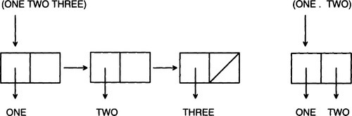
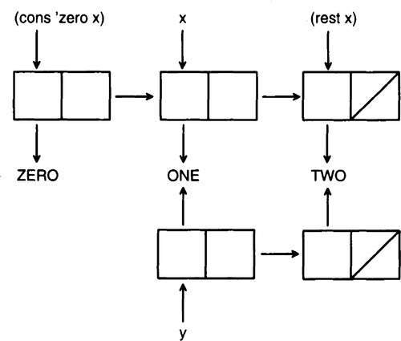
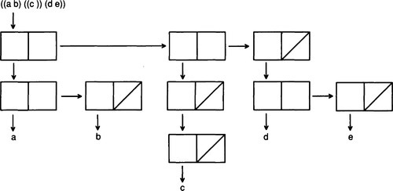

# Chapter 3
## Overview of Lisp

> No doubt about it.
Common Lisp is a *big* language.

> -Guy L. Steele, Jr.

> Foreword to Koschman 1990

This chapter briefly covers the most important special forms and functions in Lisp.
It can be safely skipped or skimmed by the experienced Common Lisp programmer but is required reading for the novice Lisp programmer, or one who is new to the Common Lisp dialect.

This chapter can be used as a reference source, but the definitive reference is Steele's *Common Lisp the Language*, 2d edition, which should be consulted whenever there is any confusion.
Since that book is 25 times longer than this chapter, it is clear that we can only touch on the important highlights here.
More detailed coverage is given later in this book as each feature is used in a real program.

## 3.1 A Guide to Lisp Style

The beginning Common Lisp programmer is often overwhelmed by the number of options that the language provides.
In this chapter we show fourteen different ways to find the length of a list.
How is the programmer to choose between them?
One answer is by reading examples of good programs - as illustrated in this book - and copying that style.
In general, there are six maxims that every programmer should follow:

* Be specific.
* Use abstractions.
* Be concise.
* Use the provided tools.
* Don't be obscure.
* Be consistent.

These require some explanation.

Using the most specific form possible makes it easier for your reader to understand your intent.
For example, the conditional special form `when` is more specific than `if`.
The reader who sees a `when` knows to look for only one thing: the clause to consider when the test is true.
The reader who sees an `if` can rightfully expect two clauses: one for when the test is true, and one for when it is false.
Even though it is possible to use `if` when there is only one clause, it is preferable to use `when,` because `when` is more specific.

One important way of being specific is using abstractions.
Lisp provides very general data structures, such as lists and arrays.
These can be used to implement specific data structures that your program will use, but you should not make the mistake of invoking primitive functions directly.
If you define a list of names:

```lisp
(defvar *names* '((Robert E. Lee) ...))
```

then you should also define functions to get at the components of each name.
To get at `Lee`, use `(last-name (first *names*))`, not `(caddar *names*)`.

Often the maxims are in concord.
For example, if your code is trying to find an element in a list, you should use `find` (or maybe `find-if`), not `loop` or `do`.
`find` is more specific than the general constructs `loop` or `do,` it is an abstraction, it is more concise, it is a built-in tool, and it is simple to understand.

Sometimes, however, the maxims are in conflict, and experience will tell you which one to prefer.
<a id="tfn03-1"></a>
Consider the following two ways of placing a new key/value pair on an association list:[[1]](#fn03-1)

```lisp
(push (cons key val) a-list)
(setf a-list (acons key val a-list))
```

The first is more concise.
But the second is more specific, as it uses the `acons` function, which is designed specifically for association lists.
The decision between them probably hinges on obscurity: those who find `acons` to be a familiar function would prefer the second, and those who find it obscure would prefer the first.

A similar choice arises in the question of setting a variable to a value.
Some prefer `(setq x val)` because it is most specific; others use `(setf x val)`, feeling that it is more consistent to use a single form, `setf`, for all updating.
Whichever choice you make on such issues, remember the sixth maxim: be consistent.

## 3.2 Special Forms

As noted in [chapter 1](chapter1.md), "special form" is the term used to refer both to Common Lisp's syntactic constructs and the reserved words that mark these constructs.

The most commonly used special forms are:

| definitions    | conditional | variables | iteration | other      |
|----------------|-------------|-----------|-----------|------------|
| `defun`        | `and`       | `let`     | `do`      | `declare`  |
| `defstruct`    | `case`      | `let*`    | `do*`     | `function` |
| `defvar`       | `cond`      | `pop`     | `dolist`  | `progn`    |
| `defparameter` | `if`        | `push`    | `dotimes` | `quote`    |
| `defconstant`  | `or`        | `setf`    | `loop`    | `return`   |
| `defmacro`     | `unless`    | `incf`    |           | `trace`    |
| `labels`       | `when`      | `decf`    |           | `untrace`  |

To be precise, only `declare`, `function`, `if`, `labels`, `let`, `let*`, `progn` and `quote` are true special forms.
The others are actually defined as macros that expand into calls to more primitive special forms and functions.
There is no real difference to the programmer, and Common Lisp implementations are free to implement macros as special forms and vice versa, so for simplicity we will continue to use "special form" as a blanket term for both true special forms and built-in macros.

### Special Forms for Definitions

In this section we survey the special forms that can be used to introduce new global functions, macros, variables, and structures.
We have already seen the `defun` form for defining functions; the `defmacro` form is similar and is covered on [page 66](#p66).

> `(defun` *function-name (parameter...) "optional documentation" body...*)
>
> `(defmacro` *macro-name (parameter...) "optional documentation" body...*)

There are three forms for introducing special variables.
`defvar` defines a special variable and can optionally be used to supply an initial value and a documentation string.
The initial value is evaluated and assigned only if the variable does not yet have any value, `defparameter` is similar, except that the value is required, and it will be used to change any existing value, `defconstant` is used to declare that a symbol will always stand for a particular value.

> `(defvar` *variable-name initial-value "optional documentation"* )

> `(defparameter` *variable-name value "optional documentation"*)

> `(defconstant` *variable-name value "optional documentation"*)

All the `def-` forms define global objects.
It is also possible to define local variables with `let`, and to define local functions with `labels`, as we shall see.

Most programming languages provide a way to group related data together into a structure.
Common Lisp is no exception.
The `defstruct` special form defines a structure type (known as a *record* type in Pascal) and automatically defines functions to get at components of the structure.
The general syntax is:

> `(defstruct` *structure-name "optional documentation" slot...*)

As an example, we could define a structure for names:

```lisp
(defstruct name
  first
  (middle nil)
  last)
```

This automatically defines the constructor function `make-name,` the recognizer predicate `name-p,` and the accessor functions `name-first, name-middle` and `name-last`.
The `(middle nil)` means that each new name built by `make-name` will have a middle name of `nil` by default.
Here we create, access, and modify a structure:

```lisp
> (setf b (make-name :first 'Barney :last 'Rubble)) =>
#S(NAME :FIRST BARNEY :LAST RUBBLE)

> (name-first b) => BARNEY

> (name-middle b) => NIL

> (name-last b) => RUBBLE

> (name-p b) => T

> (name-p 'Barney) => NIL ; only the results of make-name are names

> (setf (name-middle b) 'Q) => Q

> b => #S(NAME :FIRST BARNEY :MIDDLE Q :LAST RUBBLE)
```

The printed representation of a structure starts with a `#S` and is followed by a list consisting of the type of the structure and alternating pairs of slot names and values.
Do not let this representation fool you: it is a convenient way of printing the structure, but it is not an accurate picture of the way structures are represented internally.
Structures are actually implemented much like vectors.
For the `name` structure, the type would be in the zero element of the vector, the first name in the first element, middle in the second, and last in the third.
This means structures are more efficient than lists: they take up less space, and any element can be accessed in a single step.
In a list, it takes *n* steps to access the *n*th element.

There are options that give more control over the structure itself and the individual slots.
They will be covered later as they come up.

### Special Forms for Conditionals

We have seen the special form `if,` which has the form (`if` *test then-part else-part*), where either the *then-part* or the *else-part* is the value, depending on the success of the *test.*
Remember that only `nil` counts as false; all other values are considered true for the purpose of conditionals.
However, the constant `t` is the conventional value used to denote truth (unless there is a good reason for using some other value).

There are actually quite a few special forms for doing conditional evaluation.
Technically, `if` is defined as a special form, while the other conditionals are macros, so in some sense `if` is supposed to be the most basic.
Some programmers prefer to use `if` for most of their conditionals; others prefer `cond` because it has been around the longest and is versatile (if not particularly pretty).
Finally, some programmers opt for a style more like English prose, and freely use `when, unless, if,` and all the others.

The following table shows how each conditional can be expressed in terms of `if` and `cond`.
Actually, these translations are not quite right, because `or, case`, and `cond` take care not to evaluate any expression more than once, while the translations with `if` can lead to multiple evaluation of some expressions.
The table also has translations to `cond.` The syntax of `cond` is a series of *cond-clauses,* each consisting of a test expression followed by any number of *result* expressions:

```
(cond (test result...)
      (test result...)
      ...)
```

`cond` goes through the cond-clauses one at a time, evaluating each test expression.
As soon as a test expression evaluates non-nil, the result expressions for that clause are each evaluated, and the last expression in the clause is the value of the whole `cond.`
In particular, if a cond-clause consists of just a test and no result expressions, then the value of the `cond` is the test expression itself, if it is non-nil.
If all of the test expressions evaluate to nil, then nil is returned as the value of the `cond.` A common idiom is to make the last cond-clause be `(t` *result...*).

The forms `when` and `unless` operate like a single `cond` clause.
Both forms consist of a test followed by any number of consequents, which are evaluated if the test is satisfied - that is, if the test is true for `when` or false for `unless.`

The `and` form tests whether every one of a list of conditions is true, and `or` tests whether any one is true.
Both evaluate the arguments left to right, and stop as soon as the final result can be determined.
Here is a table of equivalences:

| **conditional**                  | `if` **form**                       | `cond` **form**                    |
|----------------------------------|-------------------------------------|------------------------------------|
| `(when` *test a b c*)            | `(if` *test* `(progn` *a  b c*))    | `(cond` (*test a b c*))            |
| `(unless` *test x y*)            | `(if (not` *test*) `(progn` *x y*)) | `(cond ((not` *test*) *x y*))      |
| `(and` *a b c*)                  | `(if` *a* `(if` *b c*))             | `(cond` (*a* `(cond` (*b c*))))    |
| `(or` *a b c*)                   | `(if` *a a* `(if` *b b c*))         | `(cond (a)` (*b*) (*c*))           |
| `(*case*` *a* (*b c*) `*(t x*))` | `(if (eql` *a 'b*) *c x*)           | `(cond ((eql `*a 'b*) *c*) (*tx*)) |

It is considered poor style to use `and` and `or` for anything other than testing a logical condition, `when, unless,` and `if` can all be used for taking conditional action.
For example:

```lisp
(and (> n 100)
     (princ "N is large."))    ; Bad style!
(or (<= n 100)
    (princ "N is large."))    ; Even worse style!
(cond ((> n 100)        ; OK, but not MY preference
      (princ "N is large."))
(when (> n 100)
  (princ "N is large."))    ; Good style.
```

When the main purpose is to return a value rather than take action, `cond` and `if` (with explicit `nil` in the else case) are preferred over when and `unless`, which implicitly return `nil` in the else case, `when` and `unless` are preferred when there is only one possibility, `if` (or, for some people, `cond)` when there are two, and `cond` when there are more than two:

```lisp
(defun tax-bracket (income)
  "Determine what percent tax should be paid for this income."
  (cond ((< income 10000.00) 0.00)
        ((< income 30000.00) 0.20)
        ((< income 50000.00) 0.25)
        ((< income 70000.00) 0.30)
        (t                   0.35)))
```

If there are several tests comparing an expression to constants, then case is appropriate.
A `case` form looks like:

> `(case` *expression*  
      (*match result*...)...)

The *expression* is evaluated and compared to each successive *match*.
As soon as one is `eql`, the *result* expressions are evaluated and the last one is returned.
Note that the *match* expressions are *not* evaluated.
If a *match* expression is a list, then case tests if the *expression* is `eql` to any member of the list.
If a *match* expression is the symbol `otherwise` (or the symbol `t`), then it matches anything.
(It only makes sense for this `otherwise` clause to be the last one.)

There is also another special form, `typecase`, which compares the type of an expression against several possibilities and, like `case`, chooses the first clause that matches.
In addition, the special forms `ecase` and `etypecase` are just like `case` and `typecase` except that they signal an error if there is no match.

You can think of the `e` as standing for either "exhaustive" or "error."
The forms `ccase` and `ctypecase` also signal errors, but they can be continuable errors (as opposed to fatal errors): the user is offered the chance to change the expression to something that satisfies one of the matches.
Here are some examples of case forms and their `cond` equivalents:

| []()                 |                                    |
|----------------------|------------------------------------|
| `(case x`            | `(cond`                            |
| `(1 10)`             | `((eql x 1) 10)`                   |
| `(2 20))`            | `((eql x 2) 20))`                  |
|                      |                                    |
| `(typecase x`        | `(cond`                            |
| `(number (abs x))`   | `((typep x 'number) (abs x))`      |
| `(list (length x)))` | `((typep x 'list) (length x)))`    |
|                      |                                    |
| `(ecase x`           | `(cond`                            |
| `(1 10)`             | `((eql x 1) 10)`                   |
| `(2 20))`            | `((eql x 2) 20)`                   |
|                      | `(t (error "no valid case")))`     |
|                      |                                    |
| `(etypecase x`       | `(cond`                            |
| `(number (abs x))`   | `((typep x 'number) (abs x))`      |
| `(list (length x)))` | `((typep x 'list) (length x))`     |
|                      | `(t (error "no valid typecase")))` |

### Special Forms for Dealing with Variables and Places

The special form `setf` is used to assign a new value to a variable or *place,* much as an assignment statement with `=` or `:=` is used in other languages.
A place, or *generalized variable* is a name for a location that can have a value stored in it.
Here is a table of corresponding assignment forms in Lisp and Pascal:

| []()                        |                      |
|-----------------------------|----------------------|
| `;; Lisp`                   | `/* Pascal */`       |
| `(setf x 0)`                | `x := 0;`            |
| `(setf (aref A i j) 0)`     | `A[i,j] := 0;`       |
| `(setf (rest list) nil)`    | `list^.rest := nil;` |
| `(setf (name-middle b) 'Q)` | `b\middle := "Q";`   |

`setf` can be used to set a component of a structure as well as to set a variable.
In languages like Pascal, the expressions that can appear on the left-hand side of an assignment statement are limited by the syntax of the language.
In Lisp, the user can extend the expressions that are allowed in a `setf` form using the special forms `defsetf` or `define-setf-method`.
These are introduced on [pages 514](B9780080571157500157.xhtml#p514) and [884](B978008057115750025X.xhtml#p884) respectively.

There are also some built-in functions that modify places.
For example, (`rplacd list nil`) has the same effect as (`setf` (`rest list`) `nil`), except that it returns `list` instead of `nil`.
Most Common Lisp programmers prefer to use the `setf` forms rather than the specialized functions.

If you only want to set a variable, the special form `setq` can be used instead.
In this book I choose to use `setf` throughout, opting for consistency over specificity.

The discussion in this section makes it seem that variables (and slots of structures) are assigned new values all the time.
Actually, many Lisp programs do no assignments whatsoever.
It is very common to use Lisp in a functional style where new variables may be introduced, but once a new variable is established, it never changes.
One way to introduce a new variable is as a parameter of a function.
It is also possible to introduce local variables using the special form `let`.
Following are the general `let` form, along with an example.
Each variable is bound to the corresponding value, and then the body is evaluated:

> `(let` ((*variable value*)...)  
> *body*...)

```lisp
(let ((x 40)
       (y (+ 1 1)))
  (+ x y)) => 42
```

Defining a local variable with a `let` form is really no different from defining parameters to an anonymous function.
The former is equivalent to:

| []()                        |
|-----------------------------|
| ((`lambda` (*variable*... ) |
| `  ` *body*... )            |
| *value*...)                 |

```lisp
((lambda (x y)
     (+ x y))
40
(+ 1 1))
```

First, all the values are evaluated.
Then they are bound to the variables (the parameters of the lambda expression), and finally the body is evaluated, using those bindings.

The special form `let*` is appropriate when you want to use one of the newly introduced variables in a subsequent *value* computation.
For example:

```lisp
(let* ((x 6)
       (y (* x x)))
  (+ x y)) => 42
```

We could not have used `let` here, because then the variable `x` would be unbound during the computation of `y`'s value.

&#9635; **Exercise 3.1 [m]** Show a `lambda` expression that is equivalent to the above `let*` expression.
You may need more than one `lambda.`

Because lists are so important to Lisp, there are special forms for adding and deleting elements from the front of a list - in other words, for treating a list as a stack.
If `list` is the name of a location that holds a list, then (`push` *x* `list`) will change `list` to have *x* as its first element, and (`pop list`) will return the first element and, as a side-effect, change `list` to no longer contain the first element.
`push` and `pop` are equivalent to the following expressions:

```lisp
(push x list) = (setf list (cons x list))
(pop list)    = (let ((result (first list)))
                 (setf list (rest list))
                 result)
```

Just as a list can be used to accumulate elements, a running sum can be used to accumulate numbers.
Lisp provides two more special forms, `incf` and `decf`, that can be used to increment or decrement a sum.
For both forms the first argument must be a location (a variable or other `setf`-able form) and the second argument, which is optional, is the number to increment or decrement by.
For those who know C, (`incf x`) is equivalent to `++x`, and (`incf x 2`) is equivalent to `x+=2`.
In Lisp the equivalence is:

```lisp
(incf x) = (incf x 1) = (setf x (+ x 1))
(decf x) = (decf x 1) = (setf x (- x 1))
```

When the location is a complex form rather than a variable, Lisp is careful to expand into code that does not evaluate any subform more than once.
This holds for `push`, `pop`, `incf,` and `decf`.
In the following example, we have a list of players and want to decide which player has the highest score, and thus has won the game.
The structure `player` has slots for the player's score and number of wins, and the function `determine-winner` increments the winning player's `wins` field.
The expansion of the `incf` form binds a temporary variable so that the sort is not done twice.

```lisp
(defstruct player (score 0) (wins 0))


(defun determine-winner (players)
  "Increment the WINS for the player with highest score."
  (incf (player-wins (first (sort players #'>
                                  :key #'player-score)))))

(defun determine-winner (players)
   "Increment the WINS for the player with highest score."
   (let ((temp (first (sort players #'> :key #'player-score))))
      (setf (player-wins temp) (+ (player-wins temp) 1))))
```

### Functions and Special Forms for Repetition

Many languages have a small number of reserved words for forming iterative loops.
For example, Pascal has `while, repeat,` and `for` statements.
In contrast, Common Lisp has an almost bewildering range of possibilities, as summarized below:

| []()                  |                                 |
|-----------------------|---------------------------------|
| `dolist`              | loop over elements of a list    |
| `dotimes`             | loop over successive integers   |
| `do, do*`             | general loop, sparse syntax     |
| `loop`                | general loop, verbose syntax    |
| `mapc, mapcar`        | loop over elements of lists(s)  |
| `some, every`         | loop over list until condition  |
| `find, reduce,`*etc.* | more specific looping functions |
| *recursion*           | general repetition              |

To explain each possibility we will present versions of the function `length`, which returns the number of elements in a list.
First, the special form `dolist` can be used to iterate over the elements of a list.
The syntax is:

> `(dolist (`*variable list optional-result*) *body...*)

This means that the body is executed once for each element of the list, with *variable* bound to the first element, then the second element, and so on.
At the end, `dolist` evaluates and returns the *optional-result* expression, or nil if there is no result expression.

Below is a version of `length` using `dolist`.
The `let` form introduces a new variable, `len`, which is initially bound to zero.
The `dolist` form then executes the body once for each element of the list, with the body incrementing `len` by one each time.
This use is unusual in that the loop iteration variable, `element`, is not used in the body.

```lisp
(defun length1 (list)
  (let ((len 0))            ; start with LEN=0
    (dolist (element list)  ; and on each iteration
      (incf len))           ;  increment LEN by 1
    len))                   ; and return LEN
```

It is also possible to use the optional result of `dolist`, as shown below.
While many programmers use this style, I find that it is too easy to lose track of the result, and so I prefer to place the result last explicitly.

```lisp
(defun length1.1 (list)         ; alternate version:
  (let ((len 0))                ; (not my preference)
    (dolist (element list len)  ; uses len as result here
      (incf len))))
```

The function `mapc` performs much the same operation as the special form `dolist`.
In the simplest case, `mapc` takes two arguments, the first a function, the second a list.
It applies the function to each element of the list.
Here is `length` using `mapc`:

```lisp
(defun length2 (list)
  (let ((len 0))                    ; start with LEN=0
    (mapc #'(lambda (element)       ; and on each iteration
              (incf len))           ;  increment LEN by 1
          list)
    len))                           ; and return LEN
```

There are seven different mapping functions, of which the most useful are `mapc` and `mapcar`.
`mapcar` executes the same function calls as `mapc,` but then returns the results in a list.

There is also a `dotimes` form, which has the syntax:

> (`dotimes` (*variable number optional-result*) *body...*)

and executes the body with *variable* bound first to zero, then one, all the way up to *number*-1 (for a total of *number* times).
Of course, `dotimes` is not appropriate for implementing `length`, since we don't know the number of iterations ahead of time.

There are two very general looping forms, `do` and `loop`.
The syntax of `do` is as follows:

```lisp
(do ((variable initial next)...)
    (exit-test result)
  body...)
```

Each *variable* is initially bound to the *initial* value.
If *exit-test* is true, then *result* is returned.
Otherwise, the body is executed and each *variable* is set to the corresponding *next* value and *exit-test* is tried again.
The loop repeats until *exit-test* is true.
If a *next* value is omitted, then the corresponding variable is not updated each time through the loop.
Rather, it is treated as if it had been bound with a `let` form.

Here is `length` implemented with `do`, using two variables, `len` to count the number of elements, and `l` to go down the list.
This is often referred to as *cdr-ing down a list,* because on each operation we apply the function `cdr` to the list.
(Actually, here we have used the more mnemonic name `rest` instead of `cdr`.)
Note that the `do` loop has no body!
All the computation is done in the variable initialization and stepping, and in the end test.

```lisp
(defun length3 (list)
  (do ((len 0 (+ len 1))   ; start with LEN=0, increment
       (l list (rest l)))  ; ... on each iteration
      ((null l) len)))     ; (until the end of the list)
```

I find the `do` form a little confusing, because it does not clearly say that we are looping through a list.
To see that it is indeed iterating over the list requires looking at both the variable `l` and the end test.
Worse, there is no variable that stands for the current element of the list; we would need to say (`first l`) to get at it.
Both `dolist` and `mapc` take care of stepping, end testing, and variable naming automatically.
They are examples of the "be specific" principle.
Because it is so unspecific, `do` will not be used much in this book.
However, many good programmers use it, so it is important to know how to read `do` loops, even if you decide never to write one.

The syntax of `loop` is an entire language by itself, and a decidedly non-Lisp-like language it is.
Rather than list all the possibilities for `loop`, we will just give examples here, and refer the reader to *Common Lisp the Language*, 2d edition, or chapter 24.5 for more details.
Here are three versions of `length` using `loop`:

```lisp
(defun length4 (list)
  (loop for element in list      ; go through each element
        count t))                ;   counting each one

(defun length5 (list)
  (loop for element in list      ; go through each element
        summing 1))              ;   adding 1 each time

(defun length6 (list)
  (loop with len = 0             ; start with LEN=0
        until (null list)        ; and (until end of list)
        for element = (pop list) ; on each iteration
        do (incf len)            ;  increment LEN by 1
        finally (return len)))   ; and return LEN
```

Every programmer learns that there are certain kinds of loops that are used again and again.
These are often called *programming idioms* or *cliches.* An example is going through the elements of a list or array and doing some operation to each element.
In most languages, these idioms do not have an explicit syntactic marker.
Instead, they are implemented with a general loop construct, and it is up to the reader of the program to recognize what the programmer is doing.

Lisp is unusual in that it provides ways to explicitly encapsulate such idioms, and refer to them with explicit syntactic and functional forms.
`dolist` and `dotimes` are two examples of this - they both follow the "be specific" principle.
Most programmers prefer to use a `dolist` rather than an equivalent `do,` because it cries out "this loop iterates over the elements of a list."
Of course, the corresponding `do` form also says the same thing - but it takes more work for the reader to discover this.

In addition to special forms like `dolist` and `dotimes,` there are quite a few functions that are designed to handle common idioms.
Two examples are `count-if,` which counts the number of elements of a sequence that satisfy a predicate, and `position-if,` which returns the index of an element satisfying a predicate.
Both can be used to implement `length.`
In `length7` below, `count-if` gives the number of elements in `list` that satisfy the predicate `true.`
Since `true` is defined to be always true, this gives the length of the list.

```lisp
(defun length7 (list)
  (count-if #'true list))

(defun true (x) t)
```

In `length8,` the function `position-if` finds the position of an element that satisfies the predicate true, starting from the end of the list.
This will be the very last element of the list, and since indexing is zero-based, we add one to get the length.
Admittedly, this is not the most straightforward implementation of `length.`

```lisp
(defun length8 (list)
  (if (null list)
      0
      (+ 1 (position-if #'true list :from-end t))))
```

A partial table of functions that implement looping idioms is given below.
These functions are designed to be flexible enough to handle almost all operations on sequences.
The flexibility comes in three forms.
First, functions like `mapcar` can apply to an arbitrary number of lists, not just one:

```lisp
> (mapcar #'- '(1 2 3)) => (-1 -2 -3)
> (mapcar #'+ '(1 2) '(10 20)) => (11 22)
> (mapcar #'+ '(1 2) '(10 20) '(100 200)) => (111 222)
```

Second, many of the functions accept keywords that allow the user to vary the test for comparing elements, or to only consider part of the sequence.

```lisp
> (remove 1 '(1 2 3 2 1 0 -1)) => (2 3 2 0 -1)

> (remove 1 '(1 2 3 2 1 0 -1) :key #'abs) => (2 3 2 0)

> (remove 1 '(1 2 3 2 1 0 -1) :test #'<) => (1 1 0 -1)

> (remove 1 '(1 2 3 2 1 0 -1) : start 4) => (1 2 3 2 0 -1)
```

Third, some have corresponding functions ending in `-if` or `-if-not` that take a predicate rather than an element to match against:

```lisp
> (remove-if #'oddp '(1 2 3 2 1 0 -1)) => (2 2 0)

> (remove-if-not #'oddp '(1 2 3 2 1 0 -1)) => (1 3 1 -1)

> (find-if #'evenp '(1 2 3 2 1 0 -1)) => 2
```

The following two tables assume these two values:

```lisp
(setf x '(a b c))
(setf y '(1 2 3))
```

The first table lists functions that work on any number of lists but do not accept keywords:

| []()                |                  |                                                  |
|---------------------|------------------|--------------------------------------------------|
| `(every #' oddp y)` | => `nil`         | test if every element satisfies a predicate      |
| `(some #' oddp y)`  | => `t`           | test if some element satisfies predicate         |
| `(mapcar #'- y)`    | => `(-1 -2 -3)`  | apply function to each element and return result |
| `(mapc #'print y)`  | *prints* `1 2 3` | perform operation on each element                |

The second table lists functions that have `-if` and `-if-not` versions and also accept keyword arguments:

| []()                 |              |                                       |
|----------------------|--------------|---------------------------------------|
| `(member 2 y)`       | =>`(2 3)`    | see if element is in list             |
| `(count 'b x)`       | => 1         | count the number of matching elements |
| `(delete 1 y)`       | => `(2 3)`   | omit matching elements                |
| `(find 2 y)`         | => `2`       | find first element that matches       |
| `(position 'a x)`    | => 0         | find index of element in sequence     |
| `(reduce #'+ y)`     | => `6`       | apply function to successive elements |
| `(remove 2 y)`       | => `(1 3)`   | like `delete`, but makes a new copy   |
| `(substitute 4 2 y)` | => `(1 4 3)` | replace elements with new ones        |

### Repetition through Recursion
Lisp has gained a reputation as a "recursive" language, meaning that Lisp encourages programmers to write functions that call themselves.
As we have seen above, there is a dizzying number of functions and special forms for writing loops in Common Lisp, but it is also true that many programs handle repetition through recursion rather than with a syntactic loop.

One simple definition of `length` is "the empty list has length 0, and any other list has a length which is one more than the length of the rest of the list (after the first element)."
This translates directly into a recursive function:

```lisp
(defun length9 (list)
  (if (null list)
      0
      (+ 1 (length9 (rest list)))))
```

This version of `length` arises naturally from the recursive definition of a list: "a list is either the empty list or an element `cons`ed onto another list."
In general, most recursive functions derive from the recursive nature of the data they are operating on.
Some kinds of data, like binary trees, are hard to deal with in anything but a recursive fashion.
Others, like lists and integers, can be defined either recursively (leading to recursive functions) or as a sequence (leading to iterative functions).
In this book, I tend to use the "list-as-sequence" view rather than the "list-as-first-and-rest" view.
The reason is that defining a list as a first and a rest is an arbitrary and artificial distinction that is based on the implementation of lists that Lisp happens to use.
But there are many other ways to decompose a list.
We could break it into the last element and all-but-the-last elements, for example, or the first half and the second half.
The "list-as-sequence" view makes no such artificial distinction.
It treats all elements identically.

One objection to the use of recursive functions is that they are inefficient, because the compiler has to allocate memory for each recursive call.
This may be true for the function `length9`, but it is not necessarily true for all recursive calls.
Consider the following definition:

```lisp
(defun length10 (list)
  (length10-aux list 0))

(defun length10-aux (sublist len-so-far)
  (if (null sublist)
      len-so-far
      (length10-aux (rest sublist) (+ 1 len-so-far))))
```

`length10` uses `length10-aux` as an auxiliary function, passing it 0 as the length of the list so far.
`length10-aux` then goes down the list to the end, adding 1 for each element.
The invariant relation is that the length of the sublist plus `len-so-far` always equals the length of the original list.
Thus, when the sublist is nil, then `len-so-far` is the length of the original list.
Variables like `len-so-far` that keep track of partial results are called *accumulators.*
Other examples of functions that use accumulators include `flatten-all` on page 329; `one-unknown` on page 237; the Prolog predicates discussed on page 686; and `anonymous-variables-in` on pages 400 and 433, which uses two accumulators.

The important difference between `length9` and `length10` is *when* the addition is done.
In `length9`, the function calls itself, then returns, and then adds 1.
In `length10-aux`, the function adds 1, then calls itself, then returns.
There are no pending operations to do after the recursive call returns, so the compiler is free to release any memory allocated for the original call before making the recursive call.
`length10-aux` is called a *tail-recursive* function, because the recursive call appears as the last thing the function does (the tail).
Many compilers will optimize tail-recursive calls, although not all do.
([Chapter 22](chapter22.md) treats tail-recursion in more detail, and points out that Scheme compilers guarantee that tail-recursive calls will be optimized.)

Some find it ugly to introduce `length10-aux`.
For them, there are two alternatives.
First, we could combine `length10` and `length10-aux` into a single function with an optional parameter:

```lisp
(defun length11 (list &optional (len-so-far 0))
  (if (null list)
      len-so-far
      (length11 (rest list) (+ 1 len-so-far))))
```

Second, we could introduce a *local* function inside the definition of the main function.
This is done with the special form `labels`:

```lisp
(defun length12 (the-list)
  (labels
    ((length13 (list len-so-far)
       (if (null list)
           len-so-far
           (length13 (rest list) (+ 1 len-so-far)))))
    (length13 the-list 0)))
```

In general, a `labels` form (or the similar `flet` form) can be used to introduce one or more local functions.
It has the following syntax:

```lisp
(labels ((function-name (parameter...) function-body)...)
 body-of-labels)
```

### Other Special Forms

A few more special forms do not fit neatly into any category.
We have already seen the two special forms for creating constants and functions, `quote` and `function.`
These are so common that they have abbreviations: `'x` for `(quote x`) and `#'f` for `(function f).`

The special form `progn` can be used to evaluate a sequence of forms and return the value of the last one:

```lisp
(progn (setf x 0) (setf x (+ x 1)) x) => 1
```

`progn` is the equivalent of a `begin...end` block in other languages, but it is used very infrequently in Lisp.
There are two reasons for this.
First, programs written in a functional style never need a sequence of actions, because they don't have side effects.
Second, even when side effects are used, many special forms allow for a body which is a sequence - an implicit `progn.`
I can only think of three places where a `progn` is justified.
First, to implement side effects in a branch of a two-branched conditional, one could use either an `if` with a `progn,` or a `cond`:

```lisp
(if (> x 100)                             (cond ((> x 100)
    (progn (print "too big")                     (print "too big")
           (setf x 100))                         (setf x 100))
    x)                                          (t x))
```

If the conditional had only one branch, then `when` or `unless` should be used, since they allow an implicit `progn`.
If there are more than two branches, then `cond` should be used.

Second, `progn` is sometimes needed in macros that expand into more than one top-level form, as in the `defun*` macro on page 326, [section 10.3](B9780080571157500108.xhtml#s0020).
Third, a progn is sometimes needed in an `unwind-protect`, an advanced macro.
An example of this is the `with-resource` macro on [page 338](B9780080571157500108.xhtml#p338), [section 10.4](B9780080571157500108.xhtml#s0025).

The forms `trace` and `untrace` are used to control debugging information about entry and exit to a function:

```lisp
> (trace length9) => (LENGTH9)
> (length9 '(a b c))=>
(1 ENTER LENGTH9: (ABC))
  (2 ENTER LENGTH9: (B C))
    (3 ENTER LENGTH9: (C))
      (4 ENTER LENGTH9: NIL)
      (4 EXIT LENGTH9: 0)
    (3 EXIT LENGTH9: 1)
  (2 EXIT LENGTH9: 2)
(1 EXIT LENGTH9: 3)
3

> (untrace length9) => (LENGTH9)

> (length9 '(a b c)) => 3
```

Finally, the special form `return` can be used to break out of a block of code.
Blocks are set up by the special form `block`, or by the looping forms `(do, do*, dolist, dotimes`, or `loop`).
For example, the following function computes the product of a list of numbers, but if any number is zero, then the whole product must be zero, so we immediately return zero from the `dolist` loop.
Note that this returns from the `dolist` only, not from the function itself (although in this case, the value returned by `dolist` becomes the value returned by the function, because it is the last expression in the function).
I have used uppercase letters in `RETURN` to emphasize the fact that it is an unusual step to exit from a loop.

```lisp
(defun product (numbers)
  "Multiply all the numbers together to compute their product."
  (let ((prod 1))
    (dolist (n numbers prod)
      (if (= n 0)
          (RETURN 0)
          (setf prod (* n prod))))))
```

### Macros

The preceding discussion has been somewhat cavalier with the term "special form."
Actually, some of these special forms are really *macros*, forms that the compiler expands into some other code.
Common Lisp provides a number of built-in macros and allows the user to extend the language by defining new macros.
(There is no way for the user to define new special forms, however.)

Macros are defined with the special form `defmacro`.
Suppose we wanted to define a macro, `while`, that would act like the `while` loop statement of Pascal.
Writing a macro is a four-step process:

* Decide if the macro is really necessary.
* Write down the syntax of the macro.
* Figure out what the macro should expand into.
* Use `defmacro` to implement the syntax/expansion correspondence.

The first step in writing a macro is to recognize that every time you write one, you are defining a new language that is just like Lisp except for your new macro.
The programmer who thinks that way will rightfully be extremely frugal in defining macros.
(Besides, when someone asks, "What did you get done today?" it sounds more impressive to say "I defined a new language and wrote a compiler for it" than to say "I just hacked up a couple of macros.")
Introducing a macro puts much more memory strain on the reader of your program than does introducing a function, variable or data type, so it should not be taken lightly.
Introduce macros only when there is a clear need, and when the macro fits in well with your existing system.
As C.A.R. Hoare put it, "One thing the language designer should not do is to include untried ideas of his own."

The next step is to decide what code the macro should expand into.
It is a good idea to follow established Lisp conventions for macro syntax whenever possible.
Look at the looping macros `(dolist, dotimes, do-symbols),` the defining macros `(defun, defvar, defparameter, defstruct),` or the I/O macros `(with-open-file`, `with-open-stream`, `with-input-from-string)`, for example.
If you follow the naming and syntax conventions for one of these instead of inventing your own conventions, you'll be doing the reader of your program a favor.
For `while,` a good syntax is:

> `(while` *test body...*)

The third step is to write the code that you want a macro call to expand into:

```lisp
loop
  unless test (return nil))
  body
```

The final step is to write the definition of the macro, using `defmacro`.
A `defmacro` form is similar to a `defun` in that it has a parameter list, optional documentation string, and body.
There are a few differences in what is allowed in the parameter list, which will be covered later.
Here is a definition of the macro `while`, which takes a test and a body, and builds up the `loop` code shown previously:

```lisp
(defmacro while (test &rest body)
  "Repeat body while test is true."
  (list* 'loop
         (list 'unless test '(return nil))
         body))
```

(The function `list*` is like `list`, except that the last argument is appended onto the end of the list of the other arguments.)
We can see what this macro expands into by using `macroexpand`, and see how it runs by typing in an example:

```lisp
> (macroexpand-1 '(while (< i 10)
                   (print (* i i))
                   (setf i (+ i 1))))=>
(LOOP (UNLESS (< I 10) (RETURN NIL))
      (PRINT (* I I))
      (SETF I (+ I 1)))
> (setf i 7) =>7
> (while (< i 10)
    (print (* i i))
    (setf i (+ i 1)))
49
64
81
NIL
```

[Section 24.6](B9780080571157500248.xhtml) (page 853) describes a more complicated macro and some details on the pitfalls of writing complicated macros (page 855).

### Backquote Notation

The hardest part about defining `while` is building the code that is the expansion of the macro.
It would be nice if there was a more immediate way of building code.
The following version of `while` following attempts to do just that.
It defines the local variable `code` to be a template for the code we want, and then substitutes the real values of the variables test and body for the placeholders in the code.
This is done with the function `subst`; (`subst` *new old tree*) substitutes *new* for each occurrence of *old* anywhere within *tree.*

```lisp
(defmacro while (test &rest body)
  "Repeat body while test is true."
  (let ((code '(loop (unless test (return nil)) . body)))
    (subst test 'test (subst body 'body code))))
```

The need to build up code (and noncode data) from components is so frequent that there is a special notation for it, the *backquote* notation.
The backquote character ``"`"`` is similar to the quote character `"'"`.
A backquote indicates that what follows is *mostly* a literal expression but may contain some components that are to be evaluated.
Anything marked by a leading comma `","` is evaluated and inserted into the structure, and anything marked with a leading `",@"` must evaluate to a list that is spliced into the structure: each element of the list is inserted, without the top-level parentheses.
The notation is covered in more detail in [section 23.5](B9780080571157500236.xhtml#s0030).
Here we use the combination of backquote and comma to rewrite `while`:

```lisp
(defmacro while (test &rest body)
  "Repeat body while test is true."
  `(loop (unless ,test (return nil))
         ,@body))
```

Here are some more examples of backquote.
Note that at the end of a list, `",@"` has the same effect as `"."` followed by `","`.
In the middle of a list, only `",@"`is a possibility.

```lisp
> (setf test1 '(a test)) => (A TEST)

> `(this is ,test1) => (THIS IS (A TEST))

> `(this is ,@test1) => (THIS IS A TEST)

> `(this is . ,test1) => (THIS IS A TEST)

> `(this is ,@test1 -- this is only ,@test1) =>
(THIS IS A TEST -- THIS IS ONLY A TEST)
```

This completes the section on special forms and macros.
The remaining sections of this chapter give an overview of the important built-in functions in Common Lisp.

## 3.3 Functions on Lists

For the sake of example, assume we have the following assignments:

```lisp
(setf x '(a b c))
(setf y '(1 2 3))
```

The most important functions on lists are summarized here.
The more complicated ones are explained more thoroughly when they are used.

| []()             |                        |                                                |
|------------------|------------------------|------------------------------------------------|
| `(first x)`      | => `a`                 | first element of a list                        |
| `(second x)`     | => `b`                 | second element of a list                       |
| `(third x)`      | => `c`                 | third element of a list                        |
| `(nth 0 x)`      | => `a`                 | nth element of a list, `0`-based               |
| `(rest x)`       | => `(b c)`             | all but the first element                      |
| `(car x)`        | => `a`                 | another name for the first element of a list   |
| `(cdr x)`        | => `(b c)`             | another name for all but the first element     |
| `(last x)`       | => `(c)`               | last cons cell in a list                       |
| `(length x)`     | => 3                   | number of elements in a list                   |
| `(reverse x)`    | => `(c b a)`           | puts list in reverse order                     |
| `(cons 0 y)`     | => `(0 1 2 3)`         | add to front of list                           |
| `(append x y)`   | => `(a b c 1 2 3)`     | append together elements                       |
| `(list x y)`     | => `((a b c) (1 2 3))` | make a new list                                |
| `(list* 1 2 x)`  | => `(1 2 a b c)`       | append last argument to others                 |
| `(null nil)`     | => `T`                 | predicate is true of the empty list            |
| `(null x)`       | => `nil`               | ... and false for everything else              |
| `(listp x)`      | => `T`                 | predicate is true of any list, including `nil` |
| `(listp 3)`      | => `nil`               | ... and is false for nonlists                  |
| `(consp x)`      | => `t`                 | predicate is true of non-nil lists             |
| `(consp nil)`    | => `nil`               | ... and false for atoms, including `nil`       |
| `(equal x x)`    | => `t`                 | true for lists that look the same              |
| `(equal x y)`    | => `nil`                  | ... and false for lists that look different    |
| `(sort y #'>)`   | => `(3 2 1)`           | sort a list according to a comparison function |
| `(subseq x 1 2)` | => `(B)`               | subsequence with given start and end points    |

We said that (`cons` *a b*) builds a longer list by adding element *a* to the front of list *b,* but what if *b* is not a list?
This is not an error; the result is an object *x* such that (`first` *x*) => *a* (`rest`*x*) => *b,* and where *x* prints as (*a* . *b*).
This is known as *dotted pair* notation.
If *b* is a list, then the usual list notation is used for output rather than the dotted pair notation.
But either notation can be used for input.

So far we have been thinking of lists as sequences, using phrases like "a list of three elements."
The list is a convenient abstraction, but the actual implementation of lists relies on lower-level building blocks called *cons cells.*
A cons cell is a data structure with two fields: a first and a rest.
What we have been calling "a list of three elements" can also be seen as a single cons cell, whose first field points to the first element and whose rest field points to another cons cell that is a cons cell representing a list of two elements.
This second cons cell has a rest field that is a third cons cell, one whose rest field is nil.
All proper lists have a last cons cell whose rest field is nil.
[Figure 3.1](#f0010) shows the cons cell notation for the three-element list (`one two three`), as well as for the result of (`cons 'one 'two`).


**Figure 3.1: Cons Cell Diagrams**

&#9635; **Exercise 3.2 [s]** The function cons can be seen as a special case of one of the other functions listed previously.
Which one?

&#9635; **Exercise 3.3 [m]** Write a function that will print an expression in dotted pair notation.
Use the built-in function `princ` to print each component of the expression.

&#9635; **Exercise 3.4 [m]** Write a function that, like the regular `print` function, will print an expression in dotted pair notation when necessary but will use normal list notation when possible.

## 3.4 Equality and Internal Representation

In Lisp there are five major equality predicates, because not all objects are created equally equal.
The numeric equality predicate, `=`, tests if two numbers are the same.
It is an error to apply `=` to non-numbers.
The other equality predicates operate on any kind of object, but to understand the difference between them, we need to understand some of the internals of Lisp.

When Lisp reads a symbol in two different places, the result is guaranteed to be the exact same symbol.
The Lisp system maintains a symbol table that the function read uses to map between characters and symbols.
But when a list is read (or built) in two different places, the results are *not* identically the same, even though the corresponding elements may be.
This is because `read` calls `cons` to build up the list, and each call to `cons` returns a new cons cell.
[Figure 3.2](#f0015) shows two lists, `x` and `Y`, which are both equal to (`one two`), but which are composed of different cons cells, and hence are not identical.
[Figure 3.3](#f0020) shows that the expression (`rest x`) does not generate new cons cells, but rather shares structure with `x`, and that the expression (`cons 'zero x`) generates exactly one new cons cell, whose rest is `x`.


**Figure 3.2: Equal But Nonidentical Lists**


**Figure 3.3: Parts of Lists**

When two mathematically equal numbers are read (or computed) in two places, they may or may not be the same, depending on what the designers of your implementation felt was more efficient.
In most systems, two equal fixnums will be identical, but equal numbers of other types will not (except possibly short floats).
Common Lisp provides four equality predicates of increasing generality.
All four begin with the letters `eq`, with more letters meaning the predicate considers more objects to be equal.
The simplest predicate is `eq`, which tests for the exact same object.
Next, `eql` tests for objects that are either `eq` or are equivalent numbers.
`equal` tests for objects that are either `eql` or are lists or strings with `eql` elements.
Finally, `equalp` is like `equal` except it also matches upper- and lowercase characters and numbers of different types.
The following table summarizes the results of applying each of the four predicates to various values of *x* and *y*.
The ? value means that the result depends on your implementation: two integers that are `eql` may or may not be `eq`.

| *x*     | *y*     | `eq`  | `eql` | `equal` | `equalp` |
|---------|---------|-------|-------|---------|----------|
| `'X`    | `'x`    | `T`   | `T`   | `T`     | `T`      |
| `'0`    | `'0`    | `?`   | `T`   | `T`     | `T`      |
| `'(x)`  | `'(x)`  | `nil` | `nil` | `T`     | `T`      |
| `'"xy"` | `'"xy"` | `nil` | `nil` | `T`     | `T`      |
| `'"Xy"` | `'"xY"` | `nil` | `nil` | `nil`   | `T`      |
| `'0`    | `'0.0`  | `nil` | `nil` | `nil`   | `T`      |
| `'0`    | `'1`    | `nil` | `nil` | `nil`   | `nil`    |

In addition, there are specialized equality predicates such as =, `tree-equal, char-equal,` and `string-equal,` which compare numbers, trees, characters, and strings, respectively.

## 3.5 Functions on Sequences

Common Lisp is in a transitional position halfway between the Lisps of the past and the Lisps of the future.
Nowhere is that more apparent than in the sequence functions.
The earliest Lisps dealt only with symbols, numbers, and lists, and provided list functions like `append` and `length.`
More modern Lisps added support for vectors, strings, and other data types, and introduced the term *sequence* to refer to both vectors and lists.
(A vector is a one-dimensional array.
It can be represented more compactly than a list, because there is no need to store the `rest` pointers.
It is also more efficient to get at the *n*th element of a vector, because there is no need to follow a chain of pointers.)
Modern Lisps also support strings that are vectors of characters, and hence also a subtype of sequence.

With the new data types came the problem of naming functions that operated on them.
In some cases, Common Lisp chose to extend an old function: `length` can apply to vectors as well as lists.
In other cases, the old names were reserved for the list functions, and new names were invented for generic sequence functions.
For example, `append` and `mapcar` only work on lists, but `concatenate` and `map` work on any kind of sequence.
In still other cases, new functions were invented for specific data types.
For example, there are seven functions to pick the nth element out of a sequence.
The most general is `elt`, which works on any kind of sequence, but there are specific functions for lists, arrays, strings, bit vectors, simple bit vectors, and simple vectors.
Confusingly, `nth` is the only one that takes the index as the first argument:

* `(nth` *n list*)
* `(elt` *sequence n*)
* `(aref` *array n*)
* `(char` *string n*)
* `(bit` *bit vector n*)
* `(sbit` *simple-bit vector n*)
* `(svref` *simple-vector n*)

The most important sequence functions are listed elsewhere in this chapter, depending on their particular purpose.

## 3.6 Functions for Maintaining Tables

Lisp lists can be used to represent a one-dimensional sequence of objects.
Because they are so versatile, they have been put to other purposes, such as representing tables of information.
The *association list* is a type of list used to implement tables.
An association list is a list of dotted pairs, where each pair consists of a *key* and a *value.* Together, the list of pairs form a table: given a key, we can retrieve the corresponding value from the table, or verify that there is no such key stored in the table.
Here's an example for looking up the names of states by their two-letter abbreviation.
The function `assoc` is used.
It returns the key/value pair (if there is one).
To get the value, we just take the `cdr` of the result returned by `assoc`.

```lisp
(setf state-table
  '((AL . Alabama) (AK . Alaska) (AZ . Arizona) (AR . Arkansas)))

> (assoc 'AK state-table) => (AK . ALASKA)

> (cdr (assoc 'AK state-table)) => ALASKA

> (assoc 'TX state-table) => NIL
```

If we want to search the table by value rather than by key, we can use rassoc:

```lisp
> (rassoc 'Arizona table) => (AZ . ARIZONA)
> (car (rassoc 'Arizona table)) => AZ
```

Managing a table with `assoc` is simple, but there is one drawback: we have to search through the whole list one element at a time.
If the list is very long, this may take a while.

Another way to manage tables is with *hash tables.*
These are designed to handle large amounts of data efficiently but have a degree of overhead that can make them inappropriate for small tables.
The function `gethash` works much like `get` - it takes two arguments, a key and a table.
The table itself is initialized with a call to `make-hash-table` and modified with a `setf` of `gethash`:

```lisp
(setf table (make-hash-table))

(setf (gethash 'AL table) 'Alabama)
(setf (gethash 'AK table) 'Alaska)
(setf (gethash 'AZ table) 'Arizona)
(setf (gethash 'AR table) 'Arkansas)
```

Here we retrieve values from the table:

```lisp
> (gethash 'AK table) => ALASKA
> (gethash 'TX table) => NIL
```

The function `remhash` removes a key/value pair from a hash table, `clrhash` removes all pairs, and `maphash` can be used to map over the key/value pairs.
The keys to hash tables are not restricted; they can be any Lisp object.
There are many more details on the implementation of hash tables in Common Lisp, and an extensive literature on their theory.

A third way to represent table is with *property lists.*
A property list is a list of alternating key/value pairs.
Property lists (sometimes called p-lists or plists) and association lists (sometimes called a-lists or alists) are similar:

> `a-list:` ((*key*<sub>1</sub> . *val*<sub>1</sub>) (*key*<sub>2</sub> . *val*<sub>2</sub>) ... (*key*<sub>n</sub> . *val*<sub>n</sub>))  
> `p-list: (`*key*<sub>1</sub> *val*<sub>1</sub> *key*<sub>2</sub> *val*<sub>2</sub> ... *key*<sub>n</sub> *val*<sub>n</sub>)

Given this representation, there is little to choose between a-lists and p-lists.
They are slightly different permutations of the same information.
The difference is in how they are normally used.
Every symbol has a property list associated with it.
That means we can associate a property/value pair directly with a symbol.
Most programs use only a few different properties but have many instances of property/value pairs for each property.
Thus, each symbol's p-list will likely be short.
In our example, we are only interested in one property: the state associated with each abbreviation.
That means that the property lists will be very short indeed: one property for each abbreviation, instead of a list of 50 pairs in the association list implementation.

Property values are retrieved with the function get, which takes two arguments: the first is a symbol for which we are seeking information, and the second is the property of that symbol that we are interested in.
get returns the value of that property, if one has been stored.
Property/value pairs can be stored under a symbol with a `setf` form.
A table would be built as follows:

```lisp
(setf (get 'AL 'state) 'Alabama)
(setf (get 'AK 'state) 'Alaska)
(setf (get 'AZ 'state) 'Arizona)
(setf (get 'AR 'state) 'Arkansas)
```

Now we can retrieve values with get:

```lisp
> (get 'AK 'state) => ALASKA
> (get 'TX 'state) => NIL
```

This will be faster because we can go immediately from a symbol to its lone property value, regardless of the number of symbols that have properties.
However, if a given symbol has more than one property, then we still have to search linearly through the property list.
As Abraham Lincoln might have said, you can make some of the table lookups faster some of the time, but you can't make all the table lookups faster all of the time.
Notice that there is no equivalent of rassoc using property lists; if you want to get from a state to its abbreviation, you could store the abbreviation under a property of the state, but that would be a separate `setf` form, as in:

```lisp
(setf (get 'Arizona 'abbrev) 'AZ)
```

In fact, when source, property, and value are all symbols, there are quite a few possibilities for how to use properties.
We could have mimicked the a-list approach, and listed all the properties under a single symbol, using setf on the function `symbol-plist` (which gives a symbol's complete property list):

```lisp
(setf (symbol-plist 'state-table)
      '(AL Alabama AK Alaska AZ Arizona AR Arkansas))
> (get 'state-table 'AL) => ALASKA
> (get 'state-table 'Alaska) => NIL
```

Property lists have a long history in Lisp, but they are falling out of favor as new alternatives such as hash tables are introduced.
There are two main reasons why property lists are avoided.
First, because symbols and their property lists are global, it is easy to get conflicts when trying to put together two programs that use property lists.
If two programs use the same property for different purposes, they cannot be used together.
Even if two programs use *different* properties on the same symbols, they will slow each other down.
Second, property lists are messy.
There is no way to remove quickly every element of a table implemented with property lists.
In contrast, this can be done trivially with `clrhash` on hash tables, or by setting an association list to nil.

## 3.7 Functions on Trees

Many Common Lisp functions treat the expression `((a b) ((c)) (d e))` as a sequence of three elements, but there are a few functions that treat it as a tree with five non-null leaves.
The function `copy-tree` creates a copy of a tree, and `tree-equal` tests if two trees are equal by traversing cons cells, but not other complex data like vectors or strings.
In that respect, `tree-equal` is similar to `equal`, but `tree-equal` is more powerful because it allows a `:test keyword`:

```lisp
> (setf tree '((a b) ((c)) (d e)))

> (tree-equal tree (copy-tree tree)) => T

(defun same-shape-tree (a b)
  "Are two trees the same except for the leaves?"
  (tree-equal a b :test #'true))

(defun true (&rest ignore) t)

> (same-shape-tree tree '((1 2) ((3)) (4 5))) => T
> (same-shape-tree tree '((1 2) (3) (4 5))) => NIL
```

[Figure 3.4](#f0025) shows the tree `((a b) ((c)) (d e))` as a cons cell diagram.


**Figure 3.4: Cons Cell Diagram of a Tree**

There are also two functions for substituting a new expression for an old one anywhere within a tree.
`subst` substitutes a single value for another, while `sublis` takes a list of substitutions in the form of an association list of (*old . new*) pairs.
Note that the order of old and new in the a-list for `sublis` is reversed from the order of arguments to `subst`.
The name `sublis` is uncharacteristically short and confusing; a better name would be `subst-list`.

```lisp
> (subst 'new 'old '(old ((very old)))) => (NEW ((VERY NEW)))

> (sublis '((old . new)) '(old ((very old)))) => (NEW ((VERY NEW)))

> (subst 'new 'old 'old) => NEW

(defun english->french (words)
  (sublis '((are . va) (book . libre) (friend . ami)
            (hello . bonjour) (how . comment) (my . mon)
            (red . rouge) (you . tu))
          words))

> (english->french '(hello my friend - how are you today?)) =>
(BONJOUR MON AMI - COMMENT VA TU TODAY?)
```

## 3.8 Functions on Numbers

The most commonly used functions on numbers are listed here.
There are quite a few other numeric functions that have been omitted.

| []()           |          |                                                                |
|----------------|----------|----------------------------------------------------------------|
| `(+ 4 2)`      | => `6`   | add                                                            |
| `(- 4 2)`      | => `2`   | subtract                                                       |
| `(* 4 2)`      | => `8`   | multiply                                                       |
| `(/ 4 2)`      | => `2`   | divide                                                         |
| `(> 100 99)`   | => `t`   | greater than (also `>=`, greater than or equal to)             |
| `(= 100 100)`  | => `t`   | equal (also `/=`, not equal)                                   |
| `(< 99 100)`   | => `t`   | less than (also `<=`, less than or equal to)                   |
| `(random 100)` | `=> 42`  | random integer from 0 to 99                                    |
| `(expt 4 2)`   | => `16`  | exponentiation (also exp, *e<sup>x</sup>* and `log`)           |
| `(sin pi)`     | => `0.0` | sine function (also `cos`, `tan,` etc.)                        |
| `(asin 0)`     | => `0.0` | arcsine or sin<sup>-1</sup> function (also `acos, atan`, etc.) |
| `(min 2 3 4)`  | => `2`   | minimum (also `max`)                                           |
| `(abs -3)`     | => `3`   | absolute value                                                 |
| `(sqrt 4)`     | => `2`   | square root                                                    |
| `(round 4.1)`  | => `4`   | round off (also `truncate, floor, ceiling`)                    |
| `(rem 11 5)`   | => 1     | remainder (also `mod`)                                         |

## 3.9 Functions on Sets

One of the important uses of lists is to represent sets.
Common Lisp provides functions that treat lists in just that way.
For example, to see what elements the sets *r* = {*a, b, c, d*} and *s* = {*c, d, e*} have in common, we could use:

```lisp
> (setf r '(a b c d)) => (A B C D)
> (setf s '(c d e)) => (C D E)
> (intersection r s) => (C D)
```

This implementation returned (`C D`) as the answer, but another might return (`D C`).
They are equivalent sets, so either is valid, and your program should not depend on the order of elements in the result.
Here are the main functions on sets:

| []()                   |                  |                                               |
|------------------------|------------------|-----------------------------------------------|
| `(intersection r s)`   | => `(c d)`       | find common elements of two sets              |
| `(union r s)`          | => `(a b c d e)` | find all elements in either of two sets       |
| `(set-difference r s)` | => `(a b)`       | find elements in one but not other set        |
| `(member 'd r)`        | => `(d)`         | check if an element is a member of a set      |
| `(subsetp s r)`        | => `nil`         | see if all elements of one set are in another |
| `(adjoin 'b s`)        | => `(b c d e)`   | add an element to a set                       |
| `(adjoin 'c s)`        | => `(c d e)`     | ... but don't add duplicates                  |

It is also possible to represent a set with a sequence of bits, given a particular universe of discourse.
For example, if every set we are interested in must be a subset of (`a b c d e`), then we can use the bit sequence 11110 to represent (`a b c d`), 00000 to represent the empty set, and 11001 to represent (`a b e`).
The bit sequence can be represented in Common Lisp as a bit vector, or as an integer in binary notation.
For example, (`a b e`) would be the bit vector `#*11001` or the integer 25, which can also be written as `#b11001`.

The advantage of using bit sequences is that it takes less space to encode a set, assuming a small universe.
Computation will be faster, because the computer's underlying instruction set will typically process 32 elements at a time.

Common Lisp provides a full complement of functions on both bit vectors and integers.
The following table lists some, their correspondence to the list functions.

| `lists`          | `integers` | `bit vectors` |
|------------------|------------|---------------|
| `intersection`   | `logand`   | `bit-and`     |
| `union`          | `logior`   | `bit-ior`     |
| `set-difference` | `logandc2` | `bit-andc2`   |
| `member`         | `logbitp`  | `bit`         |
| `length`         | `logcount` |               |

For example,

```lisp
(intersection '(a b c d) '(a b e)) =>  (A B)
(bit-and      #*11110    #*11001)  =>  #*11000
(logand       #b11110    #b11001)  =>  24 = #b11000
```

## 3.10 Destructive Functions

In mathematics, a function is something that computes an output value given some input arguments.
Functions do not "do" anything, they just compute results.
For example, if I tell you that *x* = 4 and *y* = 5 and ask you to apply the function "plus" to *x* and *y,* I expect you to tell me 9.
If I then ask, "Now what is the value of *x*?" it would be surprising if *x* had changed.
In mathematics, applying an operator to *x* can have no effect on the value of *x.*

In Lisp, some functions *are* able to take effect beyond just computing the result.
<a id="tfn03-2"></a>
These "functions" are not functions in the mathematical sense,[[2]](#fn03-2) and in other languages they are known as "procedures."
Of course, most of the Lisp functions *are* true mathematical functions, but the few that are not can cause great problems.
They can also be quite useful in certain situations.
For both reasons, they are worth knowing about.

Consider the following:

```lisp
> (setf x '(a b c)) => (A B C)
> (setf y '(1 2 3)) => (1 2 3)
> (append x y) => (A B C 1 2 3)
```

`append` is a pure function, so after evaluating the call to `append,` we can rightfully expect that `x` and `y` retain their values.
Now consider this:

```lisp
> (nconc x y) => (A B C 1 2 3)
> x => (A B C 1 2 3)
> y => (1 2 3)
```

The function `nconc` computes the same result as `append,` but it has the side effect of altering its first argument.
It is called a *destructive* function, because it destroys existing structures, replacing them with new ones.
This means that there is quite a conceptual load on the programmer who dares to use `nconc`.
He or she must be aware that the first argument may be altered, and plan accordingly.
This is far more complicated than the case with nondestructive functions, where the programmer need worry only about the results of a function call.

The advantage of `nconc` is that it doesn't use any storage.
While `append` must make a complete copy of `x` and then have that copy end with `y`, `nconc` does not need to copy anything.
Instead, it just changes the rest field of the last element of `x` to point to `y.`
So use destructive functions when you need to conserve storage, but be aware of the consequences.

Besides `nconc`, many of the destructive functions have names that start with `n`, including `nreverse, nintersection, nunion, nset-difference`, and `nsubst`.
An important exception is `delete`, which is the name used for the destructive version of `remove`.
Of course, the `setf` special form can also be used to alter structures, but it is the destructive functions that are most dangerous, because it is easier to overlook their effects.

&#9635; **Exercise 3.5 [h]** (Exercise in altering structure.)
Write a program that will play the role of the guesser in the game Twenty Questions.
The user of the program will have in mind any type of thing.
The program will ask questions of the user, which must be answered yes or no, or "it" when the program has guessed it.
If the program runs out of guesses, it gives up and asks the user what "it" was.
At first the program will not play well, but each time it plays, it will remember the user's replies and use them for subsequent guesses.

## 3.11 Overview of Data Types

This chapter has been organized around functions, with similar functions grouped together.
But there is another way of organizing the Common Lisp world: by considering the different data types.
This is useful for two reasons.
First, it gives an alternative way of seeing the variety of available functionality.
Second, the data types themselves are objects in the Common Lisp language, and as we shall see, there are functions that manipulate data types.
These are useful mainly for testing objects (as with the typecase macro) and for making declarations.

Here is a table of the most commonly used data types:

| Type         | Example        | Explanation                                                |
|--------------|----------------|------------------------------------------------------------|
| `character`  | `#\c`          | A single letter, number, or punctuation mark.              |
| `number`     | `42`           | The most common numbers are floats and integers.           |
| `float`      | `3.14159`      | A number with a decimal point.                             |
| `integer`    | `42`           | A whole number, of either fixed or indefinite size:        |
| `fixnum`     | `123`          | An integer that fits in a single word of storage.          |
| `bignum`     | `123456789`    | An integer of unbounded size.                              |
| `function`   | `#'sin`        | A function can be applied to an argument list.             |
| `symbol`     | `sin`          | Symbols can name fns and vars, and are themselves objects. |
| `null`       | `nil`          | The object `nil` is the only object of type null.          |
| `keyword`    | `:key`         | Keywords are a subtype of symbol.                          |
| `sequence`   | `(a b c)`      | Sequences include lists and vectors.                       |
| `list`       | `(a b c)`      | A list is either a `cons` or `null`.                       |
| `vector`     | `#(a b c)`     | A vector is a subtype of sequence.                         |
| `cons`       | `(a b c)`      | A cons is a non-nil list.                                  |
| `atom`       | `t`            | An atom is anything that is not a cons.                    |
| `string`     | `"abc"`        | A string is a type of vector of characters.                |
| `array`      | `#lA(a b c)`   | Arrays include vectors and higher-dimensional arrays.      |
| `structure`  | `#S(type ...)` | Structures are defined by `defstruct`.                     |
| `hash-table` | ...            | Hash tables are created by `make-hash-table`.              |

Almost every data type has a *recognizer predicate* - a function that returns true for only elements of that type.
In general, a predicate is a function that always returns one of two values: true or false.
In Lisp, the false value is `nil`, and every other value is considered true, although the most common true value is `t`.
In most cases, the recognizer predicate's name is composed of the type name followed by `p: characterp` recognizes characters, `numberp` recognizes numbers, and so on.
For example, `(numberp 3)` returns `t` because 3 is a number, but `(numberp "x")` returns `nil` because `"x"` is a string, not a number.

Unfortunately, Common Lisp is not completely regular.
There are no recognizers for fixnums, bignums, sequences, and structures.
Two recognizers, `null` and `atom`, do not end in `p.` Also note that there is a hyphen before the `p` in `hash-table-p,` because the type has a hyphen in it.
In addition, all the recognizers generated by `defstruct` have a hyphen before the `p.`

The function `type-of` returns the type of its argument, and `typep` tests if an object is of a specified type.
The function `subtypep` tests if one type can be determined to be a subtype of another.
For example:

```lisp
> (type-of 123) => FIXNUM

> (typep 123 'fixnum) => T

> (typep 123 'number) => T

> (typep 123 'integer) => T

> (typep 123.0 'integer) => NIL

> (subtypep 'fixnum 'number) T
```

The hierarchy of types is rather complicated in Common Lisp.
As the prior example shows, there are many different numeric types, and a number like 123 is considered to be of type `fixnum, integer,` and `number.`
We will see later that it is also of type `rational` and `t.`

The type hierarchy forms a graph, not just a tree.
For example, a vector is both a sequence and an array, although neither array nor sequence are subtypes of each other.
Similarly, `null` is a subtype of both `symbol` and `list.`

The following table shows a number of more specialized data types that are not used as often:

| Type           | Example               | Explanation                                              |
|----------------|-----------------------|----------------------------------------------------------|
| `t`            | `42`                  | Every object is of type `t.`                             |
| `nil`          |                       | No object is of type `nil`.                              |
| `complex`      | `#C(0 1)`             | Imaginary numbers.                                       |
| `bit`          | `0`                   | Zero or one.                                             |
| `rational`     | `2/3`                 | Rationals include integers and ratios.                   |
| `ratio`        | `2/3`                 | Exact fractional numbers.                                |
| `simple-array` | `#lA(x y)`            | An array that is not displaced or adjustable.            |
| `readtable`    | `...`                 | A mapping from characters to their meanings to read.     |
| `package`      | `...`                 | A collection of symbols that form a module.              |
| `pathname`     | `#P"/usr/spool/mail"` | A file or directory name.                                |
| `stream`       | `...`                 | A pointer to an open file; used for reading or printing. |
| `random-state` | `...`                 | A state used as a seed by `random.`                      |

In addition, there are even more specialized types, such as `short-float`, `compiled-function`, and `bit-vector`.
It is also possible to construct more exact types, such as (`vector (integer 0 3) 100`), which represents a vector of 100 elements, each of which is an integer from 0 to 3, inclusive.
[Section 10.1](B9780080571157500108.xhtml#s0010) gives more information on types and their use.

While almost every type has a predicate, it is also true that there are predicates that are not type recognizers but rather recognize some more general condition.
For example, `oddp` is true only of odd integers, and `string-greaterp` is true if one string is alphabetically greater than another.

## 3.12 Input/Output

Input in Lisp is incredibly easy because a complete lexical and syntactic parser is available to the user.
The parser is called `read`.
It is used to read and return a single Lisp expression.
If you can design your application so that it reads Lisp expressions, then your input worries are over.
Note that the expression parsed by `read` need not be a legal *evaluable* Lisp expression.
That is, you can read (`"hello" cons zzz`) just as well as (`+ 2 2`).
In cases where Lisp expressions are not adequate, the function `read-char` reads a single character, and `read-line` reads everything up to the next newline and returns it as a string.

To read from the terminal, the functions `read, read-char,` or `read-line` (with no arguments) return an expression, a character, and a string up to the end of line, respectively.
It is also possible to read from a file.
The function `open` or the macro `with-open-stream` can be used to open a file and associate it with a *stream,* Lisp's name for a descriptor of an input/output source.
All three read functions take three optional arguments.
The first is the stream to read from.
The second, if true, causes an error to be signaled at end of file.
If the second argument is nil, then the third argument indicates the value to return at end of file.

Output in Lisp is similar to output in other languages, such as C.
There are a few low-level functions to do specific kinds of output, and there is a very general function to do formatted output.
The function `print` prints any object on a new line, with a space following it.
`prin1` will print any object without the new line and space.
For both functions, the object is printed in a form that could be processed by `read`.
For example, the string `"hello there"` would print as `"hello there".`
The function `princ` is used to print in a human-readable format.
The string in question would print as `hello there` with `princ`-the quote marks are not printed.
This means that `read` cannot recover the original form; `read` would interpret it as two symbols, not one string.
The function `write` accepts eleven different keyword arguments that control whether it acts like `prin1` or `princ,` among other things.

The output functions also take a stream as an optional argument.
In the following, we create the file `test.text` and print two expressions to it.
Then we open the file for reading, and try to read back the first expression, a single character, and then two more expressions.
Note that the `read-char` returns the character `#\G`, so the following `read` reads the characters `OODBYE` and turns them into a symbol.
The final `read` hits the end of file, and so returns the specified value, `eof`.

```lisp
> (with-open-file (stream "test.text" :direction :output)
    (print '(hello there) stream)
    (princ 'goodbye stream))=>
GOODBYE        :*and creates the file test.text

> (with-open-file (stream "test.text" :direction :input)
    (list (read stream) (read-char stream) (read stream)
          (read stream nil 'eof)))=>
((HELLO THERE) #\G OODBYE EOF)
```

The function `terpri` stands for "terminate print line," and it skips to the next line.
The function `fresh-line` also skips to the next line, unless it can be determined that the output is already at the start of a line.

Common Lisp also provides a very general function for doing formatted output, called `format.`
The first argument to `format` is always the stream to print to; use `t` to print to the terminal.
The second argument is the format string.
It is printed out verbatim, except for *format directives*, which begin with the character `"~"`.
These directives tell how to print out the remaining arguments.
Users of C's `printf` function or FORTRAN's `format` statement should be familiar with this idea.
Here's an example:

```lisp
> (format t "hello, world")
hello, world
NIL
```

Things get interesting when we put in additional arguments and include format directives:

```lisp
> (format t "~&~a plus ~s is ~f" "two" "two" 4)
two plus "two" is 4.0
NIL
```

The directive `~&` moves to a fresh line, `~a` prints the next argument as `princ` would, `~s` prints the next argument as `prin1` would, and `~f` prints a number in floating-point format.
If the argument is not a number, then `princ` is used.
`format` always returns nil.
There are 26 different format directives.
Here's a more complex example:

```lisp
> (let ((numbers '(1234 5)))
    (format t "~&~{~r~^ plus ~} is ~@r"
            numbers (apply #'+ numbers)))
one plus two plus three plus four plus five is XV
NIL
```

The directive `~r` prints the next argument, which should be a number, in English, and `~@r` prints a number as a roman numeral.
The compound directive `~{...~}` takes the next argument, which must be a list, and formats each element of the list according to the format string inside the braces.
Finally, the directive `~^` exits from the enclosing `~{...~}` loop if there are no more arguments.
You can see that `format`, like `loop`, comprises almost an entire programming language, which, also like `loop`, is not a very Lisplike language.

## 3.13 Debugging Tools

In many languages, there are two strategies for debugging: (1) edit the program to insert print statements, recompile, and try again, or (2) use a debugging program to investigate (and perhaps alter) the internal state of the running program.

Common Lisp admits both these strategies, but it also offers a third: (3) add annotations that are not part of the program but have the effect of automatically altering the running program.
The advantage of the third strategy is that once you are done you don't have to go back and undo the changes you would have introduced in the first strategy.
In addition, Common Lisp provides functions that display information about the program.
You need not rely solely on looking at the source code.

We have already seen how `trace` and `untrace` can be used to provide debugging information (page 65).
Another useful tool is `step`, which can be used to halt execution before each subform is evaluated.
The form (`step` *expression*) will evaluate and return *expression*, but pauses at certain points to allow the user to inspect the computation, and possibly change things before proceeding to the next step.
The commands available to the user are implementation-dependent, but typing a `?` should give you a list of commands.
As an example, here we step through an expression twice, the first time giving commands to stop at each subevaluation, and the second time giving commands to skip to the next function call.
In this implementation, the commands are control characters, so they do not show up in the output.

All output, including the symbols <= and => are printed by the stepper itself; I have added no annotation.

```lisp
> (step (+ 3 4 (* 5 6 (/ 7 8))))
<= (+ 3 4 (* 5 6 (/ 7 8)))
  <= 3 => 3
  <= 4 => 4
  <= (* 5 6 (/ 7 8))
  <= 5 => 5
  <= 6 => 6
  <= (/ 7 8)
    <= 7 => 7
  <= 8 => 8
    <=(/ 7 8) => 7/8
  <= (* 5 6 (/ 7 8)) => 105/4
  <= (+ 3 4 (* 5 6 (/ 7 8))) => 133/4
133/4

> (step (+ 3 4 (* 5 6 (/ 7 8))))
<= (+ 3 4 (* 5 6 (/ 7 8)))
  /: 7 8 => 7/8
  *: 5 6 7/8 => 105/4
  +: 3 4 105/4 => 133/4
<= (+ 3 4 (* 5 6 (/ 7 8))) => 133/4
133/4
```

The functions `describe`, `inspect, documentation,` and `apropos` provide information about the state of the current program.
`apropos` prints information about all symbols whose name matches the argument:

```lisp
> (apropos 'string)
MAKE-STRING            function (LENGTH &KEY INITIAL-ELEMENT)
PRIN1-T0-STRING        function (OBJECT)
PRINC-T0-STRING        function (OBJECT)
STRING                 function (X)
...
```

Once you know what object you are interested in, `describe` can give more information on it:

```lisp
> (describe 'make-string)
Symbol MAKE-STRING is in LISP package.
The function definition is #<FUNCTION MAKE-STRING -42524322 >:
  NAME:          MAKE-STRING
  ARGLIST:       (LENGTH &KEY INITIAL-ELEMENT)
  DOCUMENTATION: "Creates and returns a string of LENGTH elements,
all set to INITIAL-ELEMENT."
  DEFINITION:    (LAMBDA (LENGTH &KEY INITIAL-ELEMENT)
                   (MAKE-ARRAY LENGTH : ELEMENT-TYPE 'CHARACTER
                               :INITIAL-ELEMENT (OR INITIAL-ELEMENT
                                                    #\SPACE)))
MAKE-STRING has property INLINE: INLINE
MAKE-STRING has property :SOURCE-FILE: #P"SYS:KERNEL; STRINGS"

> (describe 1234.56)
1234.56 is a single-precision floating-point number.
  Sign 0, exponent #o211, 23-bit fraction #o6450754
```

If all you want is a symbol's documentation string, the function `documentation` will do the trick:

```lisp
> (documentation 'first 'function) => "Return the first element of LIST."
> (documentation 'pi 'variable) =$> "pi"
```

If you want to look at and possibly alter components of a complex structure, then `inspect` is the tool.
In some implementations it invokes a fancy, window-based browser.

Common Lisp also provides a debugger that is entered automatically when an error is signalled, either by an inadvertant error or by deliberate action on the part of the program.
The details of the debugger vary between implementations, but there are standard ways of entering it.
The function `break` enters the debugger after printing an optional message.
It is intended as the primary method for setting debugging break points.
`break` is intended only for debugging purposes; when a program is deemed to be working, all calls to `break` should be removed.
However, it is still a good idea to check for unusual conditions with `error`, `cerror`, `assert,` or `check-type`, which will be described in the following section.

## 3.14 Antibugging Tools

It is a good idea to include *antibugging* checks in your code, in addition to doing normal debugging.
Antibugging code checks for errors and possibly takes corrective action.

The functions `error` and `cerror` are used to signal an error condition.
These are intended to remain in the program even after it has been debugged.
The function `error` takes a format string and optional arguments.
It signals a fatal error; that is, it stops the program and does not offer the user any way of restarting it.
For example:

```lisp
(defun average (numbers)
  (if (null numbers)
      (error "Average of the empty list is undefined.")
      (/ (reduce #'+ numbers)
         (length numbers))))
```

In many cases, a fatal error is a little drastic.
The function `cerror` stands for continuable error.
`cerror` takes two format strings; the first prints a message indicating what happens if we continue, and the second prints the error message itself.
`cerror` does not actually take any action to repair the error, it just allows the user to signal that continuing is alright.
In the following implementation, the user continues by typing `:continue`.
In ANSI Common Lisp, there are additional ways of specifying options for continuing.

```lisp
(defun average (numbers)
  (if (null numbers)
      (progn
        (cerror "Use 0 as the average."
                "Average of the empty list is undefined.")
        0)
      (/ (reduce #'+ numbers)
         (length numbers))))

> (average '())
Error: Average of the empty list is undefined.
Error signaled by function AVERAGE.
If continued: Use 0 as the average.
>> :continue
0
```

In this example, adding error checking nearly doubled the length of the code.
This is not unusual; there is a big difference between code that works on the expected input and code that covers all possible errors.
Common Lisp tries to make it easier to do error checking by providing a few special forms.
The form `ecase` stands for "exhaustive case" or "error case."
It is like a normal case form, except that if none of the cases are satisfied, an error message is generated.
The form `ccase` stands for "continuable case." It is like `ecase`, except that the error is continuable.
The system will ask for a new value for the test object until the user supplies one that matches one of the programmed cases.

To make it easier to include error checks without inflating the length of the code too much, Common Lisp provides the special forms `check-type` and `assert`.
As the name implies, `check-type` is used to check the type of an argument.
It signals a continuable error if the argument has the wrong type.
For example:

```lisp
(defun sqr (x)
  "Multiply x by itself."
  (check-type x number)
  (* x x))
```

If `sqr` is called with a non-number argument, an appropriate error message is printed:

```lisp
> (sqr "hello")
Error: the argument X was "hello", which is not a NUMBER.
If continued: replace X with new value
>> :continue 4
16
```

`assert` is more general than `check-type`.
In the simplest form, assert tests an expression and signals an error if it is false.
For example:

```lisp
(defun sqr (x)
  "Multiply x by itself."
  (assert (numberp x))
  (* x x))
```

There is no possibility of continuing from this kind of assertion.
It is also possible to give `assert` a list of places that can be modified in an attempt to make the assertion true.
In this example, the variable `x` is the only thing that can be changed:

```lisp
(defun sqr (x)
  "Multiply x by itself."
  (assert (numberp x) (x))
  (* x x))
```

If the assertion is violated, an error message will be printed and the user will be given the option of continuing by altering `x`.
If `x` is given a value that satisfies the assertion, then the program continues, `assert` always returns nil.

Finally, the user who wants more control over the error message can provide a format control string and optional arguments.
So the most complex syntax for assert is:

> `(assert` *test-form* (*place...*) *format-ctl-string format-arg...*)

Here is another example.
The assertion tests that the temperature of the bear's porridge is neither too hot nor too cold.

```lisp
(defun eat-porridge (bear)
  (assert (< too-cold (temperature (bear-porridge bear)) too-hot)
          (bear (bear-porridge bear))
          "~a's porridge is not just right: ~a"
          bear (hotness (bear-porridge bear)))
  (eat (bear-porridge bear)))
```

In the interaction below, the assertion failed, and the programmer's error message was printed, along with two possibilities for continuing.
The user selected one, typed in a call to `make-porridge` for the new value, and the function successfully continued.

```lisp
> (eat-porridge momma-bear)
Error: #<MOMMA BEAR>'s porridge is not just right: 39
Restart actions (select using :continue):
 0: Supply a new value for BEAR
 1: Supply a new value for (BEAR-PORRIDGE BEAR)
>> :continue 1
Form to evaluate and use to replace (BEAR-PORRIDGE BEAR):
(make-porridge :temperature just-right)
nil
```

It may seem like wasted effort to spend time writing assertions that (if all goes well) will never be used.
However, for all but the perfect programmer, bugs do occur, and the time spent antibugging will more than pay for itself in saving debugging time.

Whenever you develop a complex data structure, such as some kind of data base, it is a good idea to develop a corresponding consistency checker.
A consistency checker is a function that will look over a data structure and test for all possible errors.
When a new error is discovered, a check for it should be incorporated into the consistency checker.
Calling the consistency checker is the fastest way to help isolate bugs in the data structure.

In addition, it is a good idea to keep a list of difficult test cases on hand.
That way, when the program is changed, it will be easy to see if the change reintroduces a bug that had been previously removed.
This is called *regression testing,* and [Waters (1991)](B9780080571157500285.xhtml#bb1350) presents an interesting tool for maintaining a suite of regression tests.
But it is simple enough to maintain an informal test suite with a function that calls assert on a series of examples:

```lisp
(defun test-ex ()
  "Test the program EX on a series of examples."
  (init-ex) ; Initialize the EX program first.
  (assert (equal (ex 3 4) 5))
  (assert (equal (ex 5 0) 0))
  (assert (equal (ex 'x 0) 0)))
```

### Timing Tools

A program is not complete just because it gives the right output.
It must also deliver the output in a timely fashion.
The form (`time` *expression*) can be used to see how long it takes to execute *expression.*
Some implementations also print statistics on the amount of storage required.
For example:

```lisp
> (defun f (n) (dotimes (i n) nil)) => F
> (time (f 10000)) NIL
Evaluation of (F 10000) took 4.347272 Seconds of elapsed time, including 0.0 seconds of paging time for 0 faults, Consed 27 words.

> (compile 'f) F

> (time (f 10000)) => NIL
Evaluation of (F 10000) took 0.011518 Seconds of elapsed time, including 0.0 seconds of paging time for 0 faults, Consed 0 words.
```

This shows that the compiled version is over 300 times faster and uses less storage to boot.
Most serious Common Lisp programmers work exclusively with compiled functions.
However, it is usually a bad idea to worry too much about efficiency details while starting to develop a program.
It is better to design a flexible program, get it to work, and then modify the most frequently used parts to be more efficient.
In other words, separate the development stage from the fine-tuning stage.
[Chapters 9](chapter9.md) and [10](chapter10.md) give more details on efficiency consideration, and [chapter 25](chapter25.md) gives more advice on debugging and antibugging techniques.

## 3.15 Evaluation

There are three functions for doing evaluation in Lisp: `funcall, apply,` and `eval`.
`funcall` is used to apply a function to individual arguments, while `apply` is used to apply a function to a list of arguments.
Actually, `apply` can be given one or more individual arguments before the final argument, which is always a list.
`eval` is passed a single argument, which should be an entire form - a function or special form followed by its arguments, or perhaps an atom.
The following five forms are equivalent:

```lisp
> (+ 1 2 3 4)             => 10
> (funcall #'+ 1 2 3 4)   => 10
> (apply #'+ '(1 2 3 4))  => 10
> (apply #'+ 1 2 '(3 4))  => 10
> (eval '(+  123 4))      => 10
```

In the past, `eval` was seen as the key to Lisp's flexibility.
In modern Lisps with lexical scoping, such as Common Lisp, `eval` is used less often (in fact, in Scheme there is no `eval` at all).
Instead, programmers are expected to use `lambda` to create a new function, and then `apply` or `funcall` the function.
In general, if you find yourself using `eval,` you are probably doing the wrong thing.

## 3.16 Closures

What does it mean to create a new function?
Certainly every time a `function` (or `#')` special form is evaluated, a function is returned.
But in the examples we have seen and in the following one, it is always the *same* function that is returned.

```lisp
> (mapcar #'(lambda (x) (+ x x)) '(1 3 10)) => (2 6 20)
```

Every time we evaluate the `#'(lambda ...)` form, it returns the function that doubles its argument.
However, in the general case, a function consists of the body of the function coupled with any *free lexical variables* that the function references.
Such a pairing is called a *lexical closure,* or just a *closure,* because the lexical variables are enclosed within the function.
Consider this example:

```lisp
(defun adder (c)
  "Return a function that adds c to its argument."
  #'(lambda (x) (+ x c)))

> (mapcar (adder 3) '(1 3 10)) => (4 6 13)

> (mapcar (adder 10) '(1 3 10)) => (11 13 20)
```

Each time we call `adder` with a different value for `c`, it creates a different function, the function that adds `c` to its argument.
Since each call to `adder` creates a new local variable named `c`, each function returned by `adder` is a unique function.

Here is another example.
The function `bank-account` returns a closure that can be used as a representation of a bank account.
The closure captures the local variable balance.
The body of the closure provides code to access and modify the local variable.

```lisp
(defun bank-account (balance)
  "Open a bank account starting with the given balance."
  #'(lambda (action amount)
      (case action
        (deposit  (setf balance (+ balance amount)))
        (withdraw (setf balance (- balance amount))))))
```

In the following, two calls to bank-account create two different closures, each with a separate value for the lexical variable `balance`.
The subsequent calls to the two closures change their respective balances, but there is no confusion between the two accounts.

```lisp
> (setf my-account (bank-account 500.00)) => #<CLOSURE 52330407>

> (setf your-account (bank-account 250.00)) => #<CLOSURE 52331203>

> (funcall my-account 'withdraw 75.00) => 425.0

> (funcall your-account 'deposit 250.00) => 500.0

> (funcall your-account 'withdraw 100.00) => 400.0

> (funcall my-account 'withdraw 25.00) => 400.0
```

This style of programming will be considered in more detail in [chapter 13](chapter13.md).

## 3.17 Special Variables

Common Lisp provides for two kinds of variables: *lexical* and *special* variables.
For the beginner, it is tempting to equate the special variables in Common Lisp with global variables in other languages.
Unfortunately, this is not quite correct and can lead to problems.
It is best to understand Common Lisp variables on their own terms.

By default, Common Lisp variables are *lexical variables.*
Lexical variables are introduced by some syntactic construct like `let` or `defun` and get their name from the fact that they may only be referred to by code that appears lexically within the body of the syntactic construct.
The body is called the *scope* of the variable.

So far, there is no difference between Common Lisp and other languages.
The interesting part is when we consider the *extent,* or lifetime, of a variable.
In other languages, the extent is the same as the scope: a new local variable is created when a block is entered, and the variable goes away when the block is exited.
But because it is possible to create new functions - closures - in Lisp, it is therefore possible for code that references a variable to live on after the scope of the variable has been exited.
Consider again the `bank-account` function, which creates a closure representing a bank account:

```lisp
(defun bank-account (balance)
  "Open a bank account starting with the given balance."
  #'(lambda (action amount)
      (case action
        (deposit (setf balance (+ balance amount)))
        (withdraw (setf balance (- balance amount))))))
```

The function introduces the lexical variable `balance`.
The scope of `balance` is the body of the function, and therefore references to `balance` can occur only within this scope.
What happens when `bank-account` is called and exited?
Once the body of the function has been left, no other code can refer to that instance of `balance.`
The scope has been exited, but the extent of `balance` lives on.
We can call the closure, and it can reference `balance`, because the code that created the closure appeared lexically within the scope of `balance`.

In summary, Common Lisp lexical variables are different because they can be captured inside closures and referred to even after the flow of control has left their scope.

Now we will consider special variables.
A variable is made special by a `defvar` or `defparameter` form.
For example, if we say

```lisp
(defvar *counter* 0)
```

then we can refer to the special variable `*counter*` anywhere in our program.
This is just like a familiar global variable.
The tricky part is that the global binding of `*counter*` can be shadowed by a local binding for that variable.
In most languages, the local binding would introduce a local lexical variable, but in Common Lisp, special variables can be bound both locally and globally.
Here is an example:

```lisp
(defun report ()
  (format t "Counter = ~d" *counter*))

> (report)
Counter = 0
NIL

> (let ((*counter* 100))
    (report))
Counter = 100
NIL

> (report)
Counter = 0
NIL
```

There are three calls to `report` here.
In the first and third, `report` prints the global value of the special variable `*counter*`.
In the second call, the `let` form introduces a new binding for the special variable `*counter*`, which is again printed by `report.`
Once the scope of the `let` is exited, the new binding is disestablished, so the final call to `report` uses the global value again.

In summary, Common Lisp special variables are different because they have global scope but admit the possibility of local (dynamic) shadowing.
Remember: A lexical variable has lexical scope and indefinite extent.
A special variable has indefinite scope and dynamic extent.

The function call (`symbol-value` *var*), where *var* evaluates to a symbol, can be used to get at the current value of a special variable.
To set a special variable, the following two forms are completely equivalent:

> `(setf (symbol-value` *var*) *value*)  
> `(set` *var value*)

where both *var* and *value* are evaluated.
There are no corresponding forms for accessing and setting lexical variables.
Special variables set up a mapping between symbols and values that is accessible to the running program.
This is unlike lexical variables (and all variables in traditional languages) where symbols (identifiers) have significance only while the program is being compiled.
Once the program is running, the identifiers have been compiled away and cannot be used to access the variables; only code that appears within the scope of a lexical variable can reference that variable.

&#9635; **Exercise 3.6 [s]** Given the following initialization for the lexical variable `a` and the special variable `*b*`, what will be the value of the `let` form?

```lisp
(setf a 'global-a)
(defvar *b* 'global-b)

(defun fn () *b*)

(let ((a 'local-a)
      (*b* 'local-b))
  (list a *b* (fn) (symbol-value 'a) (symbol-value '*b*)))
```

## 3.18 Multiple Values

Throughout this book we have spoken of "the value returned by a function."
Historically, Lisp was designed so that every function returns a value, even those functions that are more like procedures than like functions.
But sometimes we want a single function to return more than one piece of information.
Of course, we can do that by making up a list or structure to hold the information, but then we have to go to the trouble of defining the structure, building an instance each time, and then taking that instance apart to look at the pieces.
Consider the function `round.`
One way it can be used is to round off a floating-point number to the nearest integer.
So (`round 5.1`) is 5.
Sometimes, though not always, the programmer is also interested in the fractional part.
The function `round` serves both interested and disinterested programmers by returning two values: the rounded integer and the remaining fraction:

```lisp
> (round 5.1) => 5 .1
```

There are two values after the => because `round` returns two values.
Most of the time, multiple values are ignored, and only the first value is used.
So (`* 2 (round 5.1)`) is 10, just as if `round` had only returned a single value.
If you want to get at multiple values, you have to use a special form, such as `multiple-value-bind`:

```lisp
(defun show-both (x)
  (multiple-value-bind (int rem)
      (round x)
    (format t "~f = ~d + ~f" x int rem)))

>(show-both 5.1)
5.1 = 5 + 0.1
```

You can write functions of your own that return multiple values using the function `values`, which returns its arguments as multiple values:

```lisp
> (values 1 2 3) => 1 2 3
```

Multiple values are a good solution because they are unobtrusive until they are needed.
Most of the time when we are using `round,` we are only interested in the integer value.
If `round` did not use multiple values, if it packaged the two values up into a list or structure, then it would be harder to use in the normal cases.

It is also possible to return no values from a function with (`values`).
This is sometimes used by procedures that are called for effect, such as printing.
For example, `describe` is defined to print information and then return no values:

```
> (describe 'x)
Symbol X is in the USER package.
It has no value, definition or properties.
```

However, when (`values`) or any other expression returning no values is nested in a context where a value is expected, it still obeys the Lisp rule of one-value-per-expression and returns `nil`.
In the following example, `describe` returns no values, but then `list` in effect asks for the first value and gets `nil`.

```
> (list (describe 'x))
Symbol X is in AILP package.
It has no value, definition or properties.
(NIL)
```

## 3.19 More about Parameters

Common Lisp provides the user with a lot of flexibility in specifying the parameters to a function, and hence the arguments that the function accepts.
Following is a program that gives practice in arithmetic.
It asks the user a series of *n* problems, where each problem tests the arithmetic operator op (which can be `+`, `-`, `*`, or `/`, or perhaps another binary operator).
The arguments to the operator will be random integers from 0 to range.
Here is the program:

```lisp
(defun math-quiz (op range n)
  "Ask the user a series of math problems."
  (dotimes (i n)
    (problem (random range) op (random range))))

(defun problem (x op y)
  "Ask a math problem, read a reply, and say if it is correct."
  (format t "~&How much is ~d ~a ~d?" x op y)
  (if (eql (read) (funcall op x y))
      (princ "Correct!")
      (princ "Sorry, that's not right.")))
```

and here is an example of its use:

```lisp
> (math-quiz '+ 100 2)
How much is 32 + 60? 92
Correct!
How much is 91 + 19? 100
Sorry, that's not right.
```

One problem with the function `math-quiz` is that it requires the user to type three arguments: the operator, a range, and the number of iterations.
The user must remember the order of the arguments, and remember to quote the operator.
This is quite a lot to expect from a user who presumably is just learning to add!

Common Lisp provides two ways of dealing with this problem.
First, a programmer can specify that certain arguments are *optional* and provide default values for those arguments.
For example, in `math-quiz` we can arrange to make `+` be the default operator, `100` be the default number range, and `10` be the default number of examples with the following definition:

```lisp
(defun math-quiz (&optional (op '+) (range 100) (n 10))
  "Ask the user a series of math problems."
  (dotimes (i n)
    (problem (random range) op (random range))))
```

Now (`math-quiz`) means the same as (`math-quiz '+ 100 10`).
If an optional parameter appears alone without a default value, then the default is `nil`.
Optional parameters are handy; however, what if the user is happy with the operator and range but wants to change the number of iterations?
Optional parameters are still position-dependent, so the only solution is to type in all three arguments: (`math-quiz '+ 100 5`).

Common Lisp also allows for parameters that are position-independent.
These *keyword* parameters are explicitly named in the function call.
They are useful when there are a number of parameters that normally take default values but occasionally need specific values.
For example, we could have defined `math-quiz` as:

```lisp
(defun math-quiz (&key (op '+) (range 100) (n 10))
  "Ask the user a series of math problems."
  (dotimes (i n)
    (problem (random range) op (random range))))
```

Now (`math-quiz :n 5`) and (`math-quiz :op '+ :n 5 :range 100`) mean the same.
Keyword arguments are specified by the parameter name preceded by a colon, and followed by the value.
The keyword/value pairs can come in any order.

A symbol starting with a colon is called a *keyword*, and can be used anywhere, not just in argument lists.
The term *keyword* is used differently in Lisp than in many other languages.
For example, in Pascal, keywords (or *reserved* words) are syntactic symbols, like `if, else, begin`, and `end`.
In Lisp we call such symbols *special form operators* or just *special forms.*
<a id="tfn03-3"></a>
Lisp keywords are symbols that happen to reside in the keyword package.[[3]](#fn03-3)
They have no special syntactic meaning, although they do have the unusual property of being self-evaluating: they are constants that evaluate to themselves, unlike other symbols, which evaluate to whatever value was stored in the variable named by the symbol.
Keywords also happen to be used in specifying `&key` argument lists, but that is by virtue of their value, not by virtue of some syntax rule.
It is important to remember that keywords are used in the function call, but normal nonkeyword symbols are used as parameters in the function definition.

Just to make things a little more confusing, the symbols `&optional, &rest,` and `&key` are called *lambda-list keywords*, for historical reasons.
Unlike the colon in real keywords, the `&` in lambda-list keywords has no special significance.
Consider these annotated examples:


`> :xyz => :XYZ`        *; keywords are self-evaluating*

`> &optional =>`        *; lambda-list keywords are normal symbols  
Error: the symbol &optional has no value*

```lisp
> '&optional => &OPTIONAL
```
`> (defun f (&xyz) (+ &xyz &xyz)) F` *;& has no significance*

```lisp
> (f 3) => 6
> (defun f (:xyz) (+ :xyz :xyz)) =>
```
*Error: the keyword :xyz appears in a variable list.  
Keywords are constants, and so cannot be used as names of variables.*

```lisp
> (defun g (&key x y) (list x y)) => G
```
```
> (let ((key s '(:x :y :z)))
   (g (second keys) 1 (first keys) 2)) => (2 1)
```
*; keyword args can be computed*

Many of the functions presented in this chapter take keyword arguments that make them more versatile.
For example, remember the function `find`, which can be used to look for a particular element in a sequence:

```lisp
> (find 3 '(1 2 3 4 -5 6.0)) => 3
```
It turns out that `find` takes several optional keyword arguments.
For example, suppose we tried to find `6` in this sequence:

```lisp
> (find 6 '(1 2 3 4 -5 6.0)) => nil
```

This fails because `find` tests for equality with `eql`, and `6` is not `eql` to `6.0`.
However, `6` is `equalp` to 6.0, so we could use the `:test` keyword:

```lisp
> (find 6 '(1 2 3 4 -5 6.0) :test #'equalp) => 6.0
```

In fact, we can specify any binary predicate for the `:test` keyword; it doesn't have to be an equality predicate.
For example, we could find the first number that `4` is less than:

```lisp
> (find 4 '(1 2 3 4 -5 6.0) :test #'<) => 6.0
```

Now suppose we don't care about the sign of the numbers; if we look for `5`, we want to find the `-5`.
We can handle this with the key keyword to take the absolute value of each element of the list with the `abs` function:

```lisp
> (find 5 '(1 2 3 4 -5 6.0) :key #'abs) => -5
```

Keyword parameters significantly extend the usefulness of built-in functions, and they can do the same for functions you define.
Among the built-in functions, the most common keywords fall into two main groups: `:test`, `:test-not` and `:key,` which are used for matching functions, and `:start`, `:end,` and `:from-end,` which are used on sequence functions.
Some functions accept both sets of keywords.
(*Common Lisp the Language*, 2d edition, discourages the use of `:test-not` keywords, although they are still a part of the language.)

The matching functions include `sublis`, `position`, `subst`, `union`, `intersection`, `set-difference`, `remove`, `remove-if`, `subsetp`, `assoc`, `find,` and `member.`
By default, each tests if some item is `eql` to one or more of a series of other objects.
This test can be changed by supplying some other predicate as the argument to `:test`, or it can be reversed by specifying `:test-not.`
In addition, the comparison can be made against some part of the object rather than the whole object by specifying a selector function as the `:key` argument.

The sequence functions include `remove`, `remove-if`, `position,` and `find`.
The most common type of sequence is the list, but strings and vectors can also be used as sequences.
A sequence function performs some action repeatedly for some elements of a sequence.
The default is to go through the sequence from beginning to end, but the reverse order can be specified with `:from-end t` and a subsequence can be specifed by supplying a number for the `:start` or `:end` keyword.
The first element of a sequence is numbered 0, not 1, so be careful.

As an example of keyword parameters, suppose we wanted to write sequence functions that are similar to `find` and `find-if`, except that they return a list of all matching elements rather than just the first matching element.
We will call the new functions `find-all` and `find-all-if`.
Another way to look at these functions is as variations of remove.
Instead of removing items that match, they keep all the items that match, and remove the ones that don't.
Viewed this way, we can see that the function `find-all-if` is actually the same function as `remove-if-not`.
It is sometimes useful to have two names for the same function viewed in different ways (like `not` and `null`).
The new name could be defined with a `defun`, but it is easier to just copy over the definition:

```lisp
(setf (symbol-function 'find-all-if) #'remove-if-not)
```

Unfortunately, there is no built-in function that corresponds exactly to `find-all`, so we will have to define it.
Fortunately, `remove` can do most of the work.
All we have to do is arrange to pass remove the complement of the `:test` predicate.
For example, finding all elements that are equal to 1 in a list is equivalent to removing elements that are not equal to 1:

```lisp
> (setf nums '(1 2 3 2 1)) => (1 2 3 2 1)

> (find-all 1 nums :test #'=) = (remove 1 nums :test #'/=) => (1 1)
```

Now what we need is a higher-order function that returns the complement of a function.
In other words, given `=`, we want to return `/=`.
This function is called `complement` in ANSI Common Lisp, but it was not defined in earlier versions, so it is given here:

```lisp
(defun complement (fn)
  "If FN returns y, then (complement FN) returns (not y)."
  ;; This function is built-in in ANSI Common Lisp,
  ;; but is defined here for those with non-ANSI compilers.
  #'(lambda (&rest args) (not (apply fn args))))
```

When `find-all` is called with a given `:test` predicate, all we have to do is call `remove` with the complement as the `:test` predicate.
This is true even when the `:test` function is not specified, and therefore defaults to `eql`.
We should also test for when the user specifies the `:test-not` predicate, which is used to specify that the match succeeds when the predicate is false.
It is an error to specify both a `:test` and `:test-not` argument to the same call, so we need not test for that case.
The definition is:

```lisp
(defun find-all (item sequence &rest keyword-args
                 &key (test #'eql) test-not &allow-other-keys)
  "Find all those elements of sequence that match item,
  according to the keywords.  Doesn't alter sequence."
  (if test-not
      (apply #'remove item sequence
             :test-not (complement test-not) keyword-args)
      (apply #'remove item sequence
             :test (complement test) keyword-args)))
```

The only hard part about this definition is understanding the parameter list.
The `&rest` accumulates all the keyword/value pairs in the variable `keyword-args`.
In addition to the `&rest` parameter, two specific keyword parameters, `:test` and `:test-not`, are specified.
Any time you put a `&key` in a parameter list, you need an `&allow-other- keys` if, in fact, other keywords are allowed.
In this case we want to accept keywords like `:start` and `:key` and pass them on to `remove`.

All the keyword/value pairs will be accumulated in the list `keyword-args`, including the `:test` or `:test-not` values.
So we will have:

```lisp
(find-all 1 nums :test #'= :key #'abs)
  = (remove 1 nums :test (complement #'=) :test #'= :key #'abs)
  => (1 1)
```

Note that the call to `remove` will contain two `:test` keywords.
This is not an error; Common Lisp declares that the leftmost value is the one that counts.

&#9635; **Exercise 3.7 [s]** Why do you think the leftmost of two keys is the one that counts, rather than the rightmost?

&#9635; **Exercise 3.8 [m]** Some versions of Kyoto Common Lisp (KCL) have a bug wherein they use the rightmost value when more than one keyword/value pair is specified for the same keyword.
Change the definition of `find-all` so that it works in KCL.

There are two more lambda-list keywords that are sometimes used by advanced programmers.
First, within a macro definition (but not a function definition), the symbol `&body` can be used as a synonym for `&rest`.
The difference is that `&body` instructs certain formatting programs to indent the rest as a body.
Thus, if we defined the macro:

```lisp
(defmacro while2 (test &body body)
  "Repeat body while test is true."
  `(loop (if (not ,test) (return nil))
         . ,body))
```

Then the automatic indentation of `while2` (on certain systems) is prettier than `while`:

```lisp
(while (< i 10)
       (print (* i i))
       (setf i (+ i 1)))

(while2 (< i 10)
  (print (* i i))
  (setf i (+ i 1)))
```

Finally, an `&aux` can be used to bind a new local variable or variables, as if bound with `let*`.
Personally, I consider this an abomination, because `&aux` variables are not parameters at all and thus have no place in a parameter list.
I think they should be clearly distinguished as local variables with a `let`.
But some good programmers do use `&aux`, presumably to save space on the page or screen.
Against my better judgement, I show an example:

```lisp
(defun length14 (list &aux (len 0))
  (dolist (element list len)
    (incf len)))
```

## 3.20 The Rest of Lisp

There is a lot more to Common Lisp than what we have seen here, but this overview should be enough for the reader to comprehend the programs in the chapters to come.
The serious Lisp programmer will further his or her education by continuing to consult reference books and online documentation.
You may also find part V of this book to be helpful, particularly [chapter 24](chapter24.md), which covers advanced features of Common Lisp (such as packages and error handling) and [chapter 25](chapter25.md), which is a collection of troubleshooting hints for the perplexed Lisper.

While it may be distracting for the beginner to be continually looking at some reference source, the alternative - to explain every new function in complete detail as it is introduced - would be even more distracting.
It would interrupt the description of the AI programs, which is what this book is all about.

## 3.21 Exercises

&#9635; **Exercise 3.9 [m]** Write a version of `length` using the function `reduce`.

&#9635; **Exercise 3.10 [m]** Use a reference manual or `describe` to figure out what the functions `lcm` and `nreconc` do.

&#9635; **Exercise 3.11** [m] There is a built-in Common Lisp function that, given a key, a value, and an association list, returns a new association list that is extended to include the key/value pair.
What is the name of this function?

&#9635; **Exercise 3.12 [m]** Write a single expression using format that will take a list of words and print them as a sentence, with the first word capitalized and a period after the last word.
You will have to consult a reference to learn new `format` directives.

## 3.22 Answers

**Answer 3.2** `(cons` *a b*) = (`list *` *a b*)

**Answer 3.3**

```lisp
(defun dprint (x)
  "Print an expression in dotted pair notation."
  (cond ((atom x) (princ x))
        (t (princ "(")
           (dprint (first x))
           (pr-rest (rest x))
           (princ ")")
           x)))

(defun pr-rest (x)
  (princ " . ")
  (dprint x))
```

**Answer 3.4** Use the same `dprint` function defined in the last exercise, but change `pr-rest`.

```lisp
(defun pr-rest (x)
  (cond ((null x))
        ((atom x) (princ " . ") (princ x))
        (t (princ " ") (dprint (first x)) (pr-rest (rest x)))))
```

**Answer 3.5** We will keep a data base called `*db*`.
The data base is organized into a tree structure of nodes.
Each node has three fields: the name of the object it represents, a node to go to if the answer is yes, and a node for when the answer is no.
We traverse the nodes until we either get an "it" reply or have to give up.
In the latter case, we destructively modify the data base to contain the new information.

```lisp
(defstruct node
  name
  (yes nil)
  (no nil))

(defvar *db*
  (make-node :name 'animal
             :yes (make-node :name 'mammal)
             :no (make-node
                   :name 'vegetable
                   :no (make-node :name 'mineral))))


(defun questions (&optional (node *db*))
  (format t "~&Is it a ~a? " (node-name node))
  (case (read)
    ((y yes) (if (not (null (node-yes node)))
                 (questions (node-yes node))
                 (setf (node-yes node) (give-up))))
    ((n no)  (if (not (null (node-no node)))
                 (questions (node-no node))
                 (setf (node-no node) (give-up))))
    (it 'aha!)
    (t (format t "Reply with YES, NO, or IT if I have guessed it.")
       (questions node))))

(defun give-up ()
  (format t "~&I give up - what is it? ")
  (make-node :name (read)))
```

Here it is used:

```lisp
> (questions)
Is it a ANIMAL? yes
Is it a MAMMAL? yes
I give up - what is it? bear
#S(NODE :NAME BEAR)

> (questions)
Is it a ANIMAL? yes
Is it a MAMMAL? no
I give up - what is it? penguin
#S(NODE :NAME PENGUIN)

> (questions)
Is it a ANIMAL? yes
Is it a MAMMAL? yes
Is it a BEAR? it
AHA!
```

**Answer 3.6** The value is (`LOCAL-A LOCAL-B LOCAL-B GLOBAL-A LOCAL-B`).

The `let` form binds `a` lexically and `*b*` dynamically, so the references to `a` and `*b*` (including the reference to `*b*` within `fn`) all get the local values.
The function `symbol-value` always treats its argument as a special variable, so it ignores the lexical binding for a and returns the global binding instead.
However, the `symbol-value` of `*b*` is the local dynamic value.

**Answer 3.7** There are two good reasons: First, it makes it faster to search through the argument list: just search until you find the key, not all the way to the end.
Second, in the case where you want to override an existing keyword and pass the argument list on to another function, it is cheaper to `cons` the new keyword/value pair on the front of a list than to append it to the end of a list.

**Answer 3.9**

```lisp
(defun length-r (list)
  (reduce #'+ (mapcar #'(lambda (x) 1) list)))
```

or more efficiently:

```lisp
(defun length-r (list)
  (reduce #'(lambda (x y) (+ x 1)) list
          :initial-value 0))
```

or, with an ANSI-compliant Common Lisp, you can specify a `:` key

```lisp
(defun length-r (list)
  (reduce #'+ list :key #'(lambda (x) 1)))
```

**Answer 3.12** `(format t "~@(~{~a~^ ~).~)" '(this is a test))`

----------------------

<a id="fn03-1"></a>
[[1]](#tfn03-1) Association lists are covered in section 3.6.

<a id="fn03-2"></a>
[[2]](#tfn03-2) In mathematics, a function must associate a unique output value with each input value.

<a id="fn03-3"></a>
[[3]](#tfn03-3) A *package* is a symbol table: a mapping between strings and the symbols they name.
